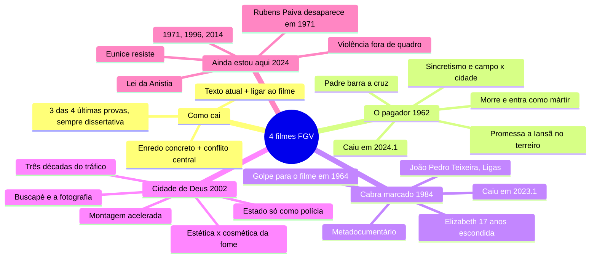

# Artes — Os 4 filmes nacionais

> 02/10/2026. Mapa mental + 44 flashcards de *O pagador de promessas*, *Cabra marcado para morrer*, *Cidade de Deus* e *Ainda estou aqui*.
> Feito junto com o guia de perguntas (`guia-de-estudo-filmes.pdf`, nesta pasta).
> ⭐ = já caiu na FGV, com o id da questão no banco de provas antigas.
> Versão interativa (cards que viram, marcação sabia/revisar): https://claude.ai/artifact/F7sBABoTCLCNTB3N9aWPnj

**O fio em uma frase:** Do homem do interior barrado na porta da igreja à família que espera um pai que não volta: os quatro filmes mostram quem tem terra, quem tem voz e como o Estado trata cada um. Na prova de cinema, a FGV cobra **enredo concreto + conflito central + um problema de hoje**.

**Por que tem card de enredo:** em Literatura você interpreta o texto na hora, com ele na frente. Em cinema não há filme na prova, e a grade cobra o enredo (2024.1).

## Mapa mental

## Flashcards

Clique na pergunta para abrir a resposta.

### Como cai e ligações

> [!question]- 1. Como o cinema cai na prova de Artes da FGV?
> - Em **3 das 4 últimas provas** (2023.1, 2024.1, 2026.1), sempre como **dissertativa**.
> - Formato: um texto sobre um problema brasileiro de hoje + o pedido de ligar ao filme.
> - Dos 4 nacionais, já caíram *Cabra marcado* e *O pagador*. *Cidade de Deus* e *Ainda estou aqui* nunca caíram.
> ⭐ 2023.1-DIS-AR3 · 2024.1-DIS-AR4 · 2026.1-DIS-AR3

> [!question]- 2. O que a grade da FGV exige numa questão de cinema?
> - **Conhecer o enredo de verdade:** nome de personagem e cena concreta. A grade de 2024.1 pede “evidências de conhecimento do enredo”.
> - **Achar o conflito central** e o problema social que o filme levanta.
> - Faltar uma parte do pedido = 50%. Um desvio de português derruba um nível.
> Tempo-alvo: **18 min**.

> [!question]- 3. Coloque os 4 filmes em ordem: ano do filme e época que ele mostra.
> 1. 1962 · *O pagador de promessas* · início dos anos 60
> 1. 1984 · *Cabra marcado para morrer* · 1962 a 1981
> 1. 2002 · *Cidade de Deus* · anos 60 a 80
> 1. 2024 · *Ainda estou aqui* · 1970 a 2014

### O pagador de promessas

> [!question]- 4. “O pagador de promessas”: quem dirigiu, quando, e de onde vem a história?
> **Anselmo Duarte, 1962.** Da peça de **Dias Gomes**, o mesmo de *O bem-amado*.
> Preto e branco, filmado em Salvador.
> **Palma de Ouro em Cannes**, a única do cinema brasileiro, e primeiro filme do Brasil indicado ao Oscar de filme estrangeiro.

> [!question]- 5. Qual foi a promessa de Zé do Burro, a quem e onde?
> Para salvar o burro **Nicolau**, prometeu a **Iansã**, num **terreiro de candomblé**, levar uma cruz pesada como a de Cristo até a igreja de **Santa Bárbara**, em Salvador. Também prometeu dividir suas terras com lavradores pobres.
> No sincretismo, Iansã = Santa Bárbara.
> ⭐ 2024.1-DIS-AR4 · a promessa feita no terreiro

> [!question]- 6. Por que o padre não deixa a cruz entrar na igreja?
> - A promessa foi feita em terreiro: para ele, feitiçaria.
> - Zé estaria querendo imitar o sacrifício de Cristo: soberba.
> É o **conflito central**: a Igreja oficial contra o catolicismo popular, “rústico”, de Zé.
> ⭐ 2024.1-DIS-AR4 · o conflito central

> [!question]- 7. Quem usa Zé do Burro em proveito próprio?
> - **O repórter:** a manchete faz de Zé um agitador da reforma agrária.
> - **A polícia:** quer a ordem.
> - **Bonitão:** seduz Rosa, a mulher de Zé.
> - **Os comerciantes** da praça vendem para a multidão.
> Ninguém quer saber da promessa.
> ⭐ 2024.1-DIS-AR4 · a imprensa deturpando o caso

> [!question]- 8. Como termina “O pagador de promessas”, e qual é a ironia?
> Na confusão com a polícia, Zé leva um tiro e morre. Os capoeiristas põem o corpo dele sobre a cruz e entram na igreja.
> **Ironia:** ele só entra morto, como **mártir**, o que a Igreja queria evitar.
> ⭐ 2024.1-DIS-AR4 · Zé vira mártir

> [!question]- 9. Em que Brasil “O pagador” foi feito?
> **1962:** governo João Goulart, reformas de base (a reforma agrária no centro), Ligas Camponesas, êxodo rural enchendo as cidades.
> Dois anos antes do golpe de 1964.

> [!question]- 10. Que temas a FGV ligou a “O pagador”?
> - Religiosidade popular e **sincretismo**
> - **Intolerância** religiosa
> - **Campo × cidade**: os “dois Brasis” da grade
> - Êxodo rural e **reforma agrária** (concentração de terras)
> - **Realismo** no cinema para tratar conflitos sociais
> ⭐ 2024.1-DIS-AR4 · temas pedidos no comando

> [!question]- 11. Que recursos de linguagem marcam “O pagador”?
> - A **escadaria**: padre no alto, Zé e o povo embaixo. A hierarquia vira imagem.
> - A **praça** como um Brasil em miniatura (herança do teatro).
> - Tema próximo do Cinema Novo, mas **narrativa clássica**: Anselmo Duarte vinha dos estúdios (Atlântida, Vera Cruz).

> [!question]- 12. Que artigos da Constituição conversam com “O pagador”?
> - **Art. 5º, VI:** liberdade de crença e proteção aos locais de culto.
> - **Art. 19, I:** Estado laico.
> Hoje: ataques a terreiros e intolerância contra religiões de matriz africana. Sueli Carneiro liga isso ao racismo.

### Cabra marcado para morrer

> [!question]- 13. “Cabra marcado para morrer”: o que é, e por que levou 20 anos?
> **Documentário de Eduardo Coutinho, 1984.**
> Em 1964 era uma ficção filmada com camponeses em Pernambuco (Engenho Galileia). Com o golpe, o Exército apreendeu o material e parte da equipe foi presa; só parte do negativo se salvou.
> Em **1981**, depois da Lei da Anistia, Coutinho volta e reencontra os personagens.
> ⭐ 2023.1-DIS-AR3 · Cabra marcado e a luta pela terra

> [!question]- 14. Quem foi João Pedro Teixeira?
> Líder da **Liga Camponesa de Sapé (PB)**, assassinado em **1962** a mando de latifundiários.
> O filme de 1964 era sobre a vida e a morte dele.
> ⭐ 2023.1-DIS-AR3

> [!question]- 15. O que eram as Ligas Camponesas?
> Organizações de trabalhadores do campo no Nordeste contra os despejos e o **cambão** (dias de trabalho de graça para o dono da terra), pela **reforma agrária**.
> Nome ligado a elas: **Francisco Julião**, em Pernambuco.

> [!question]- 16. De onde vem o título “Cabra marcado para morrer”?
> “Cabra marcado para morrer” é o homem jurado de morte.
> Vem do poema de cordel de **Ferreira Gullar** *João Boa-Morte, cabra marcado para morrer* (1962).

> [!question]- 17. Quem é Elizabeth Teixeira, e o que o golpe fez com a vida dela?
> Viúva de João Pedro. Em 1964 fazia o papel dela mesma no filme.
> Depois do golpe viveu **17 anos na clandestinidade**, no interior do Rio Grande do Norte, como **Marta Maria da Costa**, longe da maioria dos 11 filhos.

> [!question]- 18. Quais são as duas camadas de tempo de “Cabra marcado”?
> - **1962–64:** o filme interrompido, em preto e branco.
> - **1981:** o reencontro, em cor.
> Coutinho mostra as imagens antigas aos camponeses, que se veem na tela: o passado entra no presente.

> [!question]- 19. Por que “Cabra marcado” é um metadocumentário?
> O filme conta **a própria história**: Coutinho aparece, pergunta, mostra a equipe.
> Mistura ficção e realidade, e usa a **memória como método**.
> ⭐ 2023.1-DIS-AR3 · “mistura de ficção e realidade”

> [!question]- 20. O que a FGV pediu sobre “Cabra marcado” em 2023.1?
> Texto: o assassinato de **Bruno Pereira e Dom Phillips** (2022). Três pedidos:
> 1. Em que medida o filme retrata a **luta pela terra**.
> 1. Se ele é **testemunho de uma história e reconstrução de um passado**.
> 1. Se a **arte impede o esquecimento** e provoca reflexão crítica.
> Três pedidos = três linhas no esquema.
> ⭐ 2023.1-DIS-AR3

> [!question]- 21. Que casos mostram que a violência no campo continuou depois do filme?
> - **MST**, fundado em 1984 (ano do filme)
> - **Chico Mendes**, 1988
> - **Eldorado dos Carajás**, 1996: 19 sem-terra mortos
> - **Irmã Dorothy Stang**, 2005
> - **Bruno Pereira e Dom Phillips**, 2022

> [!question]- 22. O que a Constituição de 1988 diz sobre a terra?
> - A propriedade deve cumprir sua **função social** (art. 5º, XXIII, e art. 186).
> - O imóvel rural que não cumpre pode ser **desapropriado para reforma agrária** (art. 184).

### Cidade de Deus

> [!question]- 23. “Cidade de Deus”: quem fez, de onde vem e que reconhecimento teve?
> **Fernando Meirelles e Kátia Lund, 2002.** Do romance de **Paulo Lins** (1997). Roteiro de Bráulio Mantovani.
> **4 indicações ao Oscar:** direção, roteiro adaptado, fotografia e montagem.

> [!question]- 24. O que é a Cidade de Deus, o lugar?
> Conjunto habitacional criado nos **anos 1960** em Jacarepaguá, Zona Oeste do Rio, para famílias **removidas de favelas da Zona Sul** e desabrigados de enchentes.
> O Estado criou o lugar longe de tudo e depois quase só aparece como polícia.

> [!question]- 25. Quem é Paulo Lins, e por que isso importa?
> Cresceu na Cidade de Deus e trabalhou na pesquisa da antropóloga **Alba Zaluar** sobre a violência no bairro.
> É a periferia contando a periferia. O filme, porém, foi dirigido por cineastas de fora: debate sobre **quem representa quem**.

> [!question]- 26. Quem narra “Cidade de Deus”, e o que a câmera significa para ele?
> **Buscapé**, que tenta e não consegue ser bandido.
> A **fotografia** é a saída dele. É narrador-testemunha: olha de dentro, com alguma distância.

> [!question]- 27. O que muda no crime em cada década de “Cidade de Deus”?
> - **Anos 60:** o Trio Ternura (Cabeleira, Alicate e Marreco), assaltos “românticos”.
> - **Anos 70:** Dadinho vira **Zé Pequeno** e toma as bocas de fumo; o tráfico vira negócio.
> - **Anos 80:** a guerra entre Zé Pequeno e **Mané Galinha**; crianças armadas.
> A violência cresce e fica mais jovem.

> [!question]- 28. Como termina “Cidade de Deus”?
> Buscapé tem a foto da **polícia pegando dinheiro** de Zé Pequeno e a do **cadáver** de Zé. Publica a do cadáver (a outra o mataria) e ganha estágio no jornal.
> Os meninos da **Caixa Baixa** matam Zé Pequeno e saem listando quem vão matar: **o ciclo recomeça**.

> [!question]- 29. Que recursos de linguagem marcam “Cidade de Deus”?
> - **Montagem acelerada** e câmera na mão
> - **Estrutura circular:** abre e fecha com a galinha fugindo e Buscapé entre a polícia e a gangue
> - Capítulos (“A história do apartamento”)
> - Cores que esfriam com as décadas
> - Elenco de jovens sem experiência, vindos de comunidades

> [!question]- 30. “Estética da fome” × “cosmética da fome”: qual é o debate?
> **Glauber Rocha (1965):** a estética da fome, a miséria mostrada para incomodar.
> **Ivana Bentes:** em filmes como *Cidade de Deus*, a “cosmética da fome”: a violência vira espetáculo para consumo.
> **Defesa:** o ritmo põe o espectador dentro do caos e levou o tema a milhões. Na prova: os dois lados + sua posição.

> [!question]- 31. Que temas e debates de hoje se ligam a “Cidade de Deus”?
> - **Estado ausente, ou presente só como polícia** (CF, art. 144: segurança pública é “dever do Estado”)
> - **Racismo:** quem mora, mata e morre é sobretudo negro (Sueli Carneiro)
> - **Letalidade policial** e a **ADPF 635** no STF, que limitou operações nas favelas do Rio a partir de 2020
> Número de violência, só do Atlas da Violência ou do material de Atualidades.

### Ainda estou aqui

> [!question]- 32. “Ainda estou aqui”: quem fez, de onde vem e que prêmios teve?
> **Walter Salles, 2024.** Do livro de **Marcelo Rubens Paiva** (2015), filho de Rubens e Eunice.
> Fernanda Torres (Eunice), Selton Mello (Rubens), Fernanda Montenegro (Eunice idosa).
> **Oscar de Melhor Filme Internacional (2025)**, o primeiro do Brasil. Roteiro premiado em Veneza e Globo de Ouro para Fernanda Torres.

> [!question]- 33. Quem era Rubens Paiva, e o que aconteceu com ele?
> Engenheiro, deputado federal **cassado em 1964** (AI-1).
> Em **janeiro de 1971** foi levado de casa, no Leblon, por agentes da ditadura, torturado e morto no **DOI-CODI** do Rio. O corpo nunca apareceu.
> O regime manteve por décadas uma versão falsa: a de que ele teria sido “resgatado” por militantes.

> [!question]- 34. Em que momento da ditadura se passa “Ainda estou aqui”?
> **Anos de chumbo:** depois do AI-5 (1968), governo Médici, “milagre econômico”, censura e tortura como política de Estado.

> [!question]- 35. O que acontece com Eunice e a filha Eliana depois que Rubens é levado?
> As duas também vão para o DOI-CODI. **Eliana**, de 15 anos, sai no dia seguinte.
> **Eunice** fica presa **12 dias** e volta sem nenhuma resposta sobre o marido.

> [!question]- 36. Quais são os três tempos de “Ainda estou aqui”?
> - **1970–71:** prisão e desaparecimento.
> - **1996:** Eunice recebe o **atestado de óbito** (Lei 9.140/1995, que reconheceu os desaparecidos como mortos).
> - **2014:** Eunice idosa, com Alzheimer, no ano do relatório da **Comissão Nacional da Verdade**.

> [!question]- 37. Por que Eunice pede que a família sorria na foto para a revista?
> Recusa a imagem de família destruída que se esperava dela.
> Sorrir é **não entregar ao regime a foto da vítima**.

> [!question]- 38. Que escolhas de linguagem marcam “Ainda estou aqui”?
> - A **casa**: aberta, luz, praia, filmes em Super 8 → cortinas fechadas, agentes dentro, silêncio.
> - A tortura de Rubens fica **fora de quadro**: o que se vê é a ausência e a espera.
> - **Contenção**: a atuação de Fernanda Torres evita o melodrama.

> [!question]- 39. Quais são os sentidos do título “Ainda estou aqui”?
> - Eunice que **resiste**.
> - A **memória de Rubens**, que não some.
> - Eunice com **Alzheimer**, perdendo a memória enquanto o país também “esquece”: memória pessoal × memória nacional.

> [!question]- 40. O que foi a Lei da Anistia (1979), e por que ainda é polêmica?
> Perdoou crimes políticos e “conexos”, o que foi lido como perdão também aos torturadores (e excluiu condenados por “terrorismo”).
> - **O STF manteve a lei:** ADPF 153, em 2010.
> - **A Corte Interamericana condenou o Brasil** no mesmo ano (caso Gomes Lund, Araguaia): anistia não pode impedir investigar e punir.
> Conceito: **justiça de transição** (memória, verdade, reparação, justiça).

> [!question]- 41. O que é um desaparecido político, e quantos a Comissão da Verdade listou?
> Sem corpo não há atestado, enterro nem luto. Parte dos juristas trata a ocultação de cadáver como **crime permanente**, que a Anistia não alcançaria.
> A **CNV (2014)** listou **434 mortos e desaparecidos**: 191 mortos e 243 desaparecidos.

### Ligações

> [!question]- 42. Eunice Paiva e Elizabeth Teixeira: o que têm em comum, e o que muda?
> **Em comum:** perdem o marido para a violência e viram figuras públicas de luta. Eunice ainda se forma em Direito (1973) e defende os povos indígenas.
> **Diferença de classe:** Eunice, classe média alta carioca; Elizabeth, camponesa que perdeu os filhos e o próprio nome por 17 anos.
> A repressão atinge todos, mas não do mesmo jeito.

> [!question]- 43. Que eixos ligam os 4 filmes?
> - **Terra:** *O pagador* + *Cabra marcado*
> - **Memória da ditadura:** *Cabra marcado* + *Ainda estou aqui*
> - **Desigualdade e violência urbana:** *Cidade de Deus* (o campo que vira periferia)
> - **A imagem como poder:** a manchete, o negativo salvo, a foto de Buscapé, o sorriso de Eunice

> [!question]- 44. Com que outras obras da lista cada filme conversa?
> - *O pagador:* *O bem-amado*, Sueli Carneiro, *The Post*
> - *Cabra marcado:* *Torto arado*, *Vidas secas*, *Cálice*, *As meninas*
> - *Cidade de Deus:* Sueli Carneiro, *Que país é esse?*, *A hora da estrela*
> - *Ainda estou aqui:* *Cálice*, *As meninas*, Arendt, *Persépolis*

## O que já caiu na FGV (banco 2021.1–2026.1)

Cinema caiu em 3 das 4 últimas provas, sempre na dissertativa de Artes.

| Questão | Tema |
|---|---|
| `2023.1-DIS-AR3` | *Cabra marcado para morrer*: luta pela terra, testemunho, arte contra o esquecimento (caso Bruno e Dom) |
| `2024.1-DIS-AR4` | *O pagador de promessas*: religiosidade, sincretismo, êxodo rural, reforma agrária, realismo |
| `2026.1-DIS-AR3` | *Laranja mecânica* (fora deste baralho): internação involuntária |

## 🔗 Relacionados

[[Cursinho-projeto]]
