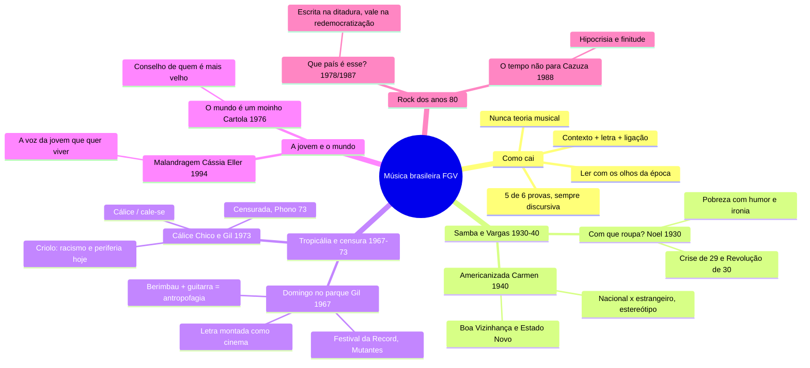

# Artes — Música brasileira (as 8 da lista)

> Manhã de Obras de 30/09/2026. Mapa mental + 30 flashcards.
> ⭐ = já caiu na FGV, com o id da questão no banco de provas antigas. ⚠️ = erro seu.
> Versão interativa (cards que viram, marcação sabia/revisar): https://claude.ai/artifact/DyNqqPYhhDU3M4zHfZ92HT

**O fio em uma frase:** as 8 músicas contam o Brasil de 1930 a 1994: a pobreza com humor no samba
(Noel), a identidade diante do estrangeiro (Carmen, Tropicália), a censura da ditadura (Cálice), e o
desencanto da redemocratização (Legião, Cazuza). A FGV pede sempre **contexto + o que a letra diz +
ligação com outra obra**.

**Uma divergência com a apostila:** ela lê *Malandragem* como desilusão amorosa. Para a prova, use a
leitura da jovem que quer viver, que é a que conversa com o Cartola (`2023.1-DIS-AR4`).

## Mapa mental

## Flashcards

Clique na pergunta para abrir a resposta.

### Como cai na prova

> [!question]- 1. Como a música cai na prova de Artes da FGV?
> - Em **5 das 6 provas** do banco (2021.1 a 2026.1), sempre na **discursiva**, nunca na objetiva.
> - Nunca pediu teoria musical. Pede **contexto + o que a letra diz + ligação** com outra obra.
> - Das 8 brasileiras da lista, 3 já caíram.

> [!question]- 2. Quais músicas brasileiras da lista já caíram, e quais nunca caíram?
> **Já caíram:** *Domingo no parque* (2024.1), *O mundo é um moinho* × *Malandragem* (2023.1),
> *Cálice* de Criolo (2026.1).
> **Nunca caíram:** *Com que roupa?*, *Disseram que voltei americanizada*, *Que país é esse?*,
> *O tempo não para*.

> [!question]- 3. Coloque as 8 músicas brasileiras em ordem no tempo.
> 1930 *Com que roupa?* · 1940 *Americanizada* · 1967 *Domingo no parque* · 1973 *Cálice*
> (Criolo, anos 2010) · 1976 *O mundo é um moinho* · 1978/1987 *Que país é esse?* ·
> 1988 *O tempo não para* · 1994 *Malandragem*

> [!question]- 4. ⚠️ Qual é o esqueleto de uma boa resposta sobre música?
> 1. Situe a música no tempo dela.
> 2. Diga o que a letra diz e qual recurso usa.
> 3. Ligue a outra obra ou conceito da lista.
> ⚠️ Leia com os olhos da época, não com os de hoje: a leitura anacrônica custou a dissertativa do
> Manifesto Antropófago (23/09, 25%).

### Samba e Era Vargas (1930–1940)

> [!question]- 5. "Com que roupa?": quem, quando e em que Brasil?
> **Noel Rosa, 1930.** Crise de 1929 e Revolução de 30. O samba estava virando a música urbana do Rio.

> [!question]- 6. "Com que roupa?": do que fala e qual é a chave?
> O eu lírico não tem roupa (dinheiro) para ir ao samba: a **pobreza contada com humor**.
> **Chave:** ironia e crônica do cotidiano. O sujeito pobre vira retrato do Brasil em crise.
> **Liga com:** *Malandragem* (outro sentido de malandragem) e *O bem-amado*.

> [!question]- 7. "Disseram que voltei americanizada": quem, quando e por que foi feita?
> **Carmen Miranda, 1940** (composição de Luiz Peixoto e Vicente Paiva). Ela fez sucesso em
> Hollywood, voltou e foi recebida com frieza, acusada de ter se americanizado. A canção é a resposta:
> ela continua brasileira.

> [!question]- 8. Em que contexto político Carmen virou "a cara do Brasil" nos EUA?
> **Era Vargas** (Estado Novo) + **Política da Boa Vizinhança**: os EUA se aproximavam da América
> Latina, e Carmen virou a vitrine do Brasil em Hollywood.

> [!question]- 9. Que debate "Americanizada" levanta?
> **Identidade nacional × estrangeiro** e **estereótipo** (a "baiana das frutas" que Hollywood vendia
> como América Latina). A identidade não é uma pureza fixa.
> **Liga com:** *Manifesto Antropófago* e *Domingo no parque* (a Tropicália resgatou Carmen como ícone).

### Tropicália e censura (1967–1973)

> [!question]- 10. "Domingo no parque": quando e onde estreou?
> **Gilberto Gil, Festival da Record de 1967**, com Os Mutantes e arranjo de Rogério Duprat.
> Ficou em 2º lugar.
> ⭐ `2024.1-DIS-AR3`

> [!question]- 11. Por que tocar guitarra elétrica num festival de 1967 era provocação?
> No mesmo ano houve a **passeata contra a guitarra elétrica**: parte da MPB via a guitarra como
> invasão estrangeira. Gil juntou berimbau e guitarra no mesmo palco.

> [!question]- 12. O que foi a Tropicália?
> A **antropofagia de Oswald na música**: arcaico + moderno, nacional + estrangeiro, popular +
> vanguarda. Caetano, Gil, Tom Zé, Gal, Os Mutantes.
> Acaba com a prisão e o exílio de Gil e Caetano depois do AI-5.
> ⭐ `2024.1-DIS-AR3` (Tropicália no contexto dos anos 1960)

> [!question]- 13. "Domingo no parque": o que conta e como?
> José, João e Juliana: um triângulo amoroso num domingo de parque que acaba em **crime passional**.
> Personagens populares, berimbau e capoeira da Bahia, e a letra **montada como cinema, em cortes**.

> [!question]- 14. "Cálice": quem, quando, e o que aconteceu com ela?
> **Chico Buarque e Gilberto Gil, 1973**, auge da repressão. Foi censurada: no show Phono 73
> cortaram os microfones. Só saiu em disco em 1978.

> [!question]- 15. Qual é o recurso central de "Cálice"?
> O trocadilho **cálice / cale-se**. Usa a Paixão de Cristo (o pedido de afastar o cálice) para
> falar de sofrimento e do silêncio imposto pela censura.

> [!question]- 16. O que muda no "Cálice" de Criolo?
> Nos anos 2010, Criolo reescreveu a letra em rap para o Brasil de hoje: **periferia, racismo,
> violência policial, tráfico**. O silenciamento continua, com outros alvos.
> ⭐ `2026.1-DIS-AR1`

> [!question]- 17. Como a FGV cobrou o "Cálice" de Criolo em 2026.1?
> Pediu para ler a letra pelas ideias de **Sueli Carneiro**: o mito da democracia racial (o país se
> diz sem racismo, mas a violência tem cor) e **raça × classe** (a desigualdade não se explica só
> pela pobreza).
> ⭐ `2026.1-DIS-AR1`

> [!question]- 18. Com que obras da lista "Cálice" (1973) conversa?
> **Ditadura e memória:** *Ainda estou aqui*, *Cabra marcado para morrer*, *As meninas* (também de 1973).
> **Poder e censura:** *1984* e Arendt.

### A jovem e o mundo (1976 × 1994)

> [!question]- 19. "O mundo é um moinho": quem, quando e que gênero?
> **Cartola, 1976.** Samba-canção, samba de raiz. Cartola foi um dos fundadores da Mangueira.

> [!question]- 20. "O mundo é um moinho": qual é o tema e a metáfora?
> Um conselho de alguém mais velho a uma **jovem que quer sair de casa cedo**: o mundo é um
> **moinho** que vai triturar os sonhos dela. Mostra o samba como poesia: lírico, melancólico.

> [!question]- 21. "Malandragem": quem compôs, quem gravou e quando?
> **Cazuza e Frejat** compuseram no fim dos anos 80. Estourou na voz de **Cássia Eller, em 1994**.

> [!question]- 22. "Malandragem": de que fala?
> A voz de uma **jovem presa à imagem de menina boazinha**, que pede um pouco de malandragem:
> quer experiência, liberdade, perder a inocência.
> (A apostila lê como desilusão amorosa. Para a prova, use esta leitura.)

> [!question]- 23. Quais são os dois sentidos de "malandragem" na lista?
> **No samba (Noel, anos 30):** o jeito de sobreviver na pobreza.
> **Em Cássia Eller (anos 90):** deixar de ser ingênua e viver.

> [!question]- 24. Como comparar "O mundo é um moinho" com "Malandragem"?
> A mesma cena, a jovem saindo para o mundo, vista dos dois lados:
> **Cartola:** quem aconselha, mais velho, pessimista.
> **Malandragem:** a própria jovem, que quer ir.
> E samba de raiz × rock/MPB.
> ⭐ `2023.1-DIS-AR4`

### Rock dos anos 80 (1987–1988)

> [!question]- 25. "Que país é esse?": quando foi escrita e quando saiu?
> **Escrita por Renato Russo em 1978**, na ditadura, no punk de Brasília. **Lançada pela Legião
> Urbana em 1987.**

> [!question]- 26. Por que importa ela ter sido escrita em 1978 e lançada em 1987?
> Uma letra da ditadura continuava valendo na redemocratização: **a ditadura acabou e o país não
> mudou** (Sarney, inflação, Constituinte). A letra diz até que ninguém respeita a Constituição, e
> saiu enquanto a nova estava sendo escrita.

> [!question]- 27. "Que país é esse?": qual é o tema?
> Enumera as mazelas do país (**corrupção, desigualdade, impunidade**). A pergunta do título é a denúncia.
> **Liga com:** *O tempo não para*, *O bem-amado*, *Cidade de Deus*.

> [!question]- 28. "O tempo não para": quem, quando e em que contexto?
> **Cazuza (com Arnaldo Brandão), 1988.** Desencanto com a Nova República (Sarney, inflação).
> Cazuza já tinha HIV, o que dá urgência à letra.

> [!question]- 29. "O tempo não para": qual é o tema e a chave?
> Ataca a **hipocrisia** e a elite acomodada: um país que repete o velho e chama de novidade.
> **Chave:** crítica social + finitude pessoal.
> Com *Que país é esse?*, forma a dupla do **desencanto dos anos 80**.

### Ligações

> [!question]- 30. Quais duplas de música a FGV pode cruzar?
> - **Ditadura e censura:** *Cálice*
> - **Desencanto depois da ditadura:** *Que país é esse?* + *O tempo não para*
> - **Nacional × estrangeiro:** *Americanizada* + *Domingo no parque* (+ Oswald, Tarsila)
> - **A jovem e o mundo:** *Moinho* × *Malandragem*
> - **Racismo hoje:** *Cálice* (Criolo) + Sueli Carneiro

## O que já caiu na FGV (banco 2021.1–2026.1)

Música caiu em 5 das 6 provas, sempre na discursiva. As internacionais (*Revolution*) caíram em
2021.1 e 2025.1.

| Questão | Tema |
|---|---|
| `2023.1-DIS-AR4` | Comparar *O mundo é um moinho* e *Malandragem* |
| `2024.1-DIS-AR3` | *Domingo no parque* e a Tropicália nos anos 1960 |
| `2026.1-DIS-AR1` | *Cálice* de Criolo lido com Sueli Carneiro |

## 🔗 Relacionados

[[Cursinho-projeto]]
