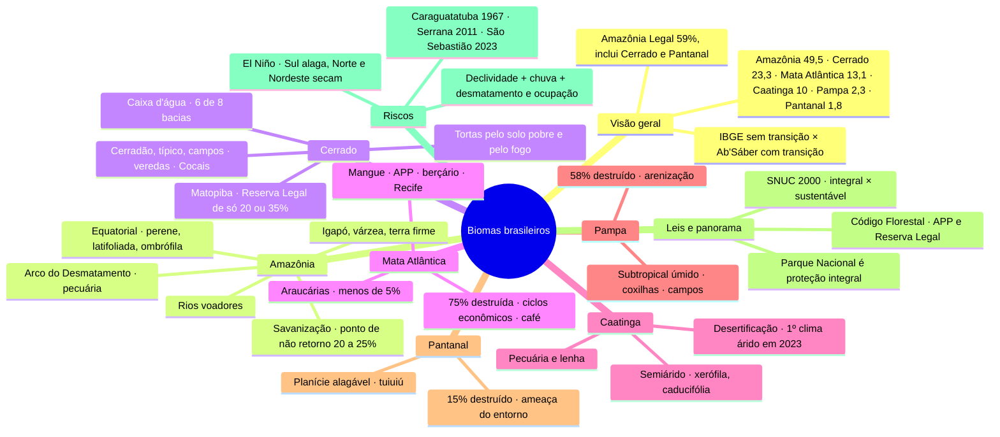

# Geografia — Biomas Brasileiros e Degradação Ambiental

> Aula de Geografia do cursinho de 01/10/2026 (transcrição e resumo da Laura). Apostila de teoria feita em 01/10/2026, pensada para FGV e Insper.
> ⭐ = tema que já caiu na FGV, com o id da questão no banco de provas antigas.
> Para ler e imprimir: `biomas-brasileiros.pdf`, nesta pasta (fica só no Mac: PDF do cursinho não vai para o backup).
> Mapa mental + 50 flashcards no fim desta nota, feitos em 01/10/2026.
> Versão interativa (cards que viram, marcação sabia/revisar): https://claude.ai/artifact/SHt38hRE3MXmfDBFthq6YK
> Abrir no Mac mesmo sem internet: `biomas-brasileiros.html`, nesta pasta.
> Os pontos principais também viraram 21 cards no baralho do trajeto (`flashcards-geografia.md`, 122 a 142).

**O fio da aula em uma frase:** o Brasil tem seis biomas e todos estão sendo destruídos pelo mesmo
motor, a agropecuária (sobretudo o boi). Mas cada bioma se degrada de um jeito: a Amazônia vira
savana, a Caatinga vira deserto e o Pampa vira areia. E onde se desmata e se ocupa morro em serra
com chuva forte, vêm os deslizamentos que matam centenas de pessoas.

## Antes de começar: 4 pontos do resumo que precisam de correção

> [!warning] Confira antes de estudar
> Comparei o resumo da aula com a lei e com os registros oficiais. Quatro pontos estão diferentes, provavelmente por erro da transcrição e não do professor. Na prova, vale a versão corrigida:
> 1. **Parque Nacional é de *proteção integral*, não de uso sustentável** (Lei do SNUC, art. 8º). O parque permite visita, mas visita conta como "uso indireto". Ver a seção 9.
> 2. **A Ilha da Queimada Grande** (a "ilha das cobras", em SP) tem visita proibida, mas a categoria oficial dela é ARIE, que fica no grupo de *uso sustentável*. Para dar exemplo de proteção integral, use uma Reserva Biológica de verdade, como o Atol das Rocas. Ver a seção 9.
> 3. **Os números dos deslizamentos estão trocados.** Os cerca de 430 mortos em uma noite são de **Caraguatatuba, em 1967**. O Litoral Norte de SP (São Sebastião, carnaval de 2023) teve **65 mortos**. Os cerca de 900 mortos de **2011** foram na **Região Serrana do Rio** (Nova Friburgo, Teresópolis, Petrópolis), não em Angra. Ver a seção 12.
> 4. **"Escleromorfismo oligotrófico" não quer dizer "folha grossa para reter água".** Quer dizer que a planta é dura e retorcida por causa do **solo pobre em nutrientes**. Quem se adapta à falta de água é a Caatinga. Ver a seção 4.

## 1. O vocabulário que aparece na aula inteira

Quase toda palavra de vegetação vem do grego ou do latim. Se você souber o pedaço da palavra, deduz o
significado na hora da prova, sem decorar.

| Termo | O que quer dizer | Onde aparece |
|---|---|---|
| **Bioma** | Grande área com clima, vegetação e animais parecidos, que funciona como uma unidade. É o conceito usado pelo IBGE. | Amazônia, Cerrado |
| **Domínio morfoclimático** | Área definida pela combinação de **relevo** (*morfo* = forma) e **clima**, junto com vegetação, solo e rios. Conceito de Aziz Ab'Sáber. | Mares de Morros |
| **Faixa de transição** | Zona onde um ambiente vai virando outro e mistura os dois. | Pantanal, Mata dos Cocais |
| **Ecossistema** | Os seres vivos de um lugar mais o ambiente em que vivem, numa escala menor que a do bioma. | Mangue, vereda |
| **Perene** | Fica verde o ano todo: não perde as folhas de uma vez. | Amazônia, Mata Atlântica |
| **Caducifólia** | Perde as folhas na seca para economizar água (*caduco* = o que cai). | Caatinga |
| **Latifoliada** | De folhas largas (*lati* = largo). Folha larga é típica de lugar quente e úmido. | Amazônia, Mata Atlântica |
| **Aciculifoliada** | De folhas finas como agulhas (*acícula* = agulha). | Araucária |
| **Ombrófila** | "Amiga da chuva" (*ombros* = chuva): vive com chuva o ano todo. | Amazônia, Mata Atlântica |
| **Higrófila** | Adaptada a muita umidade (*higro* = umidade). | Amazônia |
| **Xerófila** | Adaptada à seca (*xero* = seco): espinhos, folhas pequenas, caule que guarda água. | Caatinga |
| **Halófita** | Tolera sal (*halo* = sal). | Mangue |
| **Pneumatóforo** | Raiz que sai da lama e cresce para cima, para respirar (*pneuma* = ar). | Mangue |
| **Hidromórfico** | Solo encharcado de água quase o ano todo. | Vereda, Pantanal |
| **Oligotrófico** | Pobre em nutrientes (*oligo* = pouco; *trófico* = alimento). | Solo do Cerrado |
| **Escleromorfismo** | Forma dura e rígida da planta (*esclero* = duro): casca grossa, folha de couro, galho torto. | Cerrado |
| **Endêmica** | Espécie que só existe naquele lugar. | Mata Atlântica |

## 2. Visão geral: os seis biomas

O IBGE divide o território brasileiro em **seis biomas**. Em ordem de tamanho, pela parte do Brasil
que cada um ocupa:

  
1. Amazônia49,5%

  
2. Cerrado23,3%

  
3. Mata Atlântica13,1%

  
4. Caatinga10%

  
5. Pampa2,3%

  
6. Pantanal1,8%

  
Parte do território brasileiro ocupada por cada bioma (números da aula, que seguem o IBGE).

**Amazônia + Cerrado somam 72,8%, praticamente três quartos do país.** Guarde isso, porque não é
coincidência: os dois maiores biomas são justamente onde a fronteira agrícola está avançando hoje, e
por isso concentram o desmatamento atual.

### 2.1 Dois mapas que parecem iguais e não são

Na prova podem aparecer dois mapas diferentes da natureza brasileira. Você precisa saber qual é qual.

**O mapa de biomas (IBGE)** é o oficial do governo. Ele divide o país em seis biomas com linhas
nítidas: todo ponto do território pertence a algum bioma. **Não tem faixa de transição.** É o mapa
usado para dados de desmatamento por bioma.

**O mapa de domínios morfoclimáticos (Aziz Ab'Sáber)** foi feito por um dos maiores geógrafos
brasileiros, da USP. Ab'Sáber classificou o país juntando **relevo + clima**, e também vegetação, solo
e rios. Chegou a seis domínios e, entre eles, **faixas de transição**: áreas onde as características
de dois domínios se misturam e que aparecem no mapa sem cor própria.

| | Mapa de biomas (IBGE) | Mapa de domínios (Ab'Sáber) |
|---|---|---|
| Critério principal | Vegetação e clima | Relevo + clima (e vegetação, solo, rios) |
| Quantas unidades | 6 biomas | 6 domínios + faixas de transição |
| Faixa de transição | **Não tem** | **Tem** |
| Mata Atlântica | Mata Atlântica (inclui as Araucárias) | **Mares de Morros** |
| Araucárias | Ficam dentro da Mata Atlântica | **Domínio próprio** (das Araucárias) |
| Pampa | Pampa | **Pradarias** |
| Pantanal | É um bioma | **Não é domínio: é faixa de transição** |
| Amazônia, Cerrado, Caatinga | Mesmos nomes | Mesmos nomes |

Por que esses nomes?

- **Mares de Morros:** o relevo da faixa atlântica é feito de morros arredondados, um atrás do outro,
  que vistos de cima parecem as ondas de um mar (os geógrafos chamam de "meias-laranjas"). O clima
  quente e muito úmido decompõe a rocha (intemperismo químico) e vai arredondando os morros.
- **Pradarias:** é o nome para os campos, a vegetação rasteira de capim do Sul.
- **Pantanal como transição:** ele mistura elementos do Cerrado, da Amazônia, da Mata Atlântica e do
  Chaco (região seca da Bolívia e do Paraguai). Por isso, para Ab'Sáber, não é um domínio.

> [!tip] Pegadinha clássica
> "O Pantanal é um domínio morfoclimático." **Errado.** É bioma no mapa do IBGE, mas no mapa de Ab'Sáber é faixa de transição. O mesmo vale para a Mata dos Cocais (ver Cerrado).

### 2.2 Amazônia Legal não é o bioma Amazônia

O **bioma Amazônia** é natural: é onde existe a floresta (49,5% do país).

A **Amazônia Legal** é uma região **política**, criada por lei (em 1953) para o governo planejar e
financiar a ocupação e o desenvolvimento do Norte. O limite dela segue fronteiras de estados, não a
floresta. Inclui **AC, AM, AP, PA, RO, RR, TO, MT e a parte do MA a oeste do meridiano de 44°**, cerca
de **59% do território**. Como é maior que o bioma, ela contém também **Cerrado** (TO, MT, MA) e
**Pantanal** (MT).

Por que isso importa: os números de desmatamento do INPE (sistemas PRODES e DETER) normalmente são da
**Amazônia Legal**. Quando a questão fala em "Amazônia Legal", ela está incluindo áreas de Cerrado.

> [!tip] ⭐ Já caiu na FGV
> - **2024.1, questão 55:** avanço da fronteira agrícola e desmatamento na Amazônia Legal, com a pecuária no centro.
> - **2025.1, questão 57:** leitura de dados do INPE sobre o desmatamento da Amazônia Legal.

## 3. Amazônia

> [!abstract] Em uma frase
> A maior floresta equatorial do mundo: exuberante, mas apoiada num solo pobre. A pecuária a desmata pelo Arco do Desmatamento e, se ela perder floresta demais, vira savana.

### Onde fica e como é o clima

Ocupa o Norte do Brasil e partes do Mato Grosso e do Maranhão: **49,5% do território**. A floresta
continua por mais oito países e territórios vizinhos, mas cerca de 60% dela está no Brasil.

O clima é **equatorial**. A região fica perto da linha do Equador, onde o Sol bate forte o ano todo.
Resultado:

- **Quente o ano inteiro** (média de 25 a 27 °C), com pouca diferença entre "verão" e "inverno": a
  **amplitude térmica é baixa**.
- **Chuva muito alta** (mais de 2.000 mm por ano) e espalhada pelo ano. Muito calor + muita água =
  muita evaporação = muita chuva. São as pancadas de fim de tarde (chuvas de convecção).

### A vegetação: como ler os quatro adjetivos da aula

- **Perene:** está sempre verde, porque nunca falta água.
- **Latifoliada:** folhas largas. Onde há água de sobra, a planta não precisa economizar e pode ter
  folha grande para captar mais luz.
- **Ombrófila:** depende de chuva constante.
- **Higrófila:** adaptada à umidade alta.

Além disso, a floresta é **densa** (árvores muito próximas), **heterogênea** (muitas espécies
misturadas, raramente duas árvores iguais lado a lado) e organizada em **andares**: árvores
emergentes que podem passar de 50 m, a copa fechada logo abaixo e o sub-bosque escuro no chão.

> [!note] O paradoxo: floresta rica em solo pobre
> Na maior parte da Amazônia o solo é **pobre e ácido**, porque a chuva constante "lava" os nutrientes para baixo (a **lixiviação**). A floresta sobrevive porque **recicla a si mesma**: folhas, galhos e animais mortos caem no chão (a **serrapilheira**), apodrecem rápido no calor úmido, e os nutrientes voltam direto para as raízes.
>
> Quando a floresta é derrubada, esse ciclo quebra. O solo fica exposto, a chuva leva o pouco que sobrou, e em poucos anos a terra não serve nem para pasto. É por isso que desmatar a Amazônia para produzir costuma dar terra que se esgota rápido e empurra o desmatamento para a frente.

### Os três tipos de floresta: igapó, várzea e terra firme

Na Amazônia, os rios sobem vários metros na época das chuvas (a **cheia**) e descem na seca (a
**vazante**). Conforme a altura do terreno, a floresta passa mais ou menos tempo debaixo d'água. É
isso que separa os três tipos:

<figure style="margin:14px 0;text-align:center;">
<svg viewBox="0 0 680 300" xmlns="http://www.w3.org/2000/svg" style="width:100%;max-width:680px;font-family:'Avenir Next','Helvetica Neue',Arial,sans-serif;">
  <g stroke="#5B3A1E" stroke-width="5">
    <line x1="180" y1="205" x2="180" y2="118"/><line x1="222" y1="205" x2="222" y2="112"/><line x1="264" y1="205" x2="264" y2="120"/>
    <line x1="360" y1="165" x2="360" y2="92"/><line x1="405" y1="165" x2="405" y2="86"/><line x1="450" y1="165" x2="450" y2="94"/>
    <line x1="548" y1="110" x2="548" y2="40"/><line x1="600" y1="110" x2="600" y2="22"/><line x1="652" y1="110" x2="652" y2="42"/>
  </g>
  <g fill="#2E7D4F">
    <ellipse cx="180" cy="108" rx="22" ry="15"/><ellipse cx="222" cy="102" rx="24" ry="16"/><ellipse cx="264" cy="110" rx="22" ry="15"/>
    <ellipse cx="360" cy="82" rx="24" ry="16"/><ellipse cx="405" cy="76" rx="26" ry="17"/><ellipse cx="450" cy="84" rx="24" ry="16"/>
  </g>
  <g fill="#1F6F43">
    <ellipse cx="548" cy="30" rx="27" ry="17"/><ellipse cx="600" cy="14" rx="30" ry="14"/><ellipse cx="652" cy="32" rx="27" ry="17"/>
  </g>
  <rect x="0" y="140" width="498" height="50" fill="#9CC9E6" opacity="0.6"/>
  <rect x="0" y="190" width="312" height="110" fill="#3D8DC2" opacity="0.9"/>
  <line x1="0" y1="140" x2="498" y2="140" stroke="#2B6C99" stroke-width="1.5" stroke-dasharray="6 4"/>
  <line x1="0" y1="190" x2="312" y2="190" stroke="#1F5680" stroke-width="1.5"/>
  <polygon points="0,255 110,255 150,205 300,205 330,165 480,165 520,110 680,110 680,300 0,300" fill="#A47B4F" stroke="#6E4E2C" stroke-width="2"/>
  <text x="55" y="232" fill="#ffffff" font-size="15" font-weight="700" text-anchor="middle">RIO</text>
  <text x="225" y="236" fill="#ffffff" font-size="15" font-weight="700" text-anchor="middle">IGAPÓ</text>
  <text x="225" y="254" fill="#ffffff" font-size="12" text-anchor="middle">alagado o ano todo</text>
  <text x="405" y="198" fill="#ffffff" font-size="15" font-weight="700" text-anchor="middle">VÁRZEA</text>
  <text x="405" y="216" fill="#ffffff" font-size="12" text-anchor="middle">alaga só na cheia</text>
  <text x="600" y="146" fill="#ffffff" font-size="15" font-weight="700" text-anchor="middle">TERRA FIRME</text>
  <text x="600" y="164" fill="#ffffff" font-size="12" text-anchor="middle">nunca alaga</text>
  <text x="6" y="134" fill="#1F5680" font-size="11.5" font-weight="600">nível da cheia</text>
  <text x="6" y="204" fill="#ffffff" font-size="11.5" font-weight="600">nível da seca</text>
</svg>
<figcaption style="font-size:8.5pt;color:#666;">Corte esquemático de uma margem de rio amazônico. Faixa azul clara: o que a água cobre só na cheia.</figcaption>
</figure>

| Tipo | Quanto tempo fica alagado | Onde fica | O que saber |
|---|---|---|---|
| **Igapó** | **O ano todo** | Nas partes mais baixas, junto aos rios | Árvores adaptadas a viver com as raízes sempre submersas |
| **Várzea** | **Só na cheia** (época das chuvas) | Terrenos intermediários, na beira dos rios | Na cheia o rio deixa sedimentos que adubam o chão: é o solo mais fértil, onde os ribeirinhos plantam na vazante |
| **Terra firme** | **Nunca** | Terrenos mais altos: **a maior parte da Amazônia** | As árvores mais altas e a maior biodiversidade. "Raiz visível o ano inteiro": a base das árvores nunca fica debaixo d'água |

> [!tip] Para não confundir
> **Igapó** = **I**nundado o ano **I**nteiro. **Várzea** = **Va**ria (alaga e seca). **Terra firme** = firme, sempre seca.

### O desmatamento

**Quanto:** cerca de **18% do bioma** já foi destruído. Parece pouco, mas a Amazônia é tão grande que
isso equivale a cerca de **9% de todo o território brasileiro** (18% de 49,5% ≈ 9%).

**Onde: o Arco do Desmatamento.** É uma faixa em forma de arco (de meia-lua) na **borda sul e leste
da floresta, onde ela encontra o Cerrado**: vai do oeste do Maranhão e do sul e sudeste do Pará,
passa pelo norte de Mato Grosso e por Rondônia e chega ao Acre. O desmatamento se concentra ali porque
é por onde chegam as **estradas** (Belém–Brasília, Cuiabá–Santarém, BR-364) e a fronteira agrícola
que vem do Centro-Sul.

**Por quê: a ordem em que a floresta cai.** As três causas da aula costumam acontecer em sequência:

1. **Madeira:** a extração (muitas vezes ilegal) abre ramais na mata e tira as árvores de valor.
2. **Pecuária (a principal causa):** a área é queimada e vira pasto. Pôr boi é o jeito mais barato de
   ocupar a terra e de "provar" que ela tem dono.
3. **Soja e grãos:** quando a terra já está "limpa" e há estrada para escoar, chega a lavoura.

Por trás disso está a **grilagem**: a invasão de terra pública com documento falso. O nome vem de um
truque antigo: guardar o papel falso numa gaveta com grilos, para ele ficar amarelado e parecer velho.

> [!tip] ⭐ Já caiu na FGV
> **2024.1, questão 55:** relação entre o avanço da fronteira agrícola e o desmatamento na Amazônia Legal, com a pecuária como peça central.

### Savanização: quando a floresta vira savana

A Amazônia **produz boa parte da própria chuva**: as árvores puxam água do solo e a soltam no ar pela
transpiração, e esse vapor vira chuva de novo, sobre a própria floresta. Quando se desmata:

1. menos árvores → menos vapor no ar → **menos chuva** e estação seca mais longa;
2. a mata fica mais seca e o **fogo** entra com mais facilidade;
3. as árvores de floresta úmida morrem e quem ocupa o lugar é **capim e vegetação de savana**.

A área degradada vira algo parecido com o Cerrado, mas **não é um Cerrado de verdade**, rico como o
original: é uma savana empobrecida.

Cientistas como **Carlos Nobre** falam num **"ponto de não retorno"**: se o desmatamento chegar a
**20–25% da floresta**, grandes áreas podem savanizar **sozinhas**, sem volta. Com cerca de 18% já
perdido, estamos perto desse limite. Esse é o grande argumento para zerar o desmatamento.

> [!example] Para ir além: os rios voadores ⭐
> Caiu como **discursiva na FGV (2024.1, questão CH6)**. Os ventos (alísios) trazem umidade do Oceano Atlântico para a Amazônia. A floresta recicla essa água e a devolve ao ar pela transpiração. Esse "rio de vapor" segue para oeste, bate na **Cordilheira dos Andes**, que funciona como um paredão, e é desviado para o **sul**. Assim leva chuva ao **Centro-Oeste, ao Sudeste e ao Sul**.
>
> Conclusão que a banca quer: desmatar a Amazônia diminui a chuva nas lavouras do Centro-Oeste e nos reservatórios do Sudeste. Ou seja, **o desmatamento prejudica o próprio agronegócio** e a energia das hidrelétricas.

### A história do desmatamento, governo a governo

| Período | O que aconteceu |
|---|---|
| **2004** (Lula, 1º mandato) | **Pico da série:** cerca de 27,8 mil km² desmatados em um ano (dado do PRODES/INPE). A reação foi um plano de combate (o **PPCDAm**), com Marina Silva no Ministério do Meio Ambiente: alerta por satélite (DETER), operações de fiscalização, novas áreas protegidas e corte de crédito para quem desmata. |
| **2005–2012** | Queda forte e contínua. |
| **2012** (Dilma) | **Menor índice da série:** cerca de 4,6 mil km². |
| **2019–2022** (Bolsonaro) | **Volta a subir**, passando de 10 mil km² por ano, com o enfraquecimento da fiscalização (Ibama, ICMBio). |
| **2023 em diante** | **Volta a cair.** |

> [!tip] Como isso vira resposta de prova
> Queda de 2004 a 2012 = **fiscalização + monitoramento por satélite + crédito condicionado**. Alta de 2019 a 2022 = **desmonte da fiscalização**. O desmatamento responde à política: quando o Estado fiscaliza, ele cai.

## 4. Cerrado

> [!abstract] Em uma frase
> A savana brasileira e a "caixa d'água do Brasil". Hoje é o bioma que mais perde vegetação, pela soja e pelo boi, sobretudo no Matopiba.

### Onde fica e como é o clima

É o **2º maior bioma (23,3%)**. O coração dele é o Planalto Central (GO, DF, TO, MT, MS, MG, oeste
da BA, sul do MA e do PI), mas ele está **presente nas cinco regiões**: há manchas de Cerrado do
Paraná até Roraima e o Amapá, passando por São Paulo.

O clima é **tropical típico**, com **duas estações bem marcadas**: verão quente e chuvoso (de outubro
a março) e inverno seco (de abril a setembro). No total chove bem, entre 1.200 e 1.800 mm por ano. O
problema do Cerrado nunca foi falta de chuva no ano: é a **seca do inverno** e o **solo pobre**. O
**fogo** natural, provocado por raios no fim da seca, faz parte do ciclo, e as plantas são adaptadas a
ele.

### A "caixa d'água do Brasil"

O Cerrado ocupa as **partes altas** do país: planaltos e chapadas. Rio nasce no alto e desce para os
lados. Por isso nascem no Cerrado rios de **6 das 8 grandes bacias hidrográficas** brasileiras:

- **Amazonas** (afluentes da margem direita, como o Xingu)
- **Tocantins-Araguaia**
- **Paraná**
- **Paraguai** (que alimenta o Pantanal)
- **São Francisco** (nasce na Serra da Canastra, em MG)
- **Parnaíba**

Além disso, a vegetação funciona como uma **esponja**: as raízes profundas e o solo permeável fazem a
água da chuva infiltrar e recarregar os **aquíferos** (como o Guarani). Desmatar o Cerrado significa
**menos água nos rios** que movem as hidrelétricas do Paraná e do São Francisco e que enchem o
Pantanal.

### A vegetação clássica e o "escleromorfismo oligotrófico"

A imagem típica do Cerrado:

- **árvores baixas e espaçadas**, com capim entre elas;
- **troncos e galhos retorcidos**;
- **casca grossa**, parecida com cortiça, que protege a planta do fogo;
- **folhas duras e grossas**, com textura de couro;
- **raízes muito profundas**, que alcançam a água subterrânea mesmo na seca. Por isso se diz que o
  Cerrado é uma "**floresta de cabeça para baixo**": tem mais planta embaixo da terra do que em cima.

**Por que as árvores são tortas e duras?** É aqui que entra o nome difícil:

- **Esclero** = duro · **morfismo** = forma → planta de forma dura e rígida.
- **Oligo** = pouco · **trófico** = nutriente → por causa do solo pobre em nutrientes.

O solo do Cerrado é **ácido, pobre e rico em alumínio** (que é tóxico para as plantas). Sem nutriente,
a planta cresce devagar, com tecido duro e forma retorcida. O **fogo** completa o quadro: ele queima os
brotos da ponta dos galhos, e o galho rebrota de lado, ficando torto.

> [!warning] Não é falta de água
> No resumo está "folhas grossas para reter água". As folhas são mesmo grossas, mas **a causa que a prova espera é o solo pobre (e o fogo), não a seca**. O Cerrado tem chuva suficiente e raízes que chegam ao lençol freático. A planta *parece* de lugar seco, mas não é: por isso os botânicos falam em "falso xeromorfismo". Se perguntarem por que a vegetação do Cerrado é tortuosa, a resposta é **solo oligotrófico, ácido e com alumínio, mais o fogo**. Seca é a resposta da Caatinga.

### As três formações internas

O Cerrado não é igual em todo lugar. Conforme o solo e a água, ele vai de uma quase floresta até um
campo só de capim:

<figure style="margin:14px 0;text-align:center;">
<svg viewBox="0 0 680 210" xmlns="http://www.w3.org/2000/svg" style="width:100%;max-width:680px;font-family:'Avenir Next','Helvetica Neue',Arial,sans-serif;">
  <rect x="0" y="0" width="170" height="160" fill="#EEF3EA"/>
  <rect x="170" y="0" width="170" height="160" fill="#F5F1E4"/>
  <rect x="340" y="0" width="170" height="160" fill="#F8F3E2"/>
  <rect x="510" y="0" width="170" height="160" fill="#FBF6E6"/>
  <g stroke="#5B3A1E" stroke-width="4" fill="none" stroke-linecap="round">
    <path d="M20 160 L20 70"/><path d="M48 160 L48 60"/><path d="M76 160 L76 66"/><path d="M104 160 L104 58"/><path d="M132 160 L132 68"/><path d="M156 160 L156 74"/>
    <path d="M195 160 q-6 -18 3 -32 q8 -12 -2 -28"/><path d="M245 160 q7 -16 -2 -30 q-8 -12 4 -24"/><path d="M295 160 q-7 -14 2 -28 q7 -10 -3 -22"/>
    <path d="M380 160 q4 -10 -2 -20"/><path d="M450 160 q-4 -10 2 -18"/>
  </g>
  <g fill="#3F8A55">
    <ellipse cx="20" cy="62" rx="20" ry="14"/><ellipse cx="48" cy="52" rx="20" ry="14"/><ellipse cx="76" cy="58" rx="20" ry="14"/><ellipse cx="104" cy="50" rx="20" ry="14"/><ellipse cx="132" cy="60" rx="20" ry="14"/><ellipse cx="156" cy="66" rx="16" ry="12"/>
  </g>
  <g fill="#7FA34A">
    <ellipse cx="196" cy="98" rx="20" ry="11"/><ellipse cx="247" cy="104" rx="20" ry="11"/><ellipse cx="294" cy="108" rx="18" ry="10"/>
    <ellipse cx="378" cy="138" rx="12" ry="8"/><ellipse cx="452" cy="140" rx="11" ry="7"/>
  </g>
  <g stroke="#B49A3C" stroke-width="2" stroke-linecap="round">
    <path d="M180 160 l-3 -10 M184 160 l2 -11 M220 160 l-3 -9 M224 160 l2 -10 M270 160 l-3 -10 M274 160 l2 -11 M318 160 l-2 -9 M322 160 l3 -10"/>
    <path d="M350 160 l-3 -11 M354 160 l2 -12 M410 160 l-3 -11 M414 160 l2 -12 M470 160 l-3 -11 M474 160 l2 -12 M496 160 l-2 -10"/>
    <path d="M522 160 l-3 -12 M526 160 l2 -13 M548 160 l-3 -11 M552 160 l2 -12 M576 160 l-3 -12 M580 160 l2 -13 M604 160 l-3 -11 M608 160 l2 -12 M632 160 l-3 -12 M636 160 l2 -13 M660 160 l-3 -11 M664 160 l2 -12"/>
  </g>
  <line x1="0" y1="160" x2="680" y2="160" stroke="#8B6B43" stroke-width="3"/>
  <text x="85" y="182" font-size="13" font-weight="700" text-anchor="middle" fill="#1d2433">Cerradão</text>
  <text x="85" y="199" font-size="11" text-anchor="middle" fill="#555">formação florestal</text>
  <text x="255" y="182" font-size="13" font-weight="700" text-anchor="middle" fill="#1d2433">Cerrado típico</text>
  <text x="255" y="199" font-size="11" text-anchor="middle" fill="#555">savânico (sentido restrito)</text>
  <text x="425" y="182" font-size="13" font-weight="700" text-anchor="middle" fill="#1d2433">Campo sujo</text>
  <text x="425" y="199" font-size="11" text-anchor="middle" fill="#555">capim com arbustos</text>
  <text x="595" y="182" font-size="13" font-weight="700" text-anchor="middle" fill="#1d2433">Campo limpo</text>
  <text x="595" y="199" font-size="11" text-anchor="middle" fill="#555">quase só gramíneas</text>
</svg>
<figcaption style="font-size:8.5pt;color:#666;">Da esquerda para a direita, cada vez menos árvores e mais capim.</figcaption>
</figure>

- **Cerradão (formação florestal):** árvores mais altas e próximas, de copa quase fechada. Parece uma
  floresta.
- **Cerrado típico, ou sentido restrito (formação savânica):** árvores baixas, tortas e espaçadas, com
  capim entre elas. É o "Cerrado clássico" da foto, e o mais parecido com a **savana africana**.
- **Formação campestre:** quase só capim (gramíneas). O **campo sujo** ainda tem alguns arbustos; o
  **campo limpo** é praticamente só capim.

### As veredas

Vereda é um caminho de água no meio do Cerrado: um vale onde o **lençol freático aflora** e o solo
fica **encharcado** o ano todo (**solo hidromórfico**). A marca dela é a fileira de **buritis**, uma
palmeira que só cresce com os pés na água.

A importância: as veredas garantem **água e alimento o ano inteiro**, inclusive na seca, para os
animais e para as pessoas. Do buriti se aproveitam o fruto, o óleo e a fibra.

> [!example] Ponte com Literatura
> *Grande Sertão: Veredas* (Guimarães Rosa, 1956) se passa no sertão de Minas, que é Cerrado. O título vem justamente dessas veredas.

### A Mata dos Cocais

É uma **faixa de transição** entre três biomas: a **Amazônia** (úmida, a oeste), a **Caatinga** (seca,
a leste) e o **Cerrado** (ao sul). Fica sobretudo no **Maranhão e no Piauí**. É dominada por
**palmeiras**:

- **Babaçu:** mais no lado úmido (MA). Do coco se tiram óleo, sabão, alimento e carvão da casca.
- **Carnaúba:** mais no lado seco (PI e CE). Dela vem a **cera de carnaúba**, usada em cosméticos,
  polidores e revestimentos.

As **quebradeiras de coco babaçu** são mulheres extrativistas que quebram o coco à mão, com machado,
para tirar a amêndoa. Como muitos babaçuais ficam dentro de fazendas, elas se organizaram e
conseguiram as **Leis do Babaçu Livre** (municipais e estaduais), que garantem o direito de **entrar
mesmo em propriedade privada para coletar o coco** e proíbem a derrubada das palmeiras.

> [!tip] Por que a banca gosta disso
> É um exemplo de conflito entre **propriedade privada** e **uso tradicional da terra** por comunidades tradicionais, um tema que cruza Geografia com Direito.

### A destruição do Cerrado

- Cerca de **49%** (metade) já foi destruído.
- **Principal causa: pecuária extensiva**, ou seja, gado solto em áreas enormes, com pouco
  investimento e poucos animais por hectare. Ocupa muita terra para produzir pouco.
- Depois vêm **soja, milho, algodão e cana**.

**Como o Cerrado virou celeiro:** o solo ácido e pobre parecia inútil para lavoura. A **Embrapa**
(criada em 1973) mudou isso com **calcário** para corrigir a acidez (a calagem), adubação e
**variedades de soja adaptadas ao clima tropical**. O **relevo plano das chapadas** facilitou o uso de
máquinas. Assim o Centro-Oeste virou o centro do agronegócio exportador.

> [!tip] ⭐ Já caiu na FGV
> - **2022.1, discursiva CH4:** agricultura empresarial no Cerrado e o papel das cidades médias.
> - **2023.1, questão MH29:** transportes e commodities agrícolas (corredores de exportação a partir do Cerrado).

**Matopiba** é a sigla de **MA + TO + PI + BA**: a parte do Cerrado nesses quatro estados virou a
**nova fronteira agrícola** da soja, com terra plana, barata e chuva razoável. Segundo a aula, o
Matopiba responde por **42% do desmatamento nacional recente**, e o Cerrado é hoje o bioma que mais
está sendo desmatado.

> [!example] Para ir além: por que é mais fácil desmatar o Cerrado
> O **Código Florestal** obriga todo imóvel rural a manter parte da vegetação nativa (a **Reserva Legal**): **80%** em área de floresta na Amazônia Legal, **35%** em área de Cerrado dentro da Amazônia Legal e só **20%** no resto do país. Ou seja, no Cerrado fora da Amazônia Legal o dono pode, **legalmente**, desmatar 80% da propriedade. Muito do desmatamento do Cerrado é legal.

## 5. Mata Atlântica

> [!abstract] Em uma frase
> A floresta tropical do litoral, a mais destruída da história do país, porque foi ali que aconteceram a colonização, os ciclos econômicos e as grandes cidades.

### Onde fica e como é o clima

Ocupava a **faixa litorânea do Rio Grande do Norte ao Rio Grande do Sul**, o **interior do Sul**, e
grandes áreas de **SP, MG, BA, RJ e ES**, com **manchas no Piauí e no Ceará** (em serras úmidas).

O clima é **tropical úmido**, quente e muito chuvoso. Grande parte da chuva é **orográfica** (de
relevo): o vento úmido que vem do oceano bate na **Serra do Mar**, é obrigado a subir, esfria, o vapor
condensa e chove na encosta. Por isso a Serra do Mar está entre as áreas mais chuvosas do país, e é
também onde acontecem deslizamentos (ver a seção 12).

### A vegetação

Os adjetivos são os mesmos da Amazônia: **perene, latifoliada, ombrófila**, densa e com enorme
biodiversidade. Tem muitas **espécies endêmicas** (que só existem nela), como o mico-leão-dourado.

### A destruição: cerca de 75% perdidos

Restam cerca de **25%** da vegetação original, e nem tudo isso é floresta inteira: parte está
**degradada** (já foi mexida, mas não derrubada) ou em **fragmentos**, pequenas ilhas de mata
cercadas de cidade, pasto e lavoura. A fragmentação é grave porque os animais não conseguem passar de
um pedaço para outro. A solução são os **corredores ecológicos**, faixas de mata que reconectam os
fragmentos.

Hoje cerca de **70% da população brasileira** vive na área da Mata Atlântica.

**Por que ela foi tão destruída?** Porque cada ciclo econômico da história do Brasil passou por ela:

| Século | Atividade | Como destruiu |
|---|---|---|
| **XVI** | **Pau-brasil** | Extração da árvore para tirar tinta vermelha vendida na Europa. Primeira exploração, no litoral. |
| **XVI–XVII** | **Cana-de-açúcar** | Derrubada da mata no litoral do Nordeste para os engenhos, e lenha para as fornalhas. A região se chama **Zona da Mata** justamente por causa da floresta que havia ali. |
| **XVII–XVIII** | **Ouro** (Minas Gerais) | Mineração, abertura de caminhos, roças para alimentar as vilas, lenha e carvão. |
| **XIX** | **Café** ⭐ | Avançou do **Vale do Paraíba** (RJ e SP) para o **oeste paulista**, derrubando mata nova à medida que o solo se esgotava. |
| **XX** | **Urbanização e industrialização** | Crescimento das metrópoles (SP, RJ, BH), indústrias, estradas e a agropecuária no Paraná e em Santa Catarina. |

> [!tip] ⭐ Já caiu na FGV
> **2023.1, questão MH30:** a razão histórica da devastação da Mata Atlântica, com a resposta na **expansão cafeeira** pelo Vale do Paraíba.

### A Mata das Araucárias

- **Onde:** planaltos e serras do **Sul** (PR, SC, RS) e trechos altos do Sudeste, como a Serra da
  Mantiqueira (Campos do Jordão).
- **Clima:** mais frio, **subtropical** ou de altitude, com geada.
- **A árvore:** a **araucária**, ou pinheiro-do-paraná, cuja semente é o **pinhão**. As folhas são
  finas como agulha (**aciculifoliada**), e a mata é **relativamente homogênea**: a araucária domina a
  paisagem. Isso facilitou a exploração em escala.
- **Quanto resta:** **menos de 5%**.
- **Causas:** **madeira** (muito explorada no século XX), **papel e celulose** e **agropecuária**.
- **Nos mapas:** para o IBGE, ela faz parte do bioma Mata Atlântica; para Ab'Sáber, é um domínio
  próprio, o **Domínio das Araucárias**.

### O mangue (manguezal)

**O que é:** um ecossistema costeiro que aparece **onde o rio encontra o mar** (no estuário). A água é
**salobra** (mistura de doce com salgada), o chão é uma **lama mole e pobre em oxigênio**, e a maré
cobre e descobre o mangue duas vezes por dia. Poucas plantas aguentam isso, e as que aguentam têm
adaptações especiais:

- **Halófitas:** toleram o sal.
- **Pneumatóforos:** raízes que saem da lama e crescem para cima, como canudinhos, para **respirar**,
  já que a lama quase não tem oxigênio.
- **Raízes-escora:** raízes em arco que sustentam a árvore na lama mole.

**Por que é importante:**

- é o **"berçário marinho"**: peixes, camarões e caranguejos se reproduzem e crescem ali, o que
  sustenta a pesca de toda a costa;
- **protege o litoral** contra a erosão e filtra poluentes;
- guarda muito carbono.

**Proteção:** é **Área de Preservação Permanente (APP)** pelo Código Florestal, ou seja, protegido por
lei. Mesmo assim sofre com **aterros** para expansão urbana, portos, turismo, criação de camarão e
esgoto.

**O caso clássico: Recife.** Boa parte da cidade foi construída **aterrando mangues**. O mangue virou
até símbolo cultural da cidade com o **Manguebeat** (Chico Science & Nação Zumbi, anos 1990).

## 6. Caatinga

> [!abstract] Em uma frase
> O único bioma exclusivamente brasileiro, de clima semiárido e vegetação adaptada à seca. A pecuária e a lenha estão transformando partes dela em deserto.

### Onde fica e como é o clima

Ocupa o **interior do Nordeste** (o Sertão) e o **norte de Minas Gerais**: **10% do território**.

O clima é **semiárido**, o que significa:

- **pouca chuva**: em geral menos de 800 mm por ano, e em muitos lugares bem menos;
- **chuva mal distribuída**: concentrada em 3 ou 4 meses;
- **chuva irregular**: há anos de seca forte;
- **calor e evaporação altos**: evapora mais água do que chove.

Por isso a maioria dos rios é **intermitente** (seca parte do ano). As exceções são o **São
Francisco** e o **Parnaíba**, que são perenes porque nascem em áreas mais úmidas, fora do semiárido.

**Por que chove tão pouco?** Um dos motivos é o relevo: a umidade que vem do Atlântico descarrega no
litoral e nas serras (como o **Planalto da Borborema**) antes de chegar ao interior, que fica numa
"sombra de chuva".

### A vegetação

"**Caatinga**" quer dizer "**mata branca**" em tupi: na seca, sem folhas, a mata fica cinza e
esbranquiçada. Duas palavras resumem a vegetação:

- **Xerófila** (adaptada à seca): **espinhos** no lugar de folhas (perdem menos água), folhas pequenas
  e caules ou raízes que **guardam água**. Os exemplos clássicos são os **cactos**, como o
  **mandacaru** e o **xique-xique**.
- **Caducifólia** (perde as folhas): na seca, a planta derruba as folhas para transpirar menos. Com a
  primeira chuva, a Caatinga fica verde em poucos dias.

### A destruição

- Cerca de **40%** já foi destruído (número da aula).
- **Principal causa: pecuária** (bois, cabras e ovelhas, que comem os brotos e pisoteiam o solo).
- **Lenha:** a mata vira lenha e carvão para os fornos do **polo gesseiro** (o gesso é feito
  aquecendo uma rocha, a gipsita; o principal polo é o do Araripe, em Pernambuco) e das **cerâmicas**
  (olarias que fazem telha e tijolo).

### Desertificação

**O que é:** segundo a ONU, é a **degradação da terra em regiões áridas, semiáridas e subúmidas
secas**, causada por variações do clima e pela atividade humana. Não é "aparecer um Saara": é o solo
**perder a capacidade de produzir**. A sequência é:

1. tira-se a vegetação (pasto, lenha, lavoura);
2. o solo fica exposto ao sol forte e às chuvas fortes e concentradas;
3. a erosão leva a camada fértil, e a água infiltra menos;
4. a vegetação não consegue voltar, e o lugar fica cada vez mais seco e estéril.

Os **núcleos de desertificação** mais citados são **Gilbués (PI), Irauçuba (CE), Seridó (RN/PB) e
Cabrobó (PE)**.

> [!note] O primeiro clima árido do Brasil
> Em 2023, um estudo do INPE e do Cemaden identificou, **pela primeira vez, uma área de clima árido** (e não só semiárido) no Brasil, no **norte da Bahia**, com cerca de 5.700 km². É o sinal de que o semiárido está ficando mais seco.

## 7. Pampa

> [!abstract] Em uma frase
> Os campos do sul do Rio Grande do Sul, terra da pecuária gaúcha. É o segundo bioma mais destruído, e o problema dele é a arenização.

### Onde fica e como é

- **Onde:** **metade sul do Rio Grande do Sul** (no Brasil, só existe ali) e continua pelo Uruguai e
  pela Argentina. São **2,3% do território**.
- **Clima:** **subtropical**, com quatro estações bem definidas, inverno frio (com geada) e chuva bem
  distribuída o ano todo. **É um clima úmido**: guarde isso para entender a arenização.
- **Relevo:** as **coxilhas**, colinas baixas, suaves e arredondadas, que lembram ondas.
- **Vegetação:** **campos** de **gramíneas** (capins) e outras plantas rasteiras, de **até uns 60 cm**,
  com poucas árvores (só na beira dos rios).

Como o campo é um **pasto natural**, o Pampa tem pecuária desde o período colonial: daí as
estâncias, o charque e a cultura gaúcha.

### A destruição

- Cerca de **58%** já foi destruído: é o **2º bioma mais destruído da história** do país (depois da
  Mata Atlântica).
- **Principal causa: pecuária** (sobretudo com gado demais na mesma área).
- Também: **soja**, **arroz** irrigado e **eucalipto** e pinus plantados para celulose.

### Arenização

**O que é:** a formação de **areais**, manchas de **areia exposta, sem vegetação**, no **sudoeste do
RS** (municípios como Alegrete e São Francisco de Assis).

**Por que acontece:** os solos dali são **muito arenosos e frágeis**, formados de arenito. Enquanto o
capim cobre o chão, ele segura a areia. Quando a cobertura some (pisoteio do gado, lavoura de soja,
máquinas), **a chuva forte e o vento** arrastam o solo e expõem a areia. Formam-se sulcos, ravinas e
**bancos de areia** que crescem.

> [!warning] Arenização NÃO é desertificação
> Desertificação só existe em clima **árido, semiárido ou subúmido seco**. O Pampa tem clima **úmido**: chove bastante. O problema não é falta de água, é **solo arenoso sem proteção**. Por isso a geógrafa Dirce Suertegaray (UFRGS) criou um termo próprio: **arenização**.

## 8. Pantanal

> [!abstract] Em uma frase
> A maior planície alagável do mundo, com enorme concentração de vida. O interior está bem preservado: a ameaça vem do planalto em volta.

### Onde fica e como funciona

- **Onde:** **Mato Grosso e Mato Grosso do Sul** (a maior parte em MS), continuando pela Bolívia e
  pelo Paraguai. É o **menor bioma: 1,8%** do território.
- **O que é:** uma **planície** (área baixa e plana) na bacia do **Rio Paraguai**, cercada por
  planaltos cobertos de Cerrado.

**O ciclo das águas.** Na **estação chuvosa (verão)**, os rios que descem dos planaltos enchem e
transbordam. Como a planície é quase plana, a água escoa devagar e se espalha: **grande parte do
Pantanal alaga**. Na **estação seca (inverno, com auge por volta de julho)**, a água baixa, sobram
lagoas (as "baías") e os campos reaparecem. Esse vaivém sustenta tudo: os peixes se reproduzem na
cheia e as aves se alimentam deles na seca.

No mapa de Ab'Sáber, o Pantanal é **faixa de transição**, porque mistura Cerrado, Amazônia, Mata
Atlântica e Chaco.

### A vida no Pantanal

Segundo o professor, o Pantanal tem a **maior densidade de biodiversidade do Brasil**: mais espécies
por km² que a Amazônia, com animais muito concentrados e fáceis de ver (aves, peixes, jacarés,
capivaras, onça-pintada). A **ave símbolo é o tuiuiú** (também chamado de jaburu).

O Pantanal é **Patrimônio Nacional pela Constituição de 1988** (art. 225), junto com a Floresta
Amazônica, a Mata Atlântica, a Serra do Mar e a Zona Costeira.

> [!tip] Pegadinha
> **Cerrado e Caatinga não estão nessa lista da Constituição.** É um argumento comum de quem defende mais proteção para esses dois biomas.

### A destruição e a ameaça que vem de fora

- Só cerca de **15%** foi destruído, a menor taxa entre os biomas.
- **Dentro do Pantanal**, a principal causa é a **pecuária**. Mas a pecuária pantaneira tradicional,
  em grandes fazendas, usa o pasto natural e convive com a cheia. O difícil acesso também ajudou a
  preservar.
- **A principal ameaça vem do entorno (o Cerrado do planalto)**, onde nascem os rios que enchem o
  Pantanal:
  - o **desmatamento no planalto** causa erosão, e a terra desce e **assoreia** (entope) os rios. O
    caso clássico é o **rio Taquari**, que assoreou e mudou de curso, deixando áreas alagadas para
    sempre;
  - **agrotóxicos** das lavouras de soja escorrem para a planície;
  - **pequenas hidrelétricas** nos rios do planalto alteram o ritmo das cheias.
- **Queimadas:** em 2020, os incêndios queimaram mais de um quarto do Pantanal.

> [!tip] ⭐ Já caiu na FGV (na prova de Inglês)
> **2023.1, questões IL8 e IL9:** texto sobre as queimadas de 2020 no Pantanal. A conclusão pedida era que os incêndios resultaram mais da **ação humana** do que de causas naturais.

## 9. Proteger por lei: o SNUC

### O que é uma Unidade de Conservação

Uma **Unidade de Conservação (UC)** é uma área que o poder público (federal, estadual ou municipal)
separa, por lei, para conservar a natureza. O **SNUC (Sistema Nacional de Unidades de Conservação)**
foi criado pela **Lei 9.985, de 2000, no governo FHC**, e organizou todas as UCs em **dois grupos**.
A diferença entre eles está numa pergunta: **pode-se tirar recursos dali, ou morar ali?**

| | **Proteção Integral** | **Uso Sustentável** |
|---|---|---|
| **Objetivo** | Preservar a natureza | Conciliar conservação com uso de parte dos recursos |
| **Uso permitido** | Só **uso indireto**, que não consome nada: pesquisa, educação ambiental e, em algumas categorias, **visitação e turismo** | **Uso direto** controlado: morar, coletar, extrair, manejar |
| **Categorias** | Estação Ecológica · Reserva Biológica · **Parque Nacional** · Monumento Natural · Refúgio de Vida Silvestre (5) | Área de Proteção Ambiental (APA) · Área de Relevante Interesse Ecológico (ARIE) · Floresta Nacional · Reserva Extrativista · Reserva de Fauna · Reserva de Desenvolvimento Sustentável · Reserva Particular do Patrimônio Natural (RPPN) (7) |
| **Exemplos** | Parque Nacional do Iguaçu (PR) · Parque Nacional da Tijuca (RJ) · Reserva Biológica do Atol das Rocas (RN) | Reserva Extrativista Chico Mendes (AC) · Floresta Nacional do Tapajós (PA) |

> [!warning] Correção do resumo: Parque Nacional é PROTEÇÃO INTEGRAL
> O resumo pôs os Parques Nacionais em "uso sustentável" porque eles permitem visita. Mas, pela lei, **visitação é uso indireto**: o turista olha e vai embora, não leva nada. Parque Nacional está no **grupo de proteção integral** (art. 8º da Lei 9.985/2000).
>
> **O teste rápido:** alguém pode morar ou tirar recursos dali (madeira, castanha, peixe, látex)? **Não** → proteção integral. **Sim, de forma controlada** → uso sustentável.

> [!note] O exemplo da aula: a Ilha da Queimada Grande
> Fica no litoral sul de São Paulo e é a "ilha das cobras", lar da **jararaca-ilhoa**, que só existe ali. A visita é **proibida**: só entram pesquisadores autorizados pelo ICMBio. Na prática, então, o professor tem razão: não há uso humano. Mas a categoria oficial dela é **ARIE** (Área de Relevante Interesse Ecológico), que pertence ao grupo de **uso sustentável**. Se a questão pedir um exemplo de proteção integral, prefira um Parque Nacional ou uma Reserva Biológica.

> [!example] Para ir além: o Código Florestal (2012)
> Além das UCs, toda propriedade rural tem duas obrigações:
> - **APP (Área de Preservação Permanente):** lugares que **não podem ser desmatados** em nenhuma propriedade: margens de rios, nascentes, **topos de morro**, **encostas muito íngremes (mais de 45°)**, mangues e veredas. Ocupar encosta e topo de morro desrespeita APP, e isso tem tudo a ver com os deslizamentos (seção 12).
> - **Reserva Legal:** a parte da propriedade que deve manter vegetação nativa: 80% (floresta na Amazônia Legal), 35% (Cerrado na Amazônia Legal) ou 20% (resto do país).

## 10. O panorama: o Brasil e a destruição

Segundo a aula, cerca de **45% do território brasileiro já foi destruído** e **55% está preservado**.
Comparado com **Estados Unidos, China e Europa**, que derrubaram a maior parte das florestas
originais há séculos, é um índice alto de preservação, **graças sobretudo à Amazônia**. O Brasil usa
esse argumento nas negociações sobre clima.

Quanto cada bioma já perdeu (números da aula):

  
Mata Atlântica75%

  
Pampa58%

  
Cerrado49%

  
Caatinga40%

  
Amazônia18%

  
Pantanal15%

  
Parte de cada bioma que já foi destruída. A barra inteira seria 100% do bioma.

**A causa é a mesma em todos: a agropecuária**, especialmente a **pecuária extensiva**.

**Dá para produzir sem desmatar?** Dá. O Brasil tem enormes áreas de **pastagem degradada**: pasto
velho, de solo cansado, com poucos bois por hectare. Recuperar essas pastagens, aumentar o número de
animais por hectare e usar a **integração lavoura-pecuária-floresta** (combinar lavoura, pasto e
árvores na mesma área) permitiria, segundo a aula, **produzir 50% mais sem derrubar mais nada**.

**Por que isso não acontece?** Porque **custa mais** (calcário, adubo, máquinas, técnica) do que
simplesmente derrubar mata nova, ainda mais quando a terra é pública e invadida (grilagem) e a
fiscalização é fraca.

> [!tip] O argumento de ouro para a discursiva
> O desmatamento no Brasil é uma **escolha econômica**, não uma necessidade: há terra já aberta e tecnologia suficiente para crescer sem derrubar floresta. Derrubar só é "mais barato" porque o custo ambiental não é cobrado de quem desmata.

## 11. Os três tipos de degradação

Cada bioma, quando destruído, se degrada de um jeito diferente. A banca adora trocar os nomes.

| Processo | Bioma | Clima | O que acontece | Resultado |
|---|---|---|---|---|
| **Savanização** | **Amazônia** | Equatorial (úmido) | Desmatamento + fogo + menos chuva reciclada: a floresta não se regenera | Savana pobre no lugar da floresta |
| **Desertificação** | **Caatinga** | Semiárido | Pecuária + lenha + secas: o solo erode e fica estéril | Terra improdutiva. Em 2023, a 1ª área de clima árido do país (norte da BA) |
| **Arenização** | **Pampa** | Subtropical **úmido** | Solo arenoso frágil sem cobertura (pisoteio, lavoura) + chuva e vento | Areais (bancos de areia) |

> [!tip] Para não confundir
> Pense no clima de cada um. A **Amazônia** é úmida e vira algo um pouco mais seco: **savana**. A **Caatinga** já é seca e fica seca de vez: **deserto**. O **Pampa** continua úmido, só perde o solo: **areia**.

## 12. Deslizamentos

### O que é

Deslizamento é um **movimento de massa**: solo, rochas e vegetação descem a encosta de repente,
puxados pela gravidade. Não confunda com **enchente**, que é a água do rio subindo.

### Os três fatores

  
<b>1. Declividade acentuada</b> natural

  
+

  
<b>2. Chuva forte</b> natural

  
+

  
<b>3. Desmatamento e ocupação</b> humano

  
=

  
<b>Deslizamento</b> e mortes

1. **Declividade acentuada (natural):** quanto mais inclinada a encosta, mais a gravidade puxa o solo
   para baixo. As serras do Sudeste (Serra do Mar, Mantiqueira, serras do Rio) têm escarpas muito
   íngremes.
2. **Chuva forte (natural):** a água encharca o solo, que fica **mais pesado** e **perde a coesão** (as
   partículas "desgrudam" umas das outras). Uma chuva muito concentrada, de centenas de milímetros em
   um ou dois dias, é o gatilho. E a Serra do Mar tem a chuva orográfica (ver a Mata Atlântica).
3. **Desmatamento e ocupação (humano):** as **raízes amarram o solo** e a copa das árvores amortece a
   chuva. Sem elas, a encosta fica solta. A ocupação piora tudo: **cortes no barranco** para construir,
   aterros, o **peso das casas**, esgoto e água jogados no morro, lixo e falta de drenagem.

**A dimensão social:** quem mora em encosta de risco, em geral, é a **população pobre**, que sem acesso
a moradia em área segura ocupa os morros (a **segregação socioespacial**). Por isso deslizamento é
também um problema de **moradia e planejamento urbano**: mapear áreas de risco, emitir alertas,
retirar famílias a tempo. O **Cemaden** (Centro Nacional de Monitoramento e Alertas de Desastres
Naturais) foi criado em 2011, logo depois da tragédia da Região Serrana do Rio.

### Os casos que você precisa conhecer

| Caso | Quando | Mortes | Por que lembrar |
|---|---|---|---|
| **Caraguatatuba** (Litoral Norte de SP) | Março de **1967** | **436** oficiais (as estimativas são maiores), praticamente **em uma noite** | A maior tragédia do litoral paulista: cerca de 580 mm de chuva em 48 h, e parte da Serra do Mar desabou sobre a cidade |
| **Angra dos Reis** (RJ) | Virada de **2009 para 2010** | Cerca de **52** | Deslizamentos na Ilha Grande (uma pousada soterrada) e no Morro da Carioca |
| **Região Serrana do RJ** (Nova Friburgo, Teresópolis, Petrópolis e outras) | Janeiro de **2011** | Cerca de **900** | O **maior desastre climático da história do Brasil**. Levou à criação do Cemaden |
| **São Sebastião** (Litoral Norte de SP) | Fevereiro de **2023**, no carnaval | **65** (64 em São Sebastião e 1 em Ubatuba) | Cerca de 680 mm em 24 h, a **maior chuva já registrada no país** nesse intervalo |

> [!warning] Correção do resumo
> O resumo diz "Litoral Norte de SP: 430 mortos em uma noite (ano retrasado); Caraguatatuba: 67 mortos; Angra dos Reis, 2011: ~900 mortos". Os números parecem ter sido trocados na transcrição:
> - os cerca de **430 mortos em uma noite** são de **Caraguatatuba, em 1967**;
> - o **Litoral Norte em 2023** (São Sebastião) teve **65 mortos**, número próximo dos "67" do resumo;
> - os cerca de **900 mortos de 2011** foram na **Região Serrana**, não em Angra (Angra foi no réveillon de 2010, com cerca de 52 mortos).

## 13. El Niño e o risco neste verão

### O que é o El Niño

É o **aquecimento anormal das águas da superfície do Oceano Pacífico, na altura do Equador** (perto do
Peru e do Equador). Esse aquecimento muda os ventos e a circulação da atmosfera e **altera o clima no
mundo inteiro**. Acontece de tempos em tempos, a cada 2 a 7 anos. O nome ("o Menino", referência ao
Menino Jesus) foi dado por pescadores peruanos, que notavam o fenômeno perto do Natal.

| Região do Brasil | Efeito do El Niño |
|---|---|
| **Sul** | **Chuva acima da média** e enchentes (como no Rio Grande do Sul em 2023 e 2024) |
| **Norte e Nordeste** | **Seca** (como a seca recorde da Amazônia em 2023) |
| **Sudeste e Centro-Oeste** | Mais calor; o efeito sobre as chuvas varia de um evento para outro |

A **La Niña** é o contrário: o **resfriamento** do Pacífico. Tende a trazer **seca ao Sul** e **mais
chuva ao Norte e ao Nordeste**.

> [!tip] A frase para lembrar
> **El Niño: o Sul alaga, o Norte e o Nordeste secam.**

### A previsão do professor para este verão

Segundo o professor, este é um **ano de El Niño**, com previsão de **chuvas intensas no litoral do Sul
e do Sudeste**. As áreas de maior risco:

- as **serras do Sudeste**;
- a **Serra Gaúcha**;
- o **litoral de São Paulo**;
- as **serras do Rio de Janeiro**.

A conta é a da seção anterior: **declividade + desmatamento + ocupação + El Niño = alto risco de
mortes em dezembro e janeiro.**

**A leitura política (do professor):** tragédias em dezembro e janeiro cairiam **logo no começo do
mandato do presidente eleito** em outubro de 2026, com risco de crise de popularidade já no início do
governo.

## 14. Quadro-resumo dos seis biomas

| Bioma | Área | Clima | Vegetação (palavras-chave) | Destruído | Causa principal | Processo / ameaça |
|---|---|---|---|---|---|---|
| **Amazônia** | 49,5% | Equatorial | Perene, latifoliada, ombrófila, higrófila; igapó, várzea, terra firme | 18% | Pecuária (e madeira, soja) | Savanização; Arco do Desmatamento |
| **Cerrado** | 23,3% | Tropical (verão chuvoso, inverno seco) | Árvores tortas e esparsas, casca grossa, raízes profundas; escleromorfismo oligotrófico | 49% | Pecuária extensiva (e soja) | Matopiba; menos água nas bacias |
| **Mata Atlântica** | 13,1% | Tropical úmido | Perene, latifoliada, ombrófila; Araucárias e mangues | 75% | Ciclos econômicos + urbanização | Fragmentação; restam cerca de 25% |
| **Caatinga** | 10% | Semiárido | Xerófila, caducifólia, espinhos, cactos | 40% | Pecuária e lenha (gesso, cerâmica) | Desertificação |
| **Pampa** | 2,3% | Subtropical (úmido) | Campos de gramíneas; coxilhas | 58% | Pecuária (e soja, arroz, eucalipto) | Arenização |
| **Pantanal** | 1,8% | Tropical, cheia no verão e seca no inverno | Mistura de biomas (transição); planície alagável | 15% | Pecuária | Ameaça do entorno: assoreamento, agrotóxicos, fogo |

## 15. Teste-se: 14 perguntas de prova

Tente responder de cabeça antes de olhar a resposta.

1. **Por que o Pantanal não aparece como domínio no mapa de Ab'Sáber?**
   → Porque é faixa de transição: mistura Cerrado, Amazônia, Mata Atlântica e Chaco.
2. **Amazônia Legal e bioma Amazônia são a mesma coisa?**
   → Não. A Amazônia Legal (cerca de 59%) é uma região política de planejamento e inclui Cerrado e
   Pantanal. O bioma ocupa 49,5%.
3. **Qual a diferença entre igapó, várzea e terra firme?**
   → Alagado o ano todo / alagado só na cheia / nunca alaga (e é a maior parte da floresta).
4. **Por que as árvores do Cerrado são tortas?**
   → Solo pobre, ácido e com alumínio (escleromorfismo oligotrófico), mais o fogo. Não é falta de água.
5. **Por que o Cerrado é a "caixa d'água do Brasil"?**
   → Ocupa os planaltos onde nascem rios de 6 das 8 grandes bacias, e a vegetação ajuda a água a
   infiltrar e recarregar os aquíferos.
6. **O que é o Matopiba?**
   → MA, TO, PI e BA: a nova fronteira agrícola da soja no Cerrado, onde se concentra o desmatamento
   recente.
7. **⭐ Qual atividade explica a devastação da Mata Atlântica no século XIX?**
   → O café, do Vale do Paraíba ao oeste paulista.
8. **Savanização, desertificação e arenização: qual bioma é qual?**
   → Amazônia, Caatinga e Pampa.
9. **Por que a arenização não é desertificação?**
   → O Pampa tem clima úmido; desertificação só ocorre em clima árido, semiárido ou subúmido seco.
10. **Parque Nacional é de proteção integral ou de uso sustentável?**
    → Proteção integral. Visitação é uso indireto.
11. **Quais os três fatores do deslizamento?**
    → Declividade e chuva forte (naturais); desmatamento e ocupação (humano).
12. **O que o El Niño faz no Sul e no Norte/Nordeste?**
    → Sul: chuva demais e enchentes. Norte e Nordeste: seca.
13. **⭐ O que são os rios voadores?**
    → Umidade transpirada pela floresta amazônica, levada pelo vento, desviada pelos Andes para o sul,
    que vira chuva no Centro-Oeste, Sudeste e Sul.
14. **Qual a principal ameaça ao Pantanal?**
    → O entorno: o desmatamento no planalto (Cerrado) assoreia os rios e leva agrotóxicos à planície.

## Mapa mental

## Flashcards

Clique na pergunta para abrir a resposta. ⭐ = já caiu na FGV.

### Visão geral

> [!question]- 1. Quais são os seis biomas, do maior para o menor?
> - **Amazônia** 49,5%
> - **Cerrado** 23,3%
> - **Mata Atlântica** 13,1%
> - **Caatinga** 10%
> - **Pampa** 2,3%
> - **Pantanal** 1,8%
> Amazônia + Cerrado = 72,8%, quase **três quartos** do país. São justamente os dois que estão na
> fronteira agrícola hoje.

> [!question]- 2. Mapa de biomas (IBGE) × domínios morfoclimáticos (Ab'Sáber): qual a diferença?
> **IBGE:** 6 biomas, critério de vegetação e clima, **sem faixas de transição**.
> **Ab'Sáber:** relevo + clima (e vegetação, solo, rios): 6 domínios **com faixas de transição** entre
> eles.

> [!question]- 3. No mapa de Ab'Sáber, que nomes mudam?
> - Mata Atlântica → **Mares de Morros** (morros arredondados em sequência, as "meias-laranjas")
> - Pampa → **Pradarias** (campos)
> - Araucárias → **domínio próprio**, separado da Mata Atlântica
> - Pantanal → **não é domínio**: é faixa de transição

> [!question]- 4. Pegadinha: o Pantanal é um domínio morfoclimático?
> **Não.** É bioma no mapa do IBGE, mas no mapa de Ab'Sáber é **faixa de transição**: mistura Cerrado,
> Amazônia, Mata Atlântica e Chaco. O mesmo vale para a Mata dos Cocais.

> [!question]- 5. Amazônia Legal × bioma Amazônia
> **Bioma:** natural, onde está a floresta, 49,5% do país.
> **Amazônia Legal:** região **política** de planejamento (1953), cerca de **59%**: AC, AM, AP, PA,
> RO, RR, TO, MT e o oeste do MA. Inclui **Cerrado e Pantanal**.
> Os números de desmatamento do INPE costumam ser da Amazônia Legal.
> ⭐ Caiu na FGV: 2024.1-OBJ-55 e 2025.1-OBJ-57 · desmatamento na Amazônia Legal

> [!question]- 6. Vocabulário: perene, caducifólia, latifoliada, aciculifoliada
> - **Perene:** verde o ano todo (Amazônia, Mata Atlântica)
> - **Caducifólia:** perde as folhas na seca (Caatinga)
> - **Latifoliada:** folha larga, de lugar quente e úmido
> - **Aciculifoliada:** folha fina como agulha (Araucária)

> [!question]- 7. Vocabulário: ombrófila, higrófila, xerófila, halófita
> - **Ombrófila:** "amiga da chuva", vive com chuva o ano todo
> - **Higrófila:** adaptada a muita umidade
> - **Xerófila:** adaptada à seca (*xero* = seco): Caatinga
> - **Halófita:** tolera sal (*halo* = sal): mangue

> [!question]- 8. Vocabulário: hidromórfico, oligotrófico, escleromorfismo, pneumatóforo
> - **Hidromórfico:** solo encharcado (vereda, Pantanal)
> - **Oligotrófico:** pobre em nutrientes (solo do Cerrado)
> - **Escleromorfismo:** planta dura e rígida (Cerrado)
> - **Pneumatóforo:** raiz que sai da lama para respirar (mangue)

### Amazônia

> [!question]- 9. Como é o clima equatorial da Amazônia?
> - **Quente o ano todo** (média de 25 a 27 °C), com **amplitude térmica baixa**
> - **Chuva muito alta** (mais de 2.000 mm/ano), bem distribuída
> Muito calor + muita água = muita evaporação = chuvas de convecção, as pancadas de fim de tarde.

> [!question]- 10. Como é a vegetação amazônica?
> **Perene, latifoliada, ombrófila e higrófila.**
> Também **densa**, **heterogênea** (muitas espécies misturadas) e em **andares**: árvores emergentes
> de mais de 50 m, a copa fechada e o sub-bosque.

> [!question]- 11. Como uma floresta tão rica vive num solo pobre?
> O solo é **pobre e ácido** porque a chuva "lava" os nutrientes (**lixiviação**).
> A floresta **recicla a si mesma**: folhas e galhos caem (**serrapilheira**), apodrecem rápido e os
> nutrientes voltam às raízes.
> Derrubada a mata, o ciclo quebra e a terra se esgota em poucos anos.

> [!question]- 12. Igapó × várzea × terra firme
> - **Igapó:** alagado o ano **inteiro**
> - **Várzea:** alaga **só na cheia**; recebe sedimentos e é o solo mais **fértil**
> - **Terra firme:** **nunca** alaga; é a **maior parte** da Amazônia, com as árvores mais altas
> Truque: **I**gapó = **I**nundado o ano **I**nteiro; **Va**rzea = **va**ria.

> [!question]- 13. O que é o Arco do Desmatamento?
> Faixa em forma de meia-lua na **borda sul e leste da floresta, onde ela encontra o Cerrado**: oeste
> do MA, sul e sudeste do PA, norte de MT, RO e AC.
> O desmatamento se concentra ali porque é por onde chegam as **estradas** e a fronteira agrícola do
> Centro-Sul.

> [!question]- 14. Em que ordem a floresta costuma cair, e o que é grilagem?
> 1. **Madeira** (muitas vezes ilegal) abre a mata
> 2. Queimada e **pasto**: a **pecuária é a principal causa**
> 3. **Soja** e grãos quando há estrada
> **Grilagem:** invasão de terra pública com documento falso. Pôr boi é o jeito mais barato de
> "provar" que a terra tem dono.
> ⭐ Caiu na FGV: 2024.1-OBJ-55 · fronteira agrícola e pecuária

> [!question]- 15. Savanização: o que é, e o que é o "ponto de não retorno"?
> A floresta produz boa parte da própria chuva. Desmatou → menos vapor → **menos chuva e mais fogo** →
> a floresta morre e vira uma **savana empobrecida**.
> **Ponto de não retorno (Carlos Nobre):** com **20–25%** de desmatamento, grandes áreas podem
> savanizar **sozinhas**. Já se perdeu cerca de 18%.

> [!question]- 16. O que são os rios voadores?
> Os ventos trazem umidade do Atlântico; a floresta a **recicla pela transpiração**; os **Andes**
> barram esse fluxo e o desviam para o sul, levando chuva ao **Centro-Oeste, Sudeste e Sul**.
> Conclusão da banca: desmatar a Amazônia **prejudica o próprio agronegócio** e as hidrelétricas.
> ⭐ Caiu na FGV: 2024.1-DIS-CH6 · rios voadores (discursiva)

> [!question]- 17. Desmatamento da Amazônia: o que marcou 2004, 2012 e 2019–22?
> - **2004 (Lula):** **pico**, cerca de 27,8 mil km²
> - **2012 (Dilma):** **menor índice** da série, cerca de 4,6 mil km²
> - **2019–22 (Bolsonaro):** volta a subir, acima de 10 mil km²/ano
> - **Desde 2023:** cai de novo
> ⭐ Caiu na FGV: 2025.1-OBJ-57 · dados do INPE

> [!question]- 18. Por que o desmatamento caiu de 2004 a 2012 e subiu de 2019 a 2022?
> **Queda:** o **PPCDAm** (Marina Silva): alerta por satélite (**DETER**), fiscalização, novas áreas
> protegidas e **corte de crédito** para quem desmata.
> **Alta:** **enfraquecimento da fiscalização** (Ibama, ICMBio).
> O desmatamento responde à política.

### Cerrado

> [!question]- 19. Onde fica o Cerrado e como é o clima?
> **2º maior bioma (23,3%)**, com o coração no Planalto Central, mas **presente nas cinco regiões**.
> Clima **tropical** com **duas estações**: verão chuvoso e inverno seco. Chove 1.200–1.800 mm/ano. O
> **fogo** natural faz parte do ciclo.

> [!question]- 20. Por que o Cerrado é a "caixa d'água do Brasil"?
> Fica nos **planaltos**, onde nascem rios de **6 das 8 grandes bacias**: Amazonas,
> Tocantins-Araguaia, Paraná, Paraguai, São Francisco e Parnaíba.
> As raízes profundas fazem a chuva infiltrar e recarregar **aquíferos** (como o Guarani). Desmatar =
> menos água nos rios.

> [!question]- 21. Como é a vegetação clássica do Cerrado?
> - Árvores **baixas e espaçadas**, com capim entre elas
> - Troncos e galhos **retorcidos**
> - **Casca grossa**, que protege do fogo
> - **Folhas duras**, como couro
> - **Raízes profundas**: "floresta de cabeça para baixo"

> [!question]- 22. Por que as árvores do Cerrado são tortas? (escleromorfismo oligotrófico)
> **Solo pobre (oligotrófico), ácido e com alumínio**: a planta cresce dura e retorcida. O **fogo**
> queima os brotos da ponta e o galho rebrota de lado.
> **Não é falta de água**: chove bastante e as raízes chegam ao lençol freático. Seca é a resposta da
> Caatinga.

> [!question]- 23. Quais são as três formações do Cerrado?
> - **Cerradão:** formação florestal, copa quase fechada
> - **Cerrado típico (sentido restrito):** savânico, árvores baixas e tortas; parece a savana africana
> - **Campestre:** campo sujo (capim + arbustos) e campo limpo (só gramíneas)

> [!question]- 24. Vereda: o que é e por que importa?
> Vale onde o **lençol freático aflora**: solo **hidromórfico**, com fileiras de **buriti**.
> Garante **água e alimento o ano todo**, mesmo na seca. Dá nome a *Grande Sertão: Veredas*.

> [!question]- 25. Mata dos Cocais e Lei do Babaçu Livre
> **Faixa de transição** entre Amazônia, Cerrado e Caatinga, no **MA e PI**. Palmeiras: **babaçu**
> (lado úmido) e **carnaúba** (lado seco, cera).
> **Lei do Babaçu Livre:** as **quebradeiras de coco** podem entrar até em **propriedade privada**
> para coletar, e as palmeiras não podem ser derrubadas.

> [!question]- 26. Quanto do Cerrado já se perdeu, e como ele virou celeiro?
> Cerca de **49%**. Principal causa: **pecuária extensiva** (gado solto em áreas enormes); depois
> soja, milho, algodão.
> **Embrapa (1973):** calcário para corrigir a acidez, adubação e soja adaptada ao clima tropical. O
> **relevo plano das chapadas** facilitou as máquinas.
> ⭐ Caiu na FGV: 2022.1-DIS-CH4 e 2023.1-OBJ-MH29 · agronegócio no Cerrado

> [!question]- 27. Matopiba: o que é, e por que é mais fácil desmatar o Cerrado?
> **MA + TO + PI + BA:** nova fronteira da soja no Cerrado; segundo a aula, 42% do desmatamento
> recente.
> **Reserva Legal (Código Florestal):** 80% em floresta na Amazônia Legal, 35% no Cerrado da Amazônia
> Legal, **só 20%** no resto. Muito do desmatamento do Cerrado é **legal**.

### Mata Atlântica

> [!question]- 28. Onde fica a Mata Atlântica e por que chove tanto nela?
> Litoral do **RN ao RS**, interior do Sul, SP, MG, BA, RJ, ES, e manchas no PI e CE.
> Clima **tropical úmido**. A chuva é **orográfica**: o vento úmido do mar bate na **Serra do Mar**,
> sobe, esfria e chove na encosta.

> [!question]- 29. Quanto resta da Mata Atlântica, e por que a fragmentação é grave?
> Cerca de **75% destruída**; restam cerca de **25%**, parte degradada ou em **fragmentos**.
> Os animais não passam de um fragmento a outro. Solução: **corredores ecológicos**.
> Cerca de **70% da população** vive na área dela.

> [!question]- 30. Que ciclos econômicos destruíram a Mata Atlântica?
> - **XVI:** pau-brasil
> - **XVI–XVII:** cana-de-açúcar (daí o nome **Zona da Mata**)
> - **XVII–XVIII:** ouro em MG
> - **XIX:** **café**, do Vale do Paraíba ao oeste paulista
> - **XX:** urbanização e industrialização
> ⭐ Caiu na FGV: 2023.1-OBJ-MH30 · expansão cafeeira

> [!question]- 31. Mata das Araucárias: onde, como é e quanto resta?
> Planaltos e serras do **Sul** e trechos altos do Sudeste; clima **subtropical**, com geada.
> Araucária (pinheiro-do-paraná, dá o pinhão): **aciculifoliada**, mata **relativamente homogênea**.
> Resta **menos de 5%**: madeira, papel e celulose, agropecuária.

> [!question]- 32. Mangue: como é, e por que é protegido?
> Onde o **rio encontra o mar**: água **salobra**, lama sem oxigênio, maré.
> Plantas **halófitas**, com **pneumatóforos** e raízes-escora.
> **Berçário marinho** e proteção da costa. É **APP** por lei. Caso clássico: **Recife**, construída
> aterrando mangues.

### Caatinga

> [!question]- 33. Por que a Caatinga é semiárida?
> Chuva **pouca** (geralmente menos de 800 mm), **concentrada** em 3 ou 4 meses e **irregular**;
> evapora mais do que chove.
> A umidade do Atlântico fica no litoral e na **Borborema** (sombra de chuva).
> Rios **intermitentes**, menos o São Francisco e o Parnaíba.

> [!question]- 34. Como a vegetação da Caatinga se adapta à seca?
> **Xerófila:** espinhos no lugar de folhas, caules que guardam água, cactos (**mandacaru**,
> **xique-xique**).
> **Caducifólia:** perde as folhas na seca.
> "Caatinga" = **mata branca** em tupi. Único bioma **exclusivamente brasileiro**.

> [!question]- 35. O que destrói a Caatinga?
> Cerca de **40%** destruída (aula).
> **Pecuária** (bois, cabras, ovelhas) e **lenha** para o **polo gesseiro** (Araripe, PE) e as
> **cerâmicas**.

> [!question]- 36. Desertificação: o que é, e onde acontece no Brasil?
> Degradação da terra em clima **árido, semiárido ou subúmido seco** (ONU): o solo perde a capacidade
> de produzir.
> Núcleos: **Gilbués (PI), Irauçuba (CE), Seridó (RN/PB), Cabrobó (PE)**.
> Em 2023, a **1ª área de clima árido** do país, no **norte da Bahia**.

### Pampa

> [!question]- 37. Como é o Pampa?
> **Metade sul do RS** (2,3%), seguindo pelo Uruguai e Argentina.
> Clima **subtropical úmido**, quatro estações. Relevo de **coxilhas** (colinas suaves). **Campos** de
> gramíneas de até 60 cm: pasto natural, terra da pecuária gaúcha.
> Cerca de **58%** destruído: o **2º mais destruído** da história.

> [!question]- 38. Arenização: o que é, e por que não é desertificação?
> **Areais** no **sudoeste do RS** (Alegrete): solo **arenoso e frágil** perde o capim (pisoteio do
> gado, soja) e a chuva e o vento expõem a areia.
> Não é desertificação porque o clima do Pampa é **úmido**. Termo de Dirce Suertegaray.

### Pantanal

> [!question]- 39. Como funciona o Pantanal?
> **Maior planície alagável do mundo**, na bacia do **Rio Paraguai**, em MT e MS (1,8%).
> No **verão** chove, os rios transbordam e a planície **alaga**; no **inverno** (auge em julho) a
> água baixa e ficam as lagoas.
> Ave símbolo: **tuiuiú**. Só cerca de **15%** destruído.

> [!question]- 40. Qual é a principal ameaça ao Pantanal?
> O **entorno**: o Cerrado do planalto, onde nascem os rios que o enchem.
> - desmatamento → **assoreamento** (rio Taquari)
> - **agrotóxicos** da soja
> - pequenas **hidrelétricas**
> E as **queimadas de 2020**, que queimaram mais de um quarto do bioma.
> ⭐ Caiu na FGV: 2023.1-OBJ-IL8 e IL9 · queimadas de 2020 (prova de Inglês)

> [!question]- 41. Quais biomas são Patrimônio Nacional na Constituição?
> Art. 225 (1988): **Floresta Amazônica, Mata Atlântica, Serra do Mar, Pantanal Mato-Grossense e Zona
> Costeira**.
> Pegadinha: **Cerrado e Caatinga ficaram de fora**.

### Leis e panorama

> [!question]- 42. SNUC: quais são os dois grupos de Unidades de Conservação?
> **Lei 9.985/2000 (FHC).**
> **Proteção integral:** só uso **indireto** (pesquisa, educação, visita). Estação Ecológica, Reserva
> Biológica, **Parque Nacional**, Monumento Natural, Refúgio de Vida Silvestre.
> **Uso sustentável:** uso **direto** controlado (morar, extrair). APA, ARIE, Flona, Resex, Reserva de
> Fauna, RDS, RPPN.

> [!question]- 43. Parque Nacional e Ilha da Queimada Grande: em que grupo do SNUC?
> **Parque Nacional = proteção integral.** Visita é uso indireto: o turista não leva nada.
> **Ilha da Queimada Grande** ("ilha das cobras", SP): visita proibida, mas a categoria é **ARIE**, do
> grupo de **uso sustentável**.
> Teste: pode morar ou extrair? Não → integral. Sim, controlado → sustentável.
> O resumo da aula trazia os dois trocados.

> [!question]- 44. Código Florestal: o que é APP e o que é Reserva Legal?
> **APP:** não pode desmatar em nenhuma propriedade: margens de rios, nascentes, **topos de morro**,
> **encostas acima de 45°**, mangues, veredas.
> **Reserva Legal:** parte do imóvel que mantém vegetação nativa: 80% (floresta na Amazônia Legal),
> 35% (Cerrado na Amazônia Legal), 20% (resto).

> [!question]- 45. Savanização × desertificação × arenização
> - **Savanização → Amazônia** (úmida): a floresta vira savana
> - **Desertificação → Caatinga** (semiárida): o solo fica estéril
> - **Arenização → Pampa** (úmido): solo arenoso vira areal
> Pense no clima: úmido vira savana, seco vira deserto, úmido com solo de areia vira areal.

> [!question]- 46. O Brasil já destruiu quanto, e dá para produzir sem desmatar?
> Segundo a aula, **45% destruído e 55% preservado**: alto perto de EUA, China e Europa, graças à
> Amazônia. Causa em todos os biomas: **agropecuária**.
> Recuperar **pastagens degradadas** e usar **integração lavoura-pecuária-floresta** permitiria
> produzir **50% mais** sem desmatar. Não se faz porque **derrubar custa menos**.

### Deslizamentos e El Niño

> [!question]- 47. Quais são os três fatores de um deslizamento?
> - **Declividade acentuada** (natural)
> - **Chuva forte** (natural): o solo encharcado pesa e perde coesão
> - **Desmatamento e ocupação** (humano): sem raízes, com cortes no barranco e peso das casas
> Quem mora na encosta é a população pobre: **segregação socioespacial**.

> [!question]- 48. Que casos de deslizamento você precisa conhecer?
> - **Caraguatatuba, 1967:** 436 mortos, praticamente em uma noite
> - **Angra dos Reis, réveillon de 2010:** cerca de 52
> - **Região Serrana do RJ, 2011:** cerca de 900, o **maior desastre climático** do país (levou à criação do Cemaden)
> - **São Sebastião, 2023:** 65 mortos, a maior chuva em 24 h já registrada
> O resumo da aula tinha esses números trocados.

> [!question]- 49. El Niño × La Niña no Brasil
> **El Niño:** aquecimento do Pacífico equatorial. **Sul alaga**; **Norte e Nordeste secam**.
> **La Niña:** resfriamento. Sul seca; Norte e Nordeste com mais chuva.

> [!question]- 50. Qual é a previsão do professor para este verão?
> Ano de **El Niño**, com chuva forte no **litoral Sul–Sudeste**.
> Risco: serras do Sudeste, Serra Gaúcha, litoral de SP e serras do Rio.
> Declividade + desmatamento + ocupação + El Niño = **mortes em dez/jan**, logo no começo do mandato
> do presidente eleito.

## 🔗 Relacionados

[[Cursinho-projeto]]
