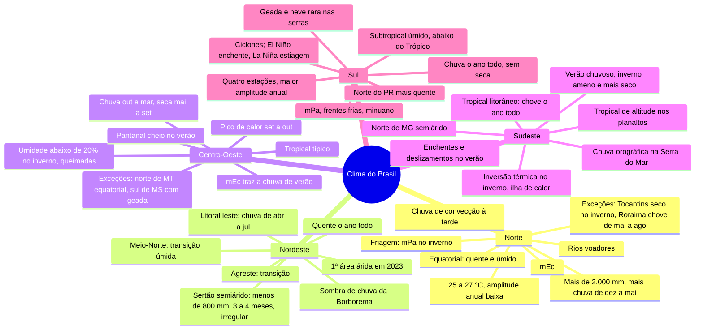

# Geografia — Clima das Regiões Brasileiras

> Pedido da Laura em 07/10/2026: clima de cada região, para Insper, FGV e ENEM. Não veio de aula: é o conteúdo-padrão
> de livro didático, conferido com a apostila de biomas (01/10) para os números baterem.
> ⭐ = tema que já caiu na FGV, com o id da questão no banco de provas antigas.
> Mapa do clima + 51 flashcards, feitos em 07/10/2026.
> Versão interativa (régua do ano por região, cards que viram, filtro por região e por tipo, sabia/revisar): https://claude.ai/artifact/X4jjr4UUB9ipSuWo5V47j4
> Abrir no Mac mesmo sem internet: `clima-do-brasil.html`, nesta pasta.

**O fio em uma frase:** quase todo o Brasil é quente; o que separa as regiões é **quando chove** e **quanto
esfria**. O Norte chove o ano todo, o Sertão quase não chove, o Centro-Oeste seca no inverno, o litoral
nordestino chove no inverno e o Sul esfria de verdade.

**No banco da FGV (2021.1–2026.1):** clima caiu em 4 das 6 provas, sempre na discursiva (efeito estufa,
matriz energética, água e rios voadores). O clima de cada região nunca caiu sozinho; o elo é a 2024.1-DIS-CH6
(rios voadores). Insper e ENEM não estão no banco.

## O ano de cada região

Verão e inverno falam de **temperatura**; chuvoso e seco falam de **chuva**. Não confundir.

| Região | Chuva ao longo do ano | Temperatura ao longo do ano |
|---|---|---|
| **Norte** (Equatorial) | Chuvoso dez–mai · chove menos jun–nov, sem seca | Quente o ano todo |
| **Nordeste · Sertão** (Semiárido) | Chuva em 3 a 4 meses entre dez e mai, irregular · seco jun–nov | Quente o ano todo |
| **Nordeste · litoral leste** (Tropical litorâneo) | Chuvoso abr–jul · chove menos ago–mar | Quente o ano todo |
| **Centro-Oeste** (Tropical típico) | Chuvoso out–mar · abr de transição · seco mai–set | Quente ago–abr (pico em set–out) · ameno mai–jul |
| **Sudeste · interior** (Tropical e de altitude) | Chuvoso out–mar · transição abr–mai e set · seco jun–ago | Quente out–mar · ameno abr–set (frio nas serras) |
| **Sul** (Subtropical) | Chove o ano todo, sem estação seca | Quente dez–fev · ameno mar–mai e set–nov · frio jun–ago |

- **Norte:** Chove o ano todo. De junho a novembro chove menos, mas não chega a secar.
- **Nordeste · Sertão:** A chuva cai em 3 a 4 meses dentro dessa janela, e em alguns anos quase não vem.
- **Nordeste · litoral leste:** Chove mais no outono e no inverno: o contrário do resto do país.
- **Centro-Oeste:** Verão chuvoso, inverno seco. O calor mais forte vem em setembro e outubro, antes das chuvas.
- **Sudeste · interior:** No interior de MG o inverno é seco de verdade; em SP, só mais seco. Nas serras, frio e geada.
- **Sul:** Chove nas quatro estações. Inverno frio, com geada; neve rara nas serras.

Estações aproximadas: verão de 21/12 a 20/03, inverno de 21/06 a 22/09. Padrão geral; as exceções estão nos cards.

## Fichas por região

### Norte

- **Clima:** Equatorial: quente e úmido
- **Temperatura:** Quente o ano todo (25 a 27 °C). Amplitude anual baixa
- **Chuva:** Muita, mais de 2.000 mm. Mais de dez a mai; menos de jun a nov, sem seca de verdade
- **Marcas de prova:** mEc · chuva de convecção à tarde · rios voadores ⭐ 2024.1 · friagem no inverno
- **Exceções:** Tocantins e sul do PA com inverno seco · Roraima chove de mai a ago

### Nordeste

- **Clima:** Semiárido no Sertão · tropical litorâneo no litoral leste · tropical no oeste · equatorial no oeste do MA
- **Temperatura:** Quente o ano todo. Serras e chapadas mais amenas
- **Chuva:** Sertão: pouca (menos de 800 mm), em 3 a 4 meses, irregular. Litoral leste: chove bem, no outono e inverno (abr–jul)
- **Marcas de prova:** Sombra de chuva da Borborema · rios intermitentes · El Niño agrava a seca · 1ª área árida em 2023
- **Exceções:** Agreste = transição · Meio-Norte (MA, PI) mais úmido

### Centro-Oeste

- **Clima:** Tropical típico: duas estações bem marcadas
- **Temperatura:** Quente; no inverno, dias quentes e noites frescas. Pico de calor em set–out
- **Chuva:** Chuvoso de out a mar; seco de mai a set (pior em ago–set). 1.200 a 1.800 mm
- **Marcas de prova:** Umidade do ar abaixo de 20% no inverno · queimadas · mEc traz a chuva de verão · cheia do Pantanal no verão
- **Exceções:** Norte de MT equatorial · sul de MS com frentes frias e geada

### Sudeste

- **Clima:** Tropical de altitude nos planaltos · tropical litorâneo no litoral · tropical no interior · semiárido no norte de MG
- **Temperatura:** Verão quente; inverno ameno; frio e geada nas serras
- **Chuva:** Chuvoso de out a mar; inverno mais seco no interior. O litoral chove o ano todo
- **Marcas de prova:** Chuva orográfica na Serra do Mar · temporais e deslizamentos no verão · inversão térmica e ilha de calor
- **Exceções:** Norte de MG semiárido · serras (Mantiqueira) frias

### Sul

- **Clima:** Subtropical úmido: quatro estações
- **Temperatura:** Verão quente; inverno frio, com geada e neve rara nas serras. Maior amplitude anual do país
- **Chuva:** Bem distribuída o ano todo, sem estação seca
- **Marcas de prova:** mPa e frentes frias · minuano · ciclones extratropicais · El Niño = enchente; La Niña = estiagem
- **Exceções:** Norte do PR mais quente, com chuva de verão · serras mais frias · litoral menos frio

## Massas de ar

Só uma é fria (mPa) e só uma é seca (mTc).

| Massa | Como é | Onde nasce | O que faz no Brasil |
|---|---|---|---|
| **mEc** (Equatorial continental) | quente e úmida | Amazônia | Chuva o ano todo no Norte; no verão leva chuva ao Centro-Oeste e ao Sudeste |
| **mEa** (Equatorial atlântica) | quente e úmida | Atlântico, perto do Equador | Umidade no litoral do Norte e do Nordeste |
| **mTa** (Tropical atlântica) | quente e úmida | Atlântico Sul | Atua o ano todo no litoral, do Nordeste ao Sul; chuva na Serra do Mar |
| **mTc** (Tropical continental) | quente e seca | Chaco (Paraguai, Bolívia, Argentina) | Tempo quente e seco numa área pequena do interior: Centro-Oeste e oeste de SP e do PR |
| **mPa** (Polar atlântica) | fria e úmida | Atlântico Sul, perto da Patagônia | Inverno: frentes frias, geada e neve rara no Sul, friagem na Amazônia |

## Mapa mental

## Flashcards

Clique na pergunta para abrir a resposta. Entre colchetes, o tipo do card: clima, temperatura, chuva,
massas e fenômenos, ou exceções.

### Norte

> [!question]- 1. Qual é o clima predominante na Região Norte? [clima]
> **Equatorial**: quente e úmido o ano todo.
> Por quê: a região fica perto da **linha do Equador** (Sol forte o ano inteiro), e a floresta e os rios soltam muita umidade.

> [!question]- 2. Como são as temperaturas no clima equatorial? [temperatura]
> **Quentes o ano todo**: média de 25 a 27 °C.
> Verão e inverno quase iguais: **amplitude térmica anual baixa**.
> Detalhe de prova: a diferença entre o dia e a noite costuma ser maior que a diferença entre os meses.

> [!question]- 3. Como é a chuva no Norte ao longo do ano? [chuva]
> **Muita chuva**: mais de 2.000 mm por ano.
> - **Mais chuvoso:** dezembro a maio
> - **Menos chuvoso:** junho a novembro
> Na maior parte da região **não existe seca de verdade**: só chove menos.

> [!question]- 4. Que chuva cai quase todo fim de tarde na Amazônia, e por quê? [chuva]
> **Chuva de convecção** (convectiva).
> O calor da manhã evapora a água da floresta e dos rios → o ar quente e úmido **sobe**, esfria e condensa → pancada à tarde.

> [!question]- 5. O que é o "inverno amazônico"? [chuva]
> É como o povo do Norte chama a **época de mais chuva** (dez–mai). A de menos chuva (jun–nov) vira o "verão".
> **Não tem a ver com frio**: a temperatura quase não muda. Na prova, inverno é a estação do meio do ano.

> [!question]- 6. Qual massa de ar se forma na Amazônia, e como ela é? [massas e fenômenos]
> **mEc (Equatorial continental)**: quente e úmida.
> Garante a chuva do Norte e, no **verão**, avança e leva chuva ao Centro-Oeste e ao Sudeste.

> [!question]- 7. Qual fenômeno pode provocar queda de temperatura na Amazônia? [massas e fenômenos]
> A **friagem**.
> No **inverno**, a massa **Polar atlântica (mPa)** sobe pelo interior do continente, entre os Andes e o Planalto Brasileiro, e chega ao sudoeste da Amazônia (AC, RO, sul do AM).
> A temperatura despenca de repente e fica baixa por alguns dias.

> [!question]- 8. O que são os rios voadores? [massas e fenômenos]
> Umidade que sai da **transpiração da floresta** amazônica, é levada pelos ventos, **barrada pelos Andes** e desviada para o **Centro-Oeste, o Sudeste e o Sul**, onde vira chuva.
> Desmatar a Amazônia = menos chuva nessas regiões.
> ⭐ 2024.1-DIS-CH6

> [!question]- 9. Quais são as exceções ao clima equatorial no Norte? [exceções]
> - **Tocantins e sul do Pará:** clima tropical, com **inverno seco** (mai–set), igual ao Centro-Oeste
> - **Roraima:** fica ao norte do Equador, então o calendário muda: chove mais de **maio a agosto**, e a seca é de **dezembro a março**

### Nordeste

> [!question]- 10. Quais são os climas do Nordeste, e onde fica cada um? [clima]
> - **Semiárido:** Sertão (interior)
> - **Tropical litorâneo (úmido):** litoral leste, a Zona da Mata
> - **Tropical:** oeste (oeste da BA, sul do MA e do PI)
> - **Equatorial:** oeste do Maranhão
> O **Agreste** fica no meio, como transição.

> [!question]- 11. Como é a temperatura no Nordeste? [temperatura]
> **Quente o ano todo** em quase toda a região, com **amplitude térmica anual baixa**.
> Exceção: **serras e chapadas** (Planalto da Borborema, Chapada Diamantina) são mais amenas, por causa da altitude.

> [!question]- 12. Como funciona o regime de chuvas do clima semiárido? [chuva]
> - **Pouca chuva:** em geral menos de 800 mm por ano
> - **Concentrada:** 3 a 4 meses, entre o verão e o outono
> - **Irregular:** há anos de seca forte
> O resto do ano é **seco**. Evapora mais do que chove, por isso a maioria dos rios é **intermitente**.

> [!question]- 13. Quando chove no Sertão? [chuva]
> Depende da parte:
> - **Norte do Sertão (CE, RN):** fevereiro a maio, a "quadra chuvosa"
> - **Sul do Sertão (BA):** mais no verão, por volta de novembro a março
> No resto do ano, seca. O sertanejo chama a época da chuva de **"inverno"**, mesmo sendo quente.

> [!question]- 14. Por que chove tão pouco no Sertão? [chuva]
> - **Relevo:** a umidade do mar descarrega na encosta do **Planalto da Borborema** e das chapadas, virada para o litoral. Do outro lado, o ar chega seco: é a **sombra de chuva**
> - As massas de ar úmidas chegam **fracas** ao interior
> - **Calor forte** = muita evaporação
> - O **El Niño** agrava as secas

> [!question]- 15. Como é o clima do litoral leste do Nordeste (Recife, Salvador)? [chuva]
> **Tropical litorâneo (úmido)**: quente o ano todo e chuvoso.
> A pegadinha: a chuva se concentra no **outono e no inverno (abr–jul)**, não no verão. Vem da umidade da massa **Tropical atlântica (mTa)** e das **frentes frias** que chegam ao litoral no meio do ano.

> [!question]- 16. O que é o Agreste, do ponto de vista do clima? [exceções]
> A **faixa de transição** entre a Zona da Mata (úmida) e o Sertão (seco).
> Chove mais que no Sertão e menos que no litoral. As partes altas, como a Borborema, são mais amenas.

> [!question]- 17. O que um estudo de 2023 achou no semiárido? [massas e fenômenos]
> A **primeira área de clima árido** do Brasil (e não só semiárido), no **norte da Bahia**, com cerca de 5.700 km² (INPE e Cemaden).
> Sinal de que o semiárido está ficando mais seco.

> [!question]- 18. Como é o clima do Meio-Norte (Maranhão e Piauí)? [exceções]
> **Transição** entre a Amazônia úmida e o Sertão seco.
> - **Oeste do MA:** equatorial, bem chuvoso
> - **Rumo ao PI:** tropical, com chuva de janeiro a abril e seca no segundo semestre
> É a área da **Mata dos Cocais** (babaçu e carnaúba).

### Centro-Oeste

> [!question]- 19. Qual é o clima predominante no Centro-Oeste? [clima]
> **Tropical típico** (também chamado de continental ou semiúmido).
> Marca registrada: **duas estações bem definidas**, verão chuvoso e inverno seco. É o clima do Cerrado.

> [!question]- 20. Quando ocorre o período chuvoso no Centro-Oeste? [chuva]
> - **Chuvoso:** outubro a março (às vezes até abril), na primavera e no verão
> - **Seco:** maio a setembro, no inverno. O pior é em agosto e setembro
> No total chove bem, 1.200 a 1.800 mm por ano. O problema é que vem tudo concentrado.

> [!question]- 21. Como é a temperatura no Centro-Oeste ao longo do ano? [temperatura]
> **Quente** na maior parte do ano.
> **Inverno:** dias quentes e noites frescas.
> Pegadinha: o **calor mais forte** costuma vir em **setembro e outubro**, no fim da seca e antes das chuvas, e não no meio do verão.

> [!question]- 22. O que acontece com a umidade do ar no inverno do Centro-Oeste? [massas e fenômenos]
> **Cai muito.** Em Brasília, pode ficar abaixo de 20% em agosto e setembro, nível de alerta para a saúde.
> Ar seco + vegetação seca = **queimadas** e fumaça.
> O céu limpo também aumenta a **amplitude térmica diária**: o calor do dia escapa à noite.

> [!question]- 23. Qual massa de ar traz a chuva de verão ao Centro-Oeste? [massas e fenômenos]
> A **mEc (Equatorial continental)**, quente e úmida, que vem da Amazônia, junto com os **rios voadores**.
> No inverno ela recua para o norte, e o ar seco toma conta.

> [!question]- 24. Como o clima explica a cheia do Pantanal? [chuva]
> As **chuvas de verão** (out–mar) enchem os rios da bacia do Paraguai, e a planície alaga: é a **cheia**.
> No **inverno seco**, a água baixa: vazante e seca.

> [!question]- 25. Quais são as exceções de clima no Centro-Oeste? [exceções]
> - **Norte de MT:** equatorial (Amazônia), mais úmido e com seca mais curta
> - **Sul de MS:** inverno mais frio, com frentes frias e até geada
> - **Planalto Central** (Brasília, a mais de 1.000 m): um pouco mais ameno

### Sudeste

> [!question]- 26. Quais são os climas do Sudeste, e onde fica cada um? [clima]
> - **Tropical de altitude:** planaltos e serras (SP, sul de MG, serras do RJ e do ES)
> - **Tropical litorâneo (úmido):** litoral
> - **Tropical típico:** interior (oeste de SP e de MG)
> - **Semiárido:** norte de MG
> O que explica a variedade: o **relevo** e a distância do mar.

> [!question]- 27. O que muda no clima tropical de altitude? [temperatura]
> O calendário é o do tropical (verão chuvoso, inverno mais seco), mas a **altitude deixa tudo mais ameno**: cerca de 0,6 °C a menos a cada 100 m.
> Verão menos quente, inverno frio, com **geada nas serras** (Mantiqueira, Campos do Jordão).

> [!question]- 28. Como são o verão e o inverno no Sudeste? [temperatura]
> - **Verão:** quente e chuvoso, com temporais de fim de tarde
> - **Inverno:** ameno e mais seco no interior; frio nas serras
> Chuva concentrada de **outubro a março**. No interior de MG o inverno é seco de verdade; em São Paulo, só mais seco.

> [!question]- 29. Como é o clima do litoral do Sudeste? [chuva]
> **Tropical litorâneo (úmido):** quente e úmido, chove o ano todo (mais no verão).
> A umidade da **mTa** bate na **Serra do Mar**, sobe e vira **chuva orográfica**: a encosta da serra está entre as áreas mais chuvosas do país.

> [!question]- 30. Por que o verão do Sudeste tem enchentes e deslizamentos? [massas e fenômenos]
> **Chuva forte e concentrada** + **serras íngremes** + **desmatamento e ocupação** das encostas.
> Exemplos: Região Serrana do RJ (2011) e São Sebastião (2023).

> [!question]- 31. O que é inversão térmica, e quando ela piora em São Paulo? [massas e fenômenos]
> Normalmente o ar perto do chão é mais quente, sobe e leva a poluição embora.
> Na inversão, uma camada de **ar quente fica por cima do ar frio** e funciona como tampa: a **poluição fica presa**.
> É mais comum no **inverno**: noites frias, ar seco e pouco vento.

> [!question]- 32. O que é ilha de calor? [massas e fenômenos]
> O **centro das grandes cidades** fica mais quente que a periferia e o campo.
> Causas: asfalto e concreto guardam calor, há pouca vegetação e pouca água, os prédios barram o vento, e carros e indústrias soltam calor.

> [!question]- 33. Quais são as exceções de clima no Sudeste? [exceções]
> - **Norte de MG:** semiárido, como o Sertão
> - **Serras** (Mantiqueira, alto da Serra do Mar): frio e geada no inverno
> - **Litoral:** chove o ano todo, sem seca

### Sul

> [!question]- 34. Qual é o clima predominante no Sul, e por que ele é diferente? [clima]
> **Subtropical (úmido).**
> A região fica quase toda **abaixo do Trópico de Capricórnio**, mais longe do Equador. Por isso é a mais fria do país e tem **quatro estações bem definidas**.

> [!question]- 35. Como são as temperaturas no Sul ao longo do ano? [temperatura]
> - **Verão (dez–fev):** quente nas áreas baixas, ameno nas serras
> - **Outono e primavera:** amenos
> - **Inverno (jun–ago):** frio, com geada frequente
> É a região com a **maior amplitude térmica anual** e as menores médias do país.

> [!question]- 36. Como é a chuva no Sul? [chuva]
> **Bem distribuída o ano todo.** Não tem estação seca.
> Essa é a grande diferença: no Sul não existe o esquema "verão chuvoso, inverno seco".
> Chuva **frontal** (frentes frias) o ano todo, **convectiva** no verão e **orográfica** nas serras.

> [!question]- 37. Onde neva no Brasil? [temperatura]
> Nas **áreas mais altas do Sul**: Serra Catarinense (São Joaquim, Urubici) e Campos de Cima da Serra, no RS.
> Só no **inverno**, com ar polar, e **não é todo ano**.

> [!question]- 38. Qual massa de ar mais marca o inverno do Sul? [massas e fenômenos]
> A **mPa (Polar atlântica)**: fria e úmida.
> Chega em **frentes frias**: chuva na passagem, depois céu limpo, frio forte e geada.
> No RS, depois da frente fria, sopra o **minuano**: vento frio e seco do sudoeste.

> [!question]- 39. O que é geada, e quando ela acontece? [massas e fenômenos]
> **Gelo que se forma sobre plantas e solo** quando a temperatura perto do chão chega a 0 °C ou menos.
> Acontece em **noites de inverno frias, de céu limpo e sem vento**, depois de uma frente fria. Prejudica lavouras: a geada de 1975 acabou com boa parte do café do Paraná.

> [!question]- 40. Que fenômenos extremos atingem o Sul? [massas e fenômenos]
> - **Ciclones extratropicais:** ventos fortes e muita chuva (RS, 2023)
> - **Furacão Catarina** (SC, 2004): raríssimo no Atlântico Sul
> - **El Niño:** chuva acima da média e enchentes (RS, maio de 2024)
> - **La Niña:** estiagem e perdas na safra

> [!question]- 41. Quais são as exceções de clima no Sul? [exceções]
> - **Norte do Paraná:** o Trópico de Capricórnio passa ali; mais quente, chuva concentrada no verão, geada mais rara
> - **Serras e planaltos** (Curitiba, Serra Catarinense): mais frios, verão ameno
> - **Litoral:** mais úmido e menos frio

### Comparando regiões

> [!question]- 42. Qual região apresenta maior influência do clima subtropical? [clima]
> **Sul.** É a única região quase toda abaixo do Trópico de Capricórnio.
> Só o norte do Paraná fica acima dele, e já tem cara de tropical.

> [!question]- 43. Quais são as massas de ar que atuam no Brasil? [massas e fenômenos]
> - **mEc:** quente e úmida · Amazônia
> - **mEa:** quente e úmida · Atlântico, perto do Equador
> - **mTa:** quente e úmida · Atlântico Sul
> - **mTc:** quente e **seca** · Chaco (Paraguai, Bolívia, Argentina)
> - **mPa:** **fria** e úmida · Atlântico Sul, perto da Patagônia
> Para memorizar: só uma é fria (mPa) e só uma é seca (mTc).

> [!question]- 44. Quais são os três tipos de chuva, e onde cada um marca o Brasil? [chuva]
> - **Convectiva:** o calor faz o ar úmido subir. Amazônia todo dia; temporais de verão no CO e no SE
> - **Orográfica:** o vento úmido sobe a serra. Serra do Mar; Borborema
> - **Frontal:** massa fria encontra massa quente. Sul o ano todo; Sudeste e litoral do NE no inverno

> [!question]- 45. Qual região tem a maior amplitude térmica anual? E a menor? [temperatura]
> **Maior: Sul**, com verão quente e inverno frio.
> **Menor: Norte**, quente o ano todo, perto do Equador.

> [!question]- 46. Onde chove mais e onde chove menos no Brasil? [chuva]
> **Mais:** Norte (Amazônia), além de pontos como a encosta da Serra do Mar.
> **Menos:** Sertão nordestino (semiárido), em geral abaixo de 800 mm por ano.

> [!question]- 47. Quais áreas têm verão chuvoso e inverno seco? [chuva]
> As de **clima tropical típico**, o clima do Cerrado: **Centro-Oeste**, interior do **Sudeste**, **Tocantins**, oeste da Bahia e sul do Maranhão e do Piauí.
> Chuva de outubro a março; seca de maio a setembro.

> [!question]- 48. Onde a chuva se concentra no outono e no inverno? [chuva]
> No **litoral leste do Nordeste** (Recife, Salvador, Maceió), de abril a julho.
> É o contrário do Centro-Oeste e do Sudeste, onde chove no verão. Num climograma, barras altas no meio do ano entregam o litoral nordestino.

> [!question]- 49. Verão e período chuvoso são a mesma coisa? [chuva]
> **Não.** Verão e inverno falam de **temperatura** (estação do ano). Chuvoso e seco falam de **chuva**.
> - **CO e SE:** coincidem (verão chuvoso, inverno seco)
> - **Litoral leste do NE:** chove no inverno
> - **Sul:** chove nas quatro estações
> - **Norte e Sertão:** chamam a época da chuva de "inverno", mesmo quente

> [!question]- 50. El Niño × La Niña: o que cada um faz no Brasil? [massas e fenômenos]
> **El Niño** (Pacífico aquecido): **Sul** com chuva acima da média e enchentes; **Norte e Nordeste** mais secos.
> **La Niña** (Pacífico resfriado): o contrário. Sul com estiagem; Norte e Nordeste com mais chuva.

> [!question]- 51. Que fatores explicam as diferenças de clima entre as regiões? [clima]
> - **Latitude:** quase todo o país fica entre os trópicos, por isso é quente; o Sul fica abaixo
> - **Altitude:** serras e planaltos são mais frescos
> - **Massas de ar:** qual chega, e quando
> - **Mar × interior:** o litoral é mais úmido e varia menos de temperatura
> - **Relevo:** barra ou força a chuva

## 🔗 Relacionados

[[Cursinho-projeto]]
