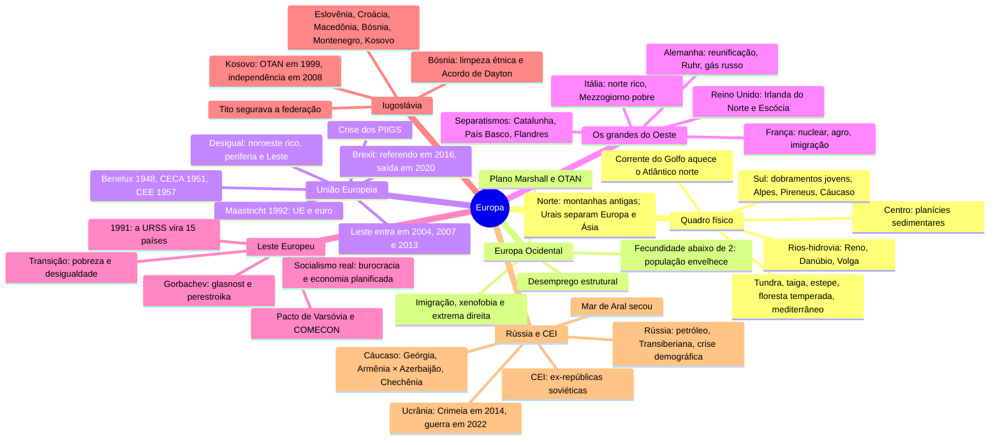

# Geografia — Europa: União Europeia e Leste Europeu

> Frente 2, Aula 11 (Caderno 3 de Geografia, páginas 117 a 146). Mapa mental + 47 flashcards, feitos em 28/09/2026.
> ⭐ = tema que já caiu na FGV, com o id da questão no banco de provas antigas.
> Versão interativa (cards que viram, marcação sabia/revisar): https://claude.ai/artifact/7QMCoANtdc8oAu7FtzyTs7
> Abrir no Mac mesmo sem internet: `europa-uniao-europeia-e-leste-europeu.html`, nesta pasta.
> Para imprimir o mapa mental (2 folhas A4 deitadas): `europa-uniao-europeia-e-leste-europeu-mapa.pdf`, nesta pasta.
> Os mesmos cards também estão no baralho do trajeto (`flashcards-geografia.md`, 77 a 121), menos os dois
> da discursiva de 2025.1, que já estavam lá (card 49).

**O fio da aula em uma frase:** a Guerra Fria partiu a Europa em duas. O Oeste capitalista se
juntou para depender menos dos EUA e virou a União Europeia, rica mas desigual. O Leste socialista
desabou entre 1989 e 1991 e ainda paga a transição: a Iugoslávia em pedaços, a Rússia contra o
avanço da OTAN e a guerra na Ucrânia.

**Dados da apostila que envelheceram:**
- A UE tem **27** países, não 28: o Reino Unido saiu em 31/01/2020 (Brexit).
- A zona do euro tem **21** países, não 19: entraram a Croácia (2023) e a Bulgária (01/01/2026).
- A ofensiva do Azerbaijão que tomou Nagorno-Karabakh e expulsou os armênios foi em **setembro de 2023**, não em 2022.
- O chanceler da Alemanha desde maio de 2025 é **Friedrich Merz** (centro-direita), não mais Olaf Scholz.
- A Conferência de Potsdam foi em **1945**; 1949 é o ano em que nasceram as duas Alemanhas.

## Mapa mental

## Flashcards

### Quadro físico

> [!question]- 1. Europa Ocidental × Leste Europeu: qual é o critério, e por que a divisão é imprecisa?
> **Critério:** a qualidade de vida. A **Ocidental** é capitalista, desenvolvida e democrática, com
> as cinco grandes economias (Alemanha, França, Reino Unido, Itália e Espanha). O **Leste** foi
> socialista até o fim dos anos 1980 e virou capitalista nos anos 1990.
> **É imprecisa** porque há desigualdade dentro de cada parte: a Itália tem o norte rico e o sul
> pobre (Mezzogiorno), e no Leste a Polônia, a Rep. Tcheca, a Hungria e a Eslovênia vão bem melhor
> que a Romênia ou a Albânia.

> [!question]- 2. Como é o relevo da Europa, de norte a sul?
> **Norte:** escudos cristalinos e montanhas **antigas**, gastas pela erosão: Alpes Escandinavos,
> Maciço Central francês e **Montes Urais**, que com o rio Ural separam a Europa da Ásia.
> **Centro:** planícies e baixos planaltos em bacias sedimentares, ao longo dos grandes rios:
> planície russa, germano-polonesa e parisiense.
> **Sul:** dobramentos **jovens** e altos, da Era Cenozoica (Terciário): Alpes, Apeninos, Pireneus
> (França × Espanha), Cárpatos, Bálcãs, Alpes Dináricos e Cáucaso.

> [!question]- 3. Por que os rios Reno, Danúbio e Volga importam?
> São hidrovias que ligam países e escoam mercadorias.
> - **Reno:** nasce nos Alpes suíços, corre na fronteira França × Alemanha, cruza a área mais
>   industrial da Europa e deságua no Mar do Norte, junto ao porto de **Roterdã**.
> - **Danúbio:** passa por 8 países e integra o Leste Europeu. Um canal pelo rio Meno liga o Reno ao
>   Danúbio.
> - **Volga:** o maior rio da Europa, na Rússia.
> Os três sofrem com poluição industrial, pior no Leste, onde a indústria é mais atrasada.

> [!question]- 4. O que a Corrente do Golfo faz com a Europa?
> É uma corrente marítima **quente** que aquece o litoral do Atlântico norte. O mar não congela (a
> pesca da Noruega funciona o ano todo) e o **clima temperado oceânico** fica ameno no Reino Unido,
> na Irlanda, nos Países Baixos, na Bélgica e na França.

> [!question]- 5. Quais são os climas da Europa, e a vegetação de cada um?
> - **Subpolar e polar** (extremo norte e altas montanhas): tundra.
> - **Temperado continental** (longe do mar, inverno seco e muito frio): **taiga**, a floresta de
>   coníferas, a maior do planeta em extensão e com pouca biodiversidade; e **estepes** (campos) na
>   Ucrânia e na Rússia.
> - **Temperado oceânico** (perto do Atlântico): floresta temperada caducifólia, quase toda
>   devastada.
> - **Mediterrâneo** (sul): verão quente e **seco**, inverno úmido; maquis e garrigue, com oliveira
>   e sobreiro.

### Europa Ocidental

> [!question]- 6. Plano Marshall e OTAN: o que foram?
> **Plano Marshall:** dinheiro dos EUA para reconstruir a Europa Ocidental depois da 2ª Guerra. Em
> troca, os europeus compravam de preferência produtos americanos. O objetivo político era **conter
> a influência soviética**.
> **OTAN (1949):** aliança militar dos EUA com a Europa Ocidental, o Canadá e a Turquia contra o
> bloco socialista. Depois do fim da URSS, **avançou para o Leste** (Polônia, Rep. Tcheca, países
> bálticos), e a Rússia vê isso como ameaça.
> ⭐ Caiu na FGV: 2026.1-OBJ-54 (texto do governo Truman, de 1949, sobre ajuda econômica para
> garantir a paz).

> [!question]- 7. Por que a população europeia envelhece, e que problema isso cria?
> **Causa:** natalidade muito baixa. A fecundidade está abaixo de 2 filhos por mulher, menos que a
> **taxa de reposição**, e a expectativa de vida chega a 80 anos. Na Suécia, os idosos passam de 20%
> da população; a Rússia perde gente.
> **Problema:** faltam trabalhadores e cresce o peso da previdência. Os incentivos para ter filhos
> (Suécia, Itália) quase não funcionaram.
> **Saída:** imigração. A ONU calculou 1,5 milhão de imigrantes por ano até 2050 só para manter a
> população em idade de trabalhar.
> ⭐ Caiu na FGV: 2025.1-DIS-CH5 e 2026.1-DIS-CH8 (envelhecimento populacional).

> [!question]- 8. O que é desemprego estrutural, e por que atinge a Europa?
> É o desemprego que não acaba quando a economia melhora, porque a vaga deixou de existir: a
> **modernização tecnológica** substituiu o trabalhador.
> Na Europa, somam-se o baixo crescimento econômico e as demissões nas estatais privatizadas.

> [!question]- 9. Imigrantes na Europa Ocidental: como vivem e como são recebidos?
> Até os anos 1980, a prosperidade atraiu imigrantes de países pobres. Eles ganham menos, fazem os
> trabalhos menos qualificados, às vezes sem proteção trabalhista, e moram em bairros pobres das
> metrópoles.
> Sofrem preconceito racial e religioso. Grupos de extrema direita e neonazistas atacam sua presença
> (Alemanha, Áustria, França, Reino Unido).
> Em **Paris, 2005**, jovens descendentes de africanos queimaram milhares de carros nas periferias,
> em resposta à exclusão, ao racismo e ao desemprego.

> [!question]- 10. Qual é a contradição da xenofobia na Europa?
> **Por que a extrema direita cresce:** a crise do Estado de bem-estar social, o desemprego e a
> mudança tecnológica rápida geram insegurança. Culpar o estrangeiro pelo desemprego e pelo crime é
> uma resposta simples, e atrai votos.
> **A contradição:** a Europa envelhece e **precisa** de imigrantes para ter quem trabalhe e pague a
> previdência. O discurso nacionalista vai contra o interesse do próprio país.

### União Europeia

> [!question]- 11. Como começou a integração europeia? (Benelux, CECA e CEE)
> **Por quê:** depois da 2ª Guerra, a Europa Ocidental dependia dos EUA. Para se recuperar e
> competir com EUA e Japão, precisou superar rivalidades antigas; a chave foi o acordo entre
> **França e Alemanha**.
> - **1948, Benelux:** Bélgica, Holanda e Luxemburgo.
> - **1951, CECA** (Tratado de Paris): livre circulação de carvão, ferro e aço entre o Benelux, a
>   Alemanha Ocidental, a França e a Itália.
> - **1957, CEE** (Tratado de Roma): os mesmos 6 levam a integração para toda a economia. Depois
>   entram Reino Unido, Irlanda e Dinamarca (1973), Grécia (1981), Espanha e Portugal (1986).

> [!question]- 12. O que mudou com o Tratado de Maastricht (1992)?
> A CEE vira **União Europeia** e se compromete a criar uma **moeda única**.
> Para entrar no euro, cada país fez a "lição de casa": baixar inflação e juros, controlar o câmbio
> e o déficit público, e aprovar a adesão em plebiscito.
> Banco Central Europeu em **Frankfurt** (1998). Em 1995 entram Áustria, Suécia e Finlândia. Ficaram
> de fora por decisão popular: **Suíça, Noruega e Islândia**.
> Exercício 4 da apostila, da FGV (gabarito D): com Maastricht, as empresas passaram a escolher onde
> produzir pensando no mercado de toda a UE.

> [!question]- 13. Como a UE se expandiu para o Leste?
> - **2004:** Estônia, Letônia, Lituânia, Polônia, Rep. Tcheca, Eslováquia, Hungria, Eslovênia,
>   Malta e Chipre.
> - **2007:** Bulgária e Romênia (com corrupção, discriminação de ciganos e turcos e baixa
>   produtividade para resolver).
> - **2013:** Croácia.
> **Turquia:** candidata, mas barrada por ser muçulmana e populosa, pelos direitos humanos
> (repressão aos curdos) e pelas finanças.
> Hoje são **27** países (o Reino Unido saiu em 2020). Depois da invasão russa, **Ucrânia e
> Moldávia** viraram candidatas (2022).

> [!question]- 14. UE: como o PIB por habitante divide o espaço europeu?
> A UE é **desigual** entre os países e dentro deles:
> - **Centro rico:** os países do noroeste, muito urbanizados.
> - **Periferia mais pobre:** os mediterrâneos.
> - **O Leste** aumentou a desigualdade: entrou com PIB por habitante bem menor.
> - **Dentro de um país:** a Itália, com o norte rico e o sul pobre.
> Foi o item (a) da discursiva. Para nota cheia, a banca pediu **duas** diferenças espaciais.
> ⭐ Caiu na FGV: 2025.1-DIS-CH8 (a) (União Europeia e PIB por habitante).

> [!question]- 15. Cite dois ganhos da entrada do Leste Europeu na UE.
> Da grade da FGV (vale quaisquer dois):
> - Mais **mercado consumidor** (cerca de 100 milhões de pessoas) e mais **mão de obra**.
> - A passagem para a economia de mercado atraiu muito **investimento de capital** (como fez a
>   Alemanha no seu lado oriental).
> - **Modernização da infraestrutura** de transportes para integrar o Leste.
> - As regras da UE dão **estabilidade e segurança** ao investimento.
> ⭐ Caiu na FGV: 2025.1-DIS-CH8 (b) (a entrada do Leste Europeu na UE).

> [!question]- 16. Zona do euro, Schengen e Tratado de Lisboa: o que é cada um?
> **Zona do euro:** os países que trocaram a sua moeda pelo euro. Hoje são **21** (a apostila diz
> 19: depois entraram a Croácia, em 2023, e a Bulgária, em 2026). Suécia, Dinamarca, Polônia,
> Hungria, Rep. Tcheca e Romênia seguem fora.
> **Schengen:** livre circulação de pessoas, sem controle nas fronteiras internas.
> **Lisboa:** reforma das regras de funcionamento da UE (a "Constituição").

> [!question]- 17. Crise da zona do euro: quem foi mais atingido, e por quê?
> Os **PIIGS**: Portugal, Irlanda, Itália, Grécia e Espanha, além do Chipre.
> Os problemas: **déficit público** alto e **dívida** alta. No Chipre, crise nos bancos.
> Veio depois da crise financeira mundial de 2008.

> [!question]- 18. Brexit: quem votou para sair, e quem votou para ficar?
> Referendo em **2016**; a saída valeu em janeiro de **2020**.
> **Sair:** idosos, conservadores, extrema direita contra imigrantes e refugiados, parte da esquerda
> e os insatisfeitos com a crise e o desemprego. Venceu na **Inglaterra** e no **País de Gales**.
> **Ficar:** jovens, progressistas e as grandes cidades, como **Londres**, além da **Escócia** e da
> **Irlanda do Norte**.
> O caso **Cambridge Analytica** (dados roubados do Facebook, a serviço da ultradireita) mostrou o
> peso das redes e das *fake news* no resultado.

> [!question]- 19. Quais são as consequências do Brexit?
> **Econômicas:** perda de parceiros comerciais, fuga de empresas (Londres perde), empregos em risco
> para britânicos na UE e estrangeiros no Reino Unido.
> **Geopolíticas:** reforça o **separatismo escocês** (a Escócia votou para ficar e tem o petróleo e
> o gás do Mar do Norte); cria problema de fronteira entre a **Irlanda** (na UE) e a **Irlanda do
> Norte** (fora dela); reacende a disputa entre a Espanha e **Gibraltar**.
> E deixou o país polarizado.

### Os grandes do Oeste

> [!question]- 20. Alemanha: como foi a divisão e a reunificação?
> Depois da 2ª Guerra, o país foi dividido em zonas de ocupação, e em 1949 nasceram a **RFA**
> (capitalista, aliada de EUA, França e Reino Unido) e a **RDA** (socialista, ligada à URSS). Berlim
> também foi dividida, pelo **Muro**.
> O Muro caiu em **novembro de 1989**, e a reunificação veio em **3/10/1990**, com a RDA incorporada
> à RFA.
> O custo: empresas do leste fechadas, desemprego e salários mais baixos no leste até hoje (o "muro
> na cabeça").
> A apostila fala em "Tratado de Potsdam (1949)": a Conferência de Potsdam foi em 1945; 1949 é o ano
> dos dois Estados.

> [!question]- 21. Onde se concentra a indústria alemã?
> **Vale do Ruhr (Renânia):** a maior concentração urbano-industrial da Europa (Colônia, Essen,
> Dortmund, Duisburg, Düsseldorf). Cresceu no século XIX por causa do carvão, da mão de obra, do
> mercado e da hidrovia do **Reno**. Siderurgia, metalurgia, química e armas (Thyssen, Krupp). Hoje
> troca a indústria pesada por alta tecnologia e serviços.
> **Sul:** Munique (tecnopolo: BMW, Audi, Siemens) e Stuttgart (Mercedes-Benz).
> **Frankfurt:** centro financeiro. **Hamburgo:** porto. **Wolfsburg:** Volkswagen. **Leipzig:**
> tecnopolo.

> [!question]- 22. Alemanha hoje: quais são os desafios?
> Perdeu o **gás russo** com as sanções da guerra na Ucrânia e entrou em crise econômica.
> Transição energética: investe em eólica e solar e desligou as usinas nucleares.
> Crescimento da direita e crise demográfica (fecundidade baixa).
> No governo, depois de Merkel (centro-direita) e Scholz (centro-esquerda), o chanceler desde maio
> de 2025 é **Friedrich Merz**, de centro-direita. A apostila ainda fala em Scholz.

> [!question]- 23. França: o que sustenta a economia?
> **Energia nuclear:** com o urânio do Maciço Central, a maior parte da eletricidade vem das usinas
> nucleares (a apostila diz 75%).
> **Agronegócio**, o mais desenvolvido da UE: trigo e vinho nos vales do Sena, do Loire, do Garonne
> e do Ródano.
> Paris e o polo de **La Défense**; carros (Renault, Peugeot, Citroën), química, cosméticos,
> perfumes e vinhos.

> [!question]- 24. França: quais são as tensões sociais e políticas?
> **Imigração e intolerância:** conflitos entre polícia e descendentes de imigrantes (Paris, 2005).
> A proibição de símbolos religiosos e do véu nas escolas é vista como ataque à liberdade religiosa.
> **Terrorismo:** atentados de 2015 (Charlie Hebdo e Bataclan).
> **Reformas:** a aposentadoria passou de 60 para 62 anos (2010). Macron (desde 2017) enfrentou os
> **coletes amarelos** (2018).
> **Oposição:** Mélenchon, na esquerda, e **Marine Le Pen**, na extrema direita, contra imigrantes e
> muçulmanos. A direita cresce.

> [!question]- 25. Reino Unido × Grã-Bretanha × Irlanda: qual é a diferença?
> **Grã-Bretanha:** a ilha, com Inglaterra, Escócia e País de Gales.
> **Reino Unido:** essas três nações mais a **Irlanda do Norte**. Monarquia parlamentarista, maioria
> protestante, capital Londres, um grande centro financeiro. Indústria antiga, ligada ao **carvão**
> (minas fechadas por **Thatcher** nos anos 1980), e petróleo e gás do **Mar do Norte**.
> **República da Irlanda (Eire):** país independente desde o começo dos anos 1920, católico, no sul
> da ilha da Irlanda. Cresceu com educação e tecnologia e sofreu com a crise de 2008.
> Exercício 2 da apostila, da FGV (gabarito B).

> [!question]- 26. Irlanda do Norte (Ulster): quem é maioria, e quem quer o quê?
> **Maioria protestante**, descendente de ingleses e escoceses: quer continuar no Reino Unido.
> **Minoria católica**, nacionalista: quer se unir à República da Irlanda. Os mais radicais formaram
> o **IRA**, de luta armada.
> Acordo de paz em 1998; o IRA anunciou o desarmamento em 2005.
> Exercícios 1 e 3 da apostila (gabarito D nos dois); o 1 é da FGV.

> [!question]- 27. Itália: por que o norte e o sul são tão diferentes?
> **Norte** (vale do Pó e Alpes; Lombardia, Piemonte): rico e industrial. Milão (finanças), Turim
> (Fiat), Gênova (porto), Veneza (turismo); hidrelétricas nos Alpes e agropecuária no vale do Pó.
> Ali atuam grupos de extrema direita e separatistas.
> **Sul, o Mezzogiorno** (Calábria, Sicília, Sardenha): bem mais pobre. O governo criou a **Cassa
> del Mezzogiorno** para industrializar (Nápoles, Bari, Tarento, Palermo).
> O Estado pesa na economia desde o pós-guerra (o conglomerado estatal IRI).
> ⭐ Caiu na FGV: 2025.1-DIS-CH8 (a) (a banca citou a Itália como desigualdade dentro de um país).

> [!question]- 28. Separatismos na Europa Ocidental: onde, e quem?
> **Espanha:** a **Catalunha** (plebiscito de 2017 pela independência) e o **País Basco** (o grupo
> ETA se dissolveu em 2018).
> **Bélgica:** Flandres (flamengos, norte mais rico) × Valônia (valões, de língua francesa).
> Bruxelas é a sede da UE e da OTAN.
> **Reino Unido:** a Escócia (rejeitou a independência no referendo de 2014) e a Irlanda do Norte.
> Exercício 5 da apostila, da FGV (gabarito D: independência da Espanha).

### Leste Europeu

> [!question]- 29. Pacto de Varsóvia × COMECON
> As duas associações da URSS com o Leste Europeu na Guerra Fria:
> **Pacto de Varsóvia:** aliança **militar** (o contrário da OTAN).
> **COMECON:** cooperação **econômica** (o contrário do Plano Marshall).

> [!question]- 30. Por que o socialismo real entrou em crise?
> **Burocracia e autoritarismo:** sem eleições, partido único, repressão e uma elite de burocratas
> com privilégios.
> **Economia planificada e estatal:** sem concorrência, as empresas não tinham por que melhorar.
> Baixa produtividade e atraso tecnológico.
> A URSS era forte em siderurgia, armas, energia nuclear e setor aeroespacial, mas os **bens de
> consumo** eram poucos e ruins.
> Exercício 3 da apostila (gabarito C): Chernobyl (1986) expôs a incompetência soviética na
> tecnologia nuclear.

> [!question]- 31. Glasnost × perestroika
> Reformas de **Gorbachev**, que chegou ao poder em 1985:
> **Glasnost:** abertura **política** (liberdade para criticar o governo na imprensa).
> **Perestroika:** reestruturação **econômica** (empresas privadas, tecnologia).
> Vieram junto os acordos com os EUA para reduzir armas nucleares e a retirada de tropas soviéticas
> do Leste, o que derrubou as ditaduras aliadas.

> [!question]- 32. Como caíram os regimes socialistas, e como acabou a URSS?
> **Queda pacífica:** Bulgária, Hungria e Tchecoslováquia (**Revolução de Veludo**). Na Polônia, a
> oposição cresceu com o sindicato **Solidariedade**.
> **Queda violenta:** Romênia, contra o ditador Ceaușescu.
> **URSS:** o nacionalismo das repúblicas e um golpe fracassado contra Gorbachev acabaram com a
> União Soviética em **1991**, que virou 15 países. Doze fundaram a **CEI**; os bálticos (Estônia,
> Letônia, Lituânia) ficaram fora e entraram na UE em 2004.

> [!question]- 33. Transição para o capitalismo no Leste: o que piorou, e quem se saiu melhor?
> **Piorou:** o Estado cortou saúde e educação e vendeu as estatais. Vieram desemprego, pobreza,
> criminalidade e caos financeiro. Antigos burocratas viraram empresários, e uma minoria enriqueceu.
> **Melhor:** Polônia, Hungria, Rep. Tcheca e Eslovênia, mais industrializadas e hoje área de
> influência de Alemanha, França e Itália.
> **Pior:** Romênia, Sérvia e Albânia.

### Iugoslávia

> [!question]- 34. Como era a Iugoslávia, e o que a mantinha unida?
> Nasceu depois da 1ª Guerra, de terras dos impérios Austro-Húngaro e Otomano: 6 repúblicas (Sérvia,
> Montenegro, Croácia, Eslovênia, Bósnia e Macedônia) e 2 regiões autônomas (Voivodina e Kosovo).
> Povos diferentes: **eslovenos e croatas**, católicos, com alfabeto latino; **sérvios,
> montenegrinos e macedônios**, ortodoxos, com alfabeto cirílico; **bósnios e albaneses**,
> muçulmanos.
> Quem segurava tudo era **Tito**, líder socialista que venceu os nazistas e não aceitava ordens da
> URSS. Ele morreu em 1980, e a crise começou. A **Sérvia** controlava o exército e a economia.

> [!question]- 35. Em que ordem a Iugoslávia se partiu?
> - **Eslovênia:** a primeira, e a mais rica.
> - **Croácia:** guerra contra o exército iugoslavo, controlado pelos sérvios.
> - **Macedônia:** a mais pobre; depois, conflito com a minoria albanesa (2001).
> - **Bósnia-Herzegovina:** plebiscito em 1992 e guerra até 1995.
> - **Montenegro:** referendo em 2006 (55,4%), para entrar mais fácil na UE. A Sérvia perdeu o
>   acesso ao mar.
> - **Kosovo:** independência unilateral em 2008.
> Exercício 1 da apostila (gabarito B: rivalidades étnicas, religiosas e territoriais).

> [!question]- 36. Guerra da Bósnia (1992–95): por que aconteceu, e como terminou?
> Três povos com planos opostos: **muçulmanos (44%)** e **croatas (17%)** queriam a independência;
> os **sérvios (31%)** queriam ficar com a Iugoslávia.
> Cerca de **200 mil mortos**, **limpeza étnica**, campos de concentração, valas comuns e estupros
> em massa.
> **Acordo de Dayton (1995):** a Bósnia continua um país só, com duas partes: a dos sérvios (49% do
> território) e a federação muçulmano-croata (51%). Sarajevo fica unida, e os crimes de guerra vão
> ao Tribunal de Haia.
> Exercício 2 da apostila (gabarito D: Bálcãs).

> [!question]- 37. Kosovo: da guerra de 1999 à independência de 2008
> Província com **90% de albaneses**. Os separatistas (ELK) foram atacados pelo exército de
> **Milošević**.
> **1999:** para evitar outra Bósnia, a **OTAN** bombardeou a Iugoslávia, e Kosovo passou a ser
> administrado pela ONU.
> **2008:** independência **unilateral**. EUA e parte da UE reconheceram; **Sérvia e Rússia**, não.
> Países da UE com minorias (Espanha, Grécia) resistiram, com medo do precedente.
> Milošević foi julgado em Haia e morreu preso, em 2006.
> Exercício 6 da apostila, da FGV (gabarito B: I, II e IV).

### Rússia e CEI

> [!question]- 38. O que é a CEI, e quem ficou dentro?
> Comunidade dos Estados Independentes: criada em 1991 por 12 das 15 ex-repúblicas soviéticas, para
> manter a cooperação econômica.
> Os **bálticos** nunca entraram. A **Geórgia** saiu em 2009, e a **Ucrânia**, em 2014.
> Ficaram 10: Rússia, Belarus, Moldávia, Armênia, Azerbaijão, Cazaquistão, Uzbequistão,
> Turcomenistão, Tajiquistão e Quirguistão. Os da Ásia Central são de maioria muçulmana.
> Na parte militar, a Rússia lidera a **OTSC**, com Belarus, Cazaquistão, Armênia, Quirguistão e
> Tajiquistão.
> Exercício 5 da apostila (gabarito B: religião islâmica).

> [!question]- 39. Geórgia: quais são os conflitos?
> Duas regiões separatistas: a **Abkházia** e a **Ossétia do Sul**, que quer se unir à Ossétia do
> Norte, na Rússia.
> Depois da **Revolução das Rosas** (2003), o governo se afastou da Rússia e se aproximou dos EUA e
> da UE.
> **2008:** a Geórgia reprimiu a Ossétia do Sul, a Rússia invadiu e depois reconheceu a
> "independência" das duas regiões. Em 2009, a Geórgia saiu da CEI.

> [!question]- 40. Armênia × Azerbaijão: por que brigam?
> Pela região de **Nagorno-Karabakh**, um enclave de maioria armênia dentro do Azerbaijão. A guerra
> começou em 1988.
> Armênia **cristã ortodoxa** × Azerbaijão **muçulmano**, exportador de petróleo e armado com ajuda
> da Turquia e de Israel.
> Em setembro de **2023**, uma ofensiva do Azerbaijão tomou a região, e mais de 100 mil armênios
> fugiram (a apostila diz 2022).
> O petróleo da região está no **Mar Cáspio**.
> Exercício 4 da apostila, da FGV (gabarito B: Mar Cáspio).

> [!question]- 41. Ucrânia: como o país se dividiu até 2014?
> **Divisão interna:** o leste é ortodoxo, fala russo e é ligado à Rússia; o oeste é católico, fala
> ucraniano e olha para a Europa.
> **Economia:** agropecuária forte e a indústria do **Donbass** (carvão, ferro, siderurgia).
> Desmontou o arsenal nuclear herdado da URSS.
> **2013–14:** o governo se aproximou da Rússia, e protestos a favor da UE o derrubaram. A Rússia
> anexou a **Crimeia** (maioria russa, base naval de Sevastopol) depois de um referendo, e
> separatistas pró-Rússia pegaram em armas no leste. A Ucrânia saiu da CEI.

> [!question]- 42. Guerra Rússia × Ucrânia (2022): as duas versões e as consequências
> **Versão russa:** a OTAN avançou para o leste até os bálticos, e uma Ucrânia na OTAN seria uma
> ameaça; alega também repressão às minorias russas do Donbass.
> **Versão ucraniana:** imperialismo russo, que anexa territórios para refazer a influência
> soviética e fere a soberania do país.
> **2022:** invasão; a Rússia ocupou cerca de 20% do território, com destaque para o Donbass.
> Infraestrutura destruída, milhares de mortos, refugiados (Polônia, Romênia, Alemanha).
> **No mundo:** alta dos alimentos e da energia, e a Alemanha perdeu o gás russo. Há risco de
> confronto entre potências nucleares.
> ⭐ Caiu na FGV: 2023.1-OBJ-MH16 e MH17 (efeitos da guerra nos juros e na crise alimentar).

> [!question]- 43. Mar de Aral: o que aconteceu?
> Os soviéticos desviaram os rios **Amu Darya e Syr Darya** para irrigar **algodão** na Ásia Central
> (Uzbequistão e Turcomenistão).
> O Aral não tem saída para o oceano e dependia desses rios. Secou com a evaporação, ficou
> **salgado** e perdeu os peixes; os pescadores quebraram.
> Os agrotóxicos contaminaram água e solo, a irrigação em excesso salinizou a terra, e a região
> virou **deserto**: tentaram criar um oásis e criaram um deserto.
> Exercício 7 da apostila (gabarito A: Uzbequistão, Cazaquistão e algodão).
> ⭐ Caiu na FGV: 2025.1-DIS-CH7 (irrigação e agrotóxicos agravam a escassez de água).

> [!question]- 44. Federação Russa: o que é preciso saber da economia?
> O maior país do mundo (17 milhões de km²). Herdou o arsenal nuclear e a cadeira da URSS no
> **Conselho de Segurança da ONU**.
> Rica em petróleo, gás, carvão, ferro e urânio. Indústria pesada, bélica e aeroespacial forte; bens
> de consumo atrasados.
> Indústria em Moscou, no Volga e nos **Urais** (siderurgia); a **Transiberiana**
> (Moscou–Vladivostok) criou os centros mais novos, na Sibéria.
> Depois da crise de 1998, se recuperou exportando **petróleo e gás**. Virou importadora de
> alimentos nos anos 1990.

> [!question]- 45. Kolkhoz × sovkhoz
> As fazendas do tempo soviético:
> **Kolkhoz:** **cooperativa** dirigida pelos camponeses, com mais autonomia (1/4 da produção,
> sobretudo na Ucrânia e na Rússia).
> **Sovkhoz:** fazenda **estatal**, administrada pelo governo, com as maiores áreas e cultivos
> especializados.

> [!question]- 46. Por que a Rússia vive uma crise demográfica?
> Natalidade baixa e mortalidade alta: **crescimento natural negativo**, e a população encolhe.
> A expectativa de vida dos homens caiu (58 anos em 2005).
> Faltam trabalhadores; apesar da xenofobia, o país vai precisar de imigrantes. Uma província chegou
> a criar um feriado para os casais terem filhos.
> Exercícios 8 (gabarito A) e 9 (gabarito B) da apostila, da FGV.
> ⭐ Caiu na FGV: 2025.1-DIS-CH5 e 2026.1-DIS-CH8 (transição demográfica e envelhecimento).

> [!question]- 47. Chechênia: por que a Rússia fez duas guerras ali?
> República russa do Cáucaso, **muçulmana** e com **petróleo**, que declarou independência (o
> separatismo atinge também o Daguestão).
> **1994–96:** primeira guerra; os russos recuam e a Chechênia ganha autonomia.
> **1999:** **Putin** lança nova ofensiva e retoma a capital, Grozni. Mais de 100 mil mortos e
> denúncias de tortura.
> Os rebeldes responderam com terrorismo (escola de Beslan, metrô de Moscou em 2010). A guerra
> deixou Putin popular.

## O que já caiu na FGV (banco 2021.1–2026.1)

Esta aula caiu inteira numa discursiva de Ciências Humanas, e os temas vizinhos caíram em outras:

| Questão | Tema |
|---|---|
| `2025.1-DIS-CH8` | **União Europeia:** diferenças de PIB por habitante e ganhos com a entrada do Leste |
| `2026.1-OBJ-54` | Texto do governo Truman (1949): ajuda econômica para garantir a paz, a lógica do Plano Marshall |
| `2026.1-DIS-CH7` | Soft power dos EUA desde 1945; Trump pressionou os aliados a pagar mais pela OTAN |
| `2025.1-DIS-CH5`, `2026.1-DIS-CH8` | Envelhecimento populacional e transição demográfica |
| `2023.1-OBJ-MH16`, `2023.1-OBJ-MH17` | Efeitos da guerra na Ucrânia: juros e crise alimentar (Atualidades) |
| `2025.1-DIS-CH7` | Atividades que agravam a escassez de água (o Mar de Aral é o exemplo clássico) |

Iugoslávia, Brexit, Cáucaso, Chechênia e o quadro físico da Europa: nenhuma questão no banco até
agora. Os exercícios 1, 2, 4 e 5 (Europa) e 4, 6, 8 e 9 (Leste) da apostila são da FGV, mas de
outros vestibulares (Administração, Economia), que não estão no banco.

## 🔗 Relacionados

[[Cursinho-projeto]]
