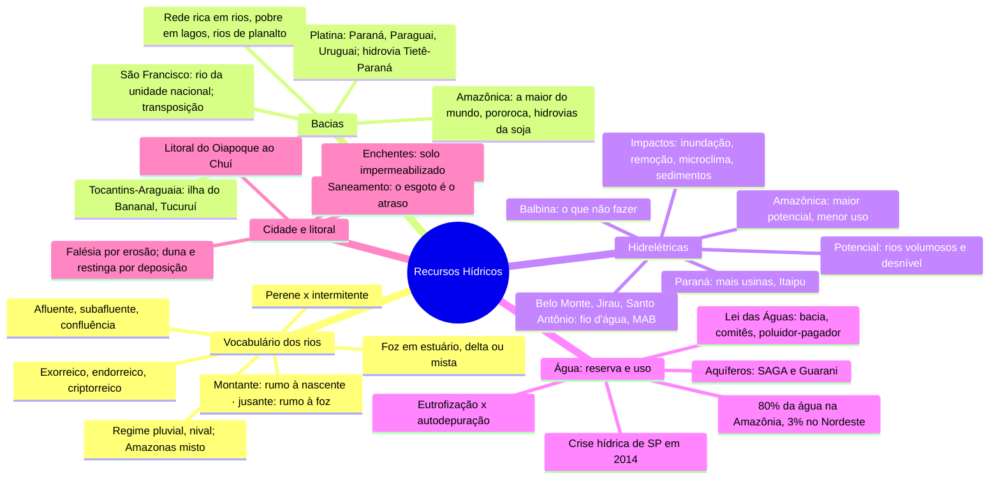

# Geografia — Recursos Hídricos

> Frente 1, Aula 12 (Caderno 4 de Geografia). Mapa mental + 26 flashcards, feitos em 25/09/2026.
> ⭐ = tema que já caiu na FGV, com o id da questão no banco de provas antigas.
> Versão interativa (cards que viram, marcação sabia/revisar): https://claude.ai/artifact/HiwWwWvnB36aiHeWvvwgk6
> Abrir no Mac mesmo sem internet: `recursos-hidricos.html`, nesta pasta.
> Os mesmos cards também estão no baralho do trajeto (`flashcards-geografia.md`, 51 a 76).

**O fio da aula em uma frase:** o Brasil tem uma rede rica em rios de planalto, quase todos
perenes, e por isso um potencial enorme de hidrelétricas e hidrovias. O problema é o preço
ambiental das usinas e uma água mal distribuída e mal cuidada: sobra na Amazônia, falta no
Nordeste e chega poluída às cidades.

**Dois números da apostila para não decorar:**
- As hidrelétricas já não geram 90% da eletricidade do país: hoje é bem menos, perto de 60%.
- A potência de Belo Monte é de **11.233 MW**, não GW.

## Mapa mental

## Flashcards

### Vocabulário dos rios

> [!question]- 1. Afluente, subafluente e confluência: o que é cada um?
> **Afluente:** rio que deságua no rio principal.
> **Subafluente:** rio que deságua num afluente.
> **Confluência:** o ponto onde um rio encontra o outro.

> [!question]- 2. Montante × jusante
> **Montante:** na direção da nascente (rio acima).
> **Jusante:** na direção da foz (rio abaixo).
> Ex.: uma barragem retém os sedimentos, e as terras **a jusante** deixam de ser fertilizadas.

> [!question]- 3. Foz em estuário × delta × mista
> **Estuário:** um canal único, o mais comum no Brasil.
> **Delta:** vários canais (Parnaíba, no Nordeste).
> **Mista:** o Amazonas, que se divide em braços, e cada braço é largo como um estuário.

> [!question]- 4. Rio perene × intermitente
> **Perene:** nunca seca, nem na estiagem. É a maioria no Brasil, por causa dos climas úmidos.
> **Intermitente (temporário):** seca na estiagem. Aparece no semiárido, no Sertão nordestino.

> [!question]- 5. Exorreico, endorreico e criptorreico
> **Exorreico:** chega ao mar, direto ou por outro rio. Quase todos os rios brasileiros.
> **Endorreico:** corre para lagos ou mares interiores.
> **Criptorreico:** corre por baixo da terra, em cavernas de calcário.

> [!question]- 6. Regime pluvial × nival. E o Amazonas?
> **Pluvial:** a água vem da chuva (a maioria dos rios brasileiros).
> **Nival:** vem do derretimento da neve.
> O **Amazonas é misto**: parte vem do degelo dos Andes, mas predomina a chuva do clima equatorial.

### Bacias

> [!question]- 7. Quais são as características da rede hidrográfica brasileira?
> - Rica em rios e pobre em lagos
> - Rios exorreicos e perenes (menos no Sertão)
> - Predomínio de **rios de planalto**, com grande potencial hidrelétrico
> - Foz em estuário, na maioria
> - Regime pluvial
> Os rios nascem em três divisores: Planalto Brasileiro, Planalto das Guianas e Andes.

> [!question]- 8. Bacia Amazônica: o que é preciso saber
> A maior bacia do mundo. O Amazonas é o maior rio em volume, com cerca de 15% da água doce que
> chega aos oceanos. Nasce nos Andes do Peru, vira **Solimões** ao entrar no Brasil e **Amazonas**
> depois de receber o rio Negro, perto de Manaus. Na foz há a **pororoca**. As hidrovias do Madeira
> e do Tapajós escoam a soja de MT e RO.

> [!question]- 9. Bacia do Tocantins-Araguaia: o essencial
> No Araguaia fica a **ilha do Bananal**, a maior ilha fluvial do mundo. No Tocantins está
> **Tucuruí** (PA), construída para abastecer os grandes projetos de mineração. Os dois rios têm bom
> potencial para hidrovias.

> [!question]- 10. Bacia Platina: quais rios, e o que tem de mais importante?
> Paraná, Paraguai e Uruguai, que só se juntam fora do Brasil e formam o rio da Prata. O **Paraná**
> nasce da junção do Grande com o Paranaíba e recebe Tietê, Paranapanema e Iguaçu (cataratas). É a
> bacia com **mais hidrelétricas** (Itaipu, binacional com o Paraguai; Furnas; Ilha Solteira) e com
> a hidrovia mais importante do país, a **Tietê-Paraná**. O Paraguai corre na planície do Pantanal.
> Exercício 3 da apostila (gabarito A).

> [!question]- 11. Rio São Francisco: por que é o "rio da unidade nacional"?
> Nasce na Serra da Canastra (MG), liga o Sudeste ao Nordeste e, sendo **perene**, atravessa o
> semiárido levando água. É navegável entre Pirapora (MG) e Sobradinho (BA). Irriga a fruticultura
> (Petrolina e Juazeiro) e suas usinas (Paulo Afonso, Sobradinho, Xingó, Itaparica) abastecem boa
> parte do Nordeste.

> [!question]- 12. Transposição do São Francisco: objetivos e problemas
> Obra federal iniciada em 2007, com canais nos eixos Norte e Leste para PE, PB, RN e CE.
> **Objetivos:** segurança hídrica (gente e animais), irrigação e perenizar rios intermitentes.
> **Problemas:** atraso e custo muito acima do previsto, desmatamento da caatinga, remoção dos
> vazanteiros, especulação com as terras perto dos canais e **salinização do solo pela evaporação**.
> Exercício 6 da apostila (gabarito D).

### Hidrelétricas

> [!question]- 13. Por que o Brasil tem tanto potencial hidrelétrico?
> Rios volumosos (clima úmido) que descem de planaltos para depressões. Quanto maior o desnível,
> maior a queda d'água e mais energia. O potencial total é maior na Amazônica, depois na Paraná, na
> Tocantins e na São Francisco.

> [!question]- 14. Por que a Bacia Amazônica tem o maior potencial e é a menos aproveitada?
> Os rios correm em **planície**, com pouco desnível no médio e baixo curso. Os centros consumidores
> ficam longe, e represar inunda floresta e terras de povos indígenas e ribeirinhos.
> Exercício 7 da apostila (gabarito A).

> [!question]- 15. Hidrelétrica de Balbina: por que virou exemplo do que não fazer?
> O lago cobriu um grande trecho de floresta, que apodreceu debaixo d'água: a decomposição consumiu
> o oxigênio e matou os peixes. Os animais não foram resgatados. E a usina gera muito menos energia
> do que o previsto, nem para Manaus é suficiente.

> [!question]- 16. Belo Monte, Jirau e Santo Antônio: por que são polêmicas?
> Belo Monte fica no rio Xingu (PA); Jirau e Santo Antônio, no Madeira (RO). Removem ribeirinhos,
> afetam povos indígenas e o ecossistema do rio. São usinas **fio d'água** (reservatório pequeno,
> para inundar menos), então geram bem menos na seca. O Movimento dos Atingidos por Barragens (MAB)
> critica.

> [!question]- 17. Quais são os impactos socioambientais de uma hidrelétrica?
> A energia é renovável e não polui o ar, mas o lago:
> - inunda floresta, terras e até cidades, e acaba com a biodiversidade
> - expulsa moradores, nem sempre bem indenizados
> - muda o clima local (mais evaporação e umidade) e faz proliferar insetos
> - retém os sedimentos: em **Assuã**, no Nilo, as terras a jusante deixaram de ser adubadas e a pesca caiu

### Água: reserva e uso

> [!question]- 18. O que é aquífero? Compare o SAGA e o Guarani.
> **Aquífero:** rocha porosa e permeável que guarda água no subsolo.
> **SAGA (Grande Amazônia, inclui Alter do Chão):** o maior do mundo em volume; a recarga depende da
> floresta.
> **Guarani:** sob a bacia do Paraná (Brasil, Argentina, Paraguai e Uruguai), em arenito coberto por
> basalto. É vulnerável onde o arenito aflora, nas áreas de recarga: há agrotóxico perto de Ribeirão
> Preto (SP).

> [!question]- 19. A água do Brasil é bem distribuída?
> Não. O Brasil tem uma das maiores reservas de água doce do mundo, mas cerca de **80% está na
> Amazônia**, onde vive só uns 7% da população. O **Nordeste**, com mais de 1/4 da população, tem só
> uns 3%. O Sudeste consome mais do que a sua fatia da população. A **agricultura** é a atividade
> que mais consome água.

> [!question]- 20. Eutrofização × autodepuração de um rio
> **Eutrofização:** esgoto sem tratamento traz matéria orgânica; as bactérias que a decompõem
> consomem o oxigênio da água e os peixes morrem. O Tietê na Grande SP é um rio praticamente morto.
> **Autodepuração:** longe da cidade, o rio vai se limpando sozinho, e o Tietê se recupera no
> interior.
> ⭐ Poluição e escassez de água: 2025.1-DIS-CH7.

> [!question]- 21. Crise hídrica de São Paulo (2014): o que a causou?
> Seca forte, mas também **má gestão**, investimento insuficiente e ocupação irregular dos
> **mananciais** (Billings e Guarapiranga, poluídos e assoreados). O Sistema Cantareira quase secou,
> e a ideia de tirar água do Paraíba do Sul abriu um conflito com o Rio de Janeiro.
> ⭐ Escassez de água: 2025.1-DIS-CH7.

> [!question]- 22. Como o Brasil gere a água? (Lei das Águas e poluidor-pagador)
> A Lei de Recursos Hídricos (1997) organiza a gestão **por bacia hidrográfica**, com **comitês de
> bacia** que reúnem usuários, sociedade civil e poder público. A ANA coordena. Na bacia do Paraíba
> do Sul começou o **poluidor-pagador**: quem usa a água paga, e quem devolve poluída paga mais.

### Cidade e litoral

> [!question]- 23. Por que as enchentes urbanas acontecem, e o que ajuda a evitá-las?
> **Causa principal:** o solo impermeabilizado (asfalto, concreto, poucas áreas verdes). A água não
> infiltra e chega de uma vez aos rios canalizados, que transbordam. Pioram a situação o lixo nos
> bueiros e a ocupação das várzeas, onde vivem os mais pobres. Depois, vem a leptospirose.
> **Soluções:** áreas verdes, piscinões e desocupar as várzeas.
> Exercícios 1 e 2 da apostila (gabaritos C e D).

> [!question]- 24. Saneamento no Brasil: onde está o maior atraso?
> No **esgoto**. A água chega a quase todos os municípios, mas grande parte não tem coleta de
> esgoto, e rios e mar recebem esgoto *in natura*. Norte e Nordeste estão pior, e é lá que a
> mortalidade infantil é maior.
> Exercício 5 da apostila, que é da FGV (gabarito A).

> [!question]- 25. Como é o litoral brasileiro, de norte a sul?
> Mais de 7 mil km, do Oiapoque (AP) ao Arroio Chuí (RS).
> - **AP e PA:** plano, com grandes manguezais
> - **MA ao RN:** praias, dunas e falésias (Jericoacoara)
> - **PB ao norte do ES:** praias amplas, falésias e manguezais
> - **Sul do ES ao norte do RS:** praias estreitas e morros costeiros
> - **Extremo sul:** restingas e lagoas (dos Patos, Mirim)

> [!question]- 26. Falésia, duna e restinga: como cada uma se forma?
> **Falésia:** escarpa aberta pela **erosão** do mar.
> **Duna e restinga:** **deposição** de areia pelo vento, pelos rios e pelo mar. A restinga é um
> cordão arenoso que pode fechar uma lagoa costeira.

## O que já caiu na FGV (banco 2021.1–2026.1)

Água e clima caíram só nas **discursivas** de Ciências Humanas:

| Questão | Tema |
|---|---|
| `2025.1-DIS-CH7` | Atividades que agravam a escassez de água e o efeito do aquecimento nos rios |
| `2024.1-DIS-CH6` | Rios voadores e as chuvas do Centro-Oeste e do Sudeste |
| `2023.1-OBJ-MH28` | Energia barata e renovável como vantagem competitiva |

Bacias, aquíferos, enchentes, litoral e transposição: nenhuma questão no banco até agora. O
exercício 5 da apostila é da FGV, mas do vestibular de Administração, que não está no banco.

## 🔗 Relacionados

[[Cursinho-projeto]]
