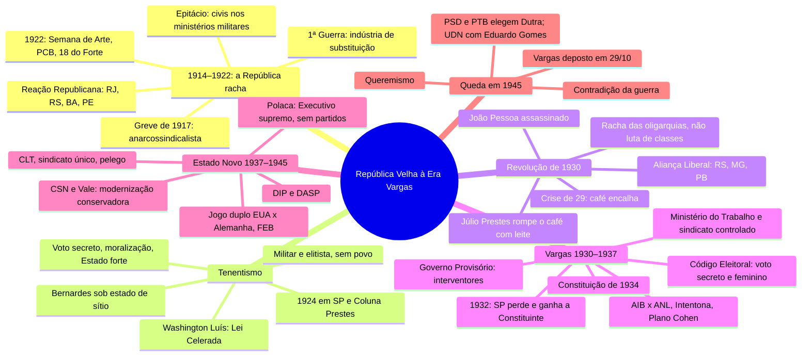

# História do Brasil — Crise da República Velha e Era Vargas

> Aulas 12 e 13 do Caderno 4 (1914–1945). Mapa mental + 38 flashcards, feitos em 25/09/2026 para o simulado de 26/09.
> ⭐ = tema que já caiu na FGV, com o id da questão no banco de provas antigas. ⚠️ = pegadinha ou erro da apostila.
> Versão interativa (cards que viram, marcação sabia/revisar): https://claude.ai/artifact/5qRfyTpr1FrnegoHS86uqM
> Abrir no Mac mesmo sem internet: `crise-da-republica-velha-e-era-vargas.html`, nesta pasta.

**O fio das duas aulas em uma frase:** a República do café entra em crise nos anos 1920 (guerra, indústria,
greves, tenentes, 1929), a Revolução de 1930 põe Vargas no poder, e ele centraliza tudo até virar ditador
no Estado Novo, com indústria de base, CLT e propaganda. Cai em 1945, mas o varguismo continua: PSD e PTB elegem Dutra.

**Esse período caiu em 5 das 6 provas da FGV** (banco 2021.1–2026.1): 6 questões de História, 5 delas dissertativas.

**Dois erros da apostila para não levar para a prova:**
- Os sobreviventes dos 18 do Forte foram Eduardo Gomes e **Siqueira Campos** (a página 102 diz "Silveira Martins").
- O PCB foi fundado em **março** de 1922 (a página 111 diz janeiro).

## Mapa mental

## Pegadinhas que os exercícios cobram

- Greve de 1917 = **anarquista**, não comunista.
- Reação Republicana (1922) = RJ, RS, BA, PE. Aliança Liberal (1930) = RS, MG, PB.
- Voto feminino e secreto só em **1932**, não nos anos 20.
- Revolução de 1930 = racha das oligarquias, **não** revolução operária. Prestes ficou de fora.
- Tenentismo **não** tinha apoio popular amplo nem plano claro de poder.
- SP perdeu a guerra de 1932, mas **ganhou a Constituinte**.
- O Decreto de dezembro de 1937 extinguiu **também a AIB**.
- Política externa do Estado Novo = **pragmática**, jogo duplo EUA × Alemanha.
- CLT = Estado **árbitro**, inspirada na Carta del Lavoro. Não foi conquista imposta pelos operários.
- Petrobras = **1953**, não Estado Novo.

## Flashcards

### 1914–1922: a República racha

> [!question]- 1. O Brasil na Primeira Guerra (1914–18): o que fez e o que mudou na economia?
> Neutro até 1917. Submarinos alemães afundaram os navios **Paraná** e **Macau**, e o Brasil declarou guerra à Alemanha. Participação tímida: aviadores, pilotos navais e 90 médicos, sem tropas.
> Na economia, as importações caíram e surgiu a **indústria de substituição** de bens não duráveis (alimentos, tecidos), com o dinheiro acumulado pelo café.
> ⚠️ Ainda não é o "processo de substituição de importações" da Cepal: esse vem com a crise de 1929 e a Segunda Guerra.

> [!question]- 2. Greve Geral de 1917: causa, estopim e ideologia
> **Causa:** o custo de vida subiu 189% na guerra e os salários ficaram parados. Jornadas de 14 a 16 horas, sem nenhuma lei trabalhista.
> **Estopim:** a Força Pública matou o operário espanhol José Martinez numa manifestação de tecelões no Brás (SP), em julho.
> Começou no têxtil (Mariângela, Crespi) e chegou ao Rio e ao RS.
> **Ideologia: anarcossindicalismo** (COB), não comunismo. O PCB só nasce em 1922.
> Exercício 1 da apostila (gabarito A): concentrada em SP, pedia jornada de 8 horas e o fim do trabalho noturno das mulheres.
> ⭐ Caiu na FGV: `2021.1-DIS-CH9` (mulheres na primeira industrialização)

> [!question]- 3. Quem eram os novos atores sociais dos anos 1920?
> Todos fora do café com leite:
> - **Burguesia industrial** (quase 12 mil fábricas em 1918)
> - **Operariado:** anarquistas e, depois, PCB (1922) e BOC (1927)
> - **Camadas médias urbanas**
> - **Tenentes**
> - **Oligarquias dissidentes** (RS, Nordeste)

> [!question]- 4. Por que Epitácio Pessoa virou presidente (1919–22), e o que irritou os militares?
> Rodrigues Alves, eleito em 1918, morreu de **gripe espanhola** antes da posse. Delfim Moreira assumiu e convocou nova eleição. Epitácio, paraibano e fora do café, foi o nome de consenso.
> Ele pôs **civis nos ministérios da Guerra e da Marinha**, o que irritou os militares. Também baixou a Lei de Repressão ao Anarquismo (1921) e comprou café para estocar.

> [!question]- 5. Reação Republicana (1922): quem, e o que foram as "cartas falsas"?
> **RJ, RS, BA e PE** lançaram Nilo Peçanha contra o mineiro **Arthur Bernardes**, com discurso contra fraude e coronelismo.
> O *Correio da Manhã* publicou cartas atribuídas a Bernardes ofendendo o Exército e o marechal Hermes. Oposição civil e militar se juntaram. Mesmo assim, Bernardes venceu.
> ⚠️ Reação Republicana (1922) = RJ, RS, BA, PE. Aliança Liberal (1930) = RS, MG, PB. Não troque.

> [!question]- 6. Os 18 do Forte (5 de julho de 1922): o que foi?
> A **primeira revolta tenentista**. Depois da prisão de Hermes da Fonseca, os tenentes do Forte de Copacabana tentaram impedir a posse de Bernardes.
> Cercados, 17 militares e 1 civil saíram pela praia contra as tropas do governo. Sobreviveram só **Eduardo Gomes e Siqueira Campos**.
> ⚠️ A página 102 da apostila diz "Silveira Martins". Está errado: o exercício 5 confirma Siqueira Campos.
> Exercício 8 da apostila (gabarito E).
> ⭐ Caiu na FGV: `2023.1-DIS-CH3` (tenentismo de 1922 e Eduardo Gomes em 1945)

> [!question]- 7. Semana de Arte Moderna (fevereiro de 1922): o que propunha e que correntes saíram dela?
> No Teatro Municipal de SP: Mário e Oswald de Andrade, Anita Malfatti, Di Cavalcanti, Villa-Lobos, Brecheret.
> Rompe com o academicismo e usa as vanguardas europeias **sem copiar**, para redescobrir o "Brasil real".
> - **Esquerda:** Pau-Brasil e Antropofagia (Oswald)
> - **Direita:** Verde-Amarelismo e Anta (**Plínio Salgado**, futuro chefe integralista)
> Exercício 4 da apostila (gabarito C).
> ⭐ Caiu na FGV: `2022.1-DIS-AR11` (Manifesto Antropófago (prova de Artes))

> [!question]- 8. 1922: por que esse ano resume a crise da República?
> - **Fevereiro:** Semana de Arte Moderna
> - **Março:** fundação do PCB e eleição de Bernardes contra a Reação Republicana
> - **Julho:** os 18 do Forte
> Cultura, operários, oligarquias dissidentes e militares contestando a ordem no mesmo ano, o do centenário da Independência.
> ⚠️ O PCB foi fundado em março de 1922. A página 111 da apostila diz janeiro.

### Tenentismo e anos 20

> [!question]- 9. Tenentismo: o que queriam e qual era o limite?
> Jovens oficiais contra fraude, oligarquias e descentralização.
> **Queriam:** voto secreto, moralização, Estado centralizado e forte, reforma do ensino, Judiciário independente.
> **Limite:** movimento militar e elitista, sem base popular nem plano claro de poder. Queriam salvar a nação "em nome de um povo inerme" (Boris Fausto). Autoritarismo em embrião.
> Exercícios 2 (gabarito B) e 5 (gabarito B) da apostila.
> ⭐ Caiu na FGV: `2023.1-DIS-CH3`

> [!question]- 10. Governo Arthur Bernardes (1922–26): marcas
> - Governou quase todo o tempo sob **estado de sítio**
> - Interveio nos estados e no Congresso; economia a serviço do café
> - **Guerra civil no RS (1923):** maragatos contra Borges de Medeiros, encerrada pelo Pacto de Pedras Altas, que proibiu a reeleição
> - **Revolta de 1924** em SP e **Coluna Prestes**

> [!question]- 11. Revolta de 5 de julho de 1924, em São Paulo
> Isidoro Dias Lopes, Miguel Costa, Juarez e Joaquim Távora, Eduardo Gomes. Ocuparam a cidade por **22 dias** exigindo a queda de Bernardes, uma Constituinte e o voto secreto.
> Bombardeados, recuaram para o interior e depois se juntaram aos rebeldes gaúchos: nasce a Coluna.

> [!question]- 12. Coluna Prestes (1925–27): o que foi e que resultado teve?
> Tenentes paulistas e gaúchos (Prestes, Miguel Costa, Siqueira Campos, Juarez Távora, João Alberto). Cerca de 2 mil homens e **25 mil km** pelo interior.
> Não levantou o sertão, preso aos coronéis, e terminou na Bolívia. Mas **desgastou as oligarquias** e fez de Prestes o "Cavaleiro da Esperança".
> Prestes vira comunista e **fica fora da Revolução de 1930**.

> [!question]- 13. Governo Washington Luís (1926–30)
> Paulista, ligado aos cafeicultores. Acabou com o estado de sítio, mas aprovou a **Lei Celerada** (1927): censura à imprensa e punição por "delito ideológico".
> O BOC e o PCB elegeram vereadores e um deputado, impedidos de tomar posse.
> Lema: "Governar é abrir estradas" (Rio–SP e Rio–Petrópolis).

> [!question]- 14. Presidentes da República Velha e um fato de cada (exercício 6)
> - **Campos Sales:** Funding Loan
> - **Rodrigues Alves:** Convênio de Taubaté
> - **Hermes da Fonseca:** Revolta de Juazeiro
> - **Wenceslau Brás:** Greve Geral de 1917
> - **Arthur Bernardes:** Coluna Prestes
> - **Washington Luís:** Lei Celerada e crise de 1929
> Exercício 6 da aula 12 (gabarito B).

### Revolução de 1930

> [!question]- 15. Crise de 1929: como ela bateu no Brasil?
> Os EUA eram o maior comprador de café. Com a quebra da bolsa, o café **encalhou nos portos** e os preços despencaram.
> O governo já não conseguia comprar os excedentes (a política do Convênio de Taubaté, com supersafras como a de 1928). A base econômica das oligarquias quebrou.

> [!question]- 16. Aliança Liberal: quem era e o que propunha?
> **RS, MG e PB**, com Vargas para presidente e João Pessoa para vice. Nasceu quando Washington Luís indicou outro paulista, **Júlio Prestes**, e rompeu o café com leite.
> **Programa:**
> - Leis trabalhistas
> - Voto secreto e voto feminino
> - Anistia aos tenentes
> - Incentivo à produção nacional, não só ao café

> [!question]- 17. Como a Revolução de 1930 aconteceu?
> - **Março:** Júlio Prestes vence, com fraude dos dois lados
> - **26 de julho:** João Pessoa é assassinado, e o país se inflama
> - "Façamos a revolução antes que o povo a faça" (Antônio Carlos, governador de MG)
> - **3 de outubro:** levante em MG, RS e no Nordeste, com Góes Monteiro no comando militar; SP resiste
> - Uma junta militar depõe Washington Luís, e **Vargas assume em 3 de novembro de 1930**
> Oswaldo Aranha foi o grande articulador.

> [!question]- 18. A Revolução de 1930 foi uma revolução de classe?
> **Não.** Não mudou as relações de produção nem levou ao poder uma classe contrária aos cafeicultores. Foi um **racha das oligarquias** (dissidentes, tenentes, classe média) contra o café paulista.
> O que mudou: o Estado passa a depender das oligarquias sem se subordinar a nenhuma delas.
> Prestes recusou participar: para ele, era briga entre oligarquias.
> Exercício 7 da apostila (gabarito A: divisão das oligarquias).

### Vargas 1930–1937

> [!question]- 19. Governo Provisório (1930–34): primeiras medidas
> - Fecha o Congresso e os legislativos, suspende a Constituição de 1891
> - **Interventores** nos estados, muitos deles tenentes
> - Cria o **Ministério do Trabalho** (Lindolfo Collor) e a Lei de Sindicalização (1931): sindicato sob controle do Ministério
> "Estado de compromisso": Vargas se equilibra entre oligarquias, tenentes, militares e industriais.
> ⭐ Caiu na FGV: `2024.1-OBJ-51` (charge sobre a posse de Vargas)

> [!question]- 20. Revolução Constitucionalista (1932): por que SP se levantou e o que ganhou?
> SP perdeu o poder em 1930 e exigia **Constituinte** e um **interventor civil e paulista** (rejeitava o tenente João Alberto). PRP e PD se uniram na Frente Única Paulista.
> A morte de quatro estudantes em 23 de maio deu nome ao **MMDC**. A guerra começou em **9 de julho**; MG e RS não aderiram, e SP se rendeu em cerca de três meses.
> Perdeu nas armas, mas **ganhou a Constituinte** (eleita em 1933). Espírito conservador: queria frear as reformas e os tenentes (José Murilo de Carvalho).
> Exercício 9 da apostila (gabarito B).

> [!question]- 21. Código Eleitoral de 1932: o que mudou?
> - **Voto secreto**: golpe no voto de cabresto
> - **Voto feminino**
> - **Justiça Eleitoral**
> - **Representação classista**: deputados escolhidos por sindicatos e associações patronais
> Em 1933, Carlota Pereira de Queirós virou a primeira deputada federal.
> ⚠️ Voto feminino e secreto são de 1932, não dos anos 1920. É a afirmação falsa do exercício 3 da aula 12 (gabarito E).
> ⭐ Caiu na FGV: `2021.1-DIS-CH10` (voto feminino nos anos 1930)

> [!question]- 22. Constituição de 1934: características
> **Promulgada** em 16 de julho de 1934 por uma Constituinte eleita. Liberal: federalismo, presidencialismo, três poderes. Incorporou o Código Eleitoral.
> **Direitos trabalhistas:** 8 horas, salário mínimo regional, descanso semanal, férias, regras para o trabalho de menores. Apresentados como concessão do Estado, com controle.
> Vargas foi eleito **indiretamente**, com eleição direta prevista para 1938.

> [!question]- 23. Ação Integralista (AIB) × Aliança Nacional Libertadora (ANL)
> **AIB (1932, Plínio Salgado):** fascismo à brasileira. Camisas-verdes, "anauê", "Deus, Pátria e Família", anticomunista e antiliberal.
> **ANL (1935):** frente antifascista do PCB, com Prestes como presidente de honra. Contra o integralismo; nacionalizar bancos e empresas estrangeiras, suspender a dívida externa, reforma agrária.
> A **Lei de Segurança Nacional** (1935) serviu para fechar a ANL.

> [!question]- 24. Intentona Comunista (novembro de 1935)
> Levantes em quartéis de **Natal, Recife e Rio**, sem apoio de massa. Fracassaram em poucos dias.
> A repressão foi feroz, e o "perigo vermelho" virou o pretexto para endurecer o regime até o golpe de 1937.

> [!question]- 25. Plano Cohen e o golpe de 10 de novembro de 1937
> A eleição de 1938 estava dividida (Armando Salles, José Américo, Plínio Salgado).
> **Plano Cohen:** plano comunista **falso**, escrito pelo capitão integralista Olímpio Mourão Filho e divulgado como verdadeiro.
> Com esse pretexto, Vargas **fechou o Congresso**, cancelou a eleição e outorgou a Constituição de 1937. O estrategista foi o general Góes Monteiro. Os integralistas apoiaram.

### Estado Novo (1937–45)

> [!question]- 26. Constituição de 1937, a "Polaca"
> **Outorgada**, escrita por Francisco Campos, inspirada na Constituição autoritária da Polônia.
> - Executivo como "órgão supremo do Estado"; Vargas governa por decreto
> - Interventores e fim da autonomia dos estados (bandeiras estaduais queimadas em praça pública)
> - **Decreto de dezembro:** todos os partidos extintos, **inclusive a AIB**
> Traídos, os integralistas atacaram o Palácio Guanabara em maio de 1938 e fracassaram.
> Exercício 4 da aula 13 (gabarito A: presidencialismo autocrático).

> [!question]- 27. Como o Estado Novo controlava e convencia?
> **Controle:** polícia política, prisões, censura. **DASP**: a burocracia federal centralizada.
> **Convencimento:** o **DIP** (Departamento de Imprensa e Propaganda) censurava e fazia propaganda no rádio, na imprensa e em cartilhas escolares. Culto a Vargas, o "pai dos pobres".
> Igrejas, escolas, sindicatos e esporte também serviram à propaganda.
> ⭐ Caiu na FGV: `2026.1-DIS-CH3` (esporte como propaganda)

> [!question]- 28. Economia do Estado Novo: o Estado empresário
> Nacionalismo e intervenção: o Estado monta a **indústria de base** que a burguesia não tinha como bancar.
> - **CSN** (Volta Redonda), com empréstimo dos EUA
> - **Vale do Rio Doce**
> - Fábrica Nacional de Motores e Conselho Nacional do Petróleo
> Nome de prova: **modernização conservadora** (ou revolução passiva): industrializa de cima para baixo sem mexer na estrutura agrária.
> ⚠️ A Petrobras é de 1953, no governo Vargas eleito, não do Estado Novo (exercício 10, gabarito A).

> [!question]- 29. Trabalhismo: CLT, sindicato único e pelego
> **CLT (1943):** reúne carteira de trabalho, salário mínimo, jornada de 8 horas, férias e Justiça do Trabalho. Inspirada na **Carta del Lavoro** de Mussolini.
> **Corporativismo:** sindicato único por categoria, atrelado ao Ministério do Trabalho. O Estado arbitra patrão × empregado e **nega a luta de classes**. Greve e lockout proibidos.
> **Pelego:** o líder sindical fiel ao governo.
> Na rua: "pai dos pobres e mãe dos ricos".
> Exercícios 3 (gabarito C), 5 (D) e 11 (A) da apostila.
> ⭐ Caiu na FGV: `2025.1-DIS-CH2` (CLT e corporativismo)

> [!question]- 30. Populismo: a definição que a prova cobra
> Líder carismático que fala direto com as massas urbanas. **Inclusão controlada**: os trabalhadores ganham direitos, mas sem autonomia, em troca de apoio. O Estado se confunde com a figura do presidente.
> Exercício 1 da aula 13 (gabarito C).

> [!question]- 31. Política externa: do jogo duplo à guerra
> Até 1942, **barganha pragmática** entre EUA (Oswaldo Aranha) e Alemanha (Dutra, Góes Monteiro, Francisco Campos), atrás de capital e tecnologia para a siderurgia.
> Os EUA, na política da boa vizinhança, financiaram a CSN em troca de **bases aéreas** em Natal, Recife e Belém.
> Depois de Pearl Harbor e dos navios brasileiros afundados (agosto de 1942), o Brasil entrou na guerra. A **FEB** lutou na Itália (1944–45, general Mascarenhas de Morais), e a FAB, com o "Senta a pua".
> Exercícios 2 (B), 7 (A) e 8 (A) da aula 13.

### A queda (1945)

> [!question]- 32. Por que o Estado Novo caiu?
> **A contradição:** soldados lutavam pela democracia na Europa enquanto o Brasil vivia uma ditadura.
> - Manifesto dos Mineiros (1943) e Congresso de Escritores (1945)
> - Entrevista de José Américo a Carlos Lacerda (fevereiro de 1945) fura a censura
> - Vargas abre: eleições e partidos, anistia, PCB legal
> - Queremismo ("Queremos Getúlio") e o PCB de Prestes apoiam a continuidade, o que assusta a oposição
> - Vargas nomeia o irmão, Benjamin, chefe de polícia: os militares (Góes Monteiro) o **depõem em 29 de outubro de 1945**
> Assume José Linhares, presidente do STF, até a eleição.

> [!question]- 33. Os partidos de 1945 e a eleição de dezembro
> - **PSD:** a máquina dos interventores. Candidato: Eurico Gaspar Dutra
> - **PTB:** sindicatos e trabalhadores, a base popular de Vargas
> - **UDN:** antigetulista, liberal, pró-EUA. Candidato: brigadeiro **Eduardo Gomes**
> - **PCB:** Yedo Fiúza
> Com PSD e PTB juntos, **Dutra venceu com 55%**: um "varguismo sem Vargas".
> ⭐ Caiu na FGV: `2023.1-DIS-CH3`

> [!question]- 34. Eduardo Gomes: o fio entre 1922 e 1945
> Sobrevivente dos 18 do Forte (1922) e rebelde em 1924. Virou brigadeiro e foi o candidato da **UDN** em 1945, com o slogan "Vote no brigadeiro, ele é bonito e é solteiro". Perdeu para Dutra.
> Mostra como os tenentes de 1922 se dividiram: uns com Vargas (Juarez Távora, João Alberto), outros contra (Eduardo Gomes), Prestes no PCB.
> Foi a pergunta exata da FGV em 2023.
> ⭐ Caiu na FGV: `2023.1-DIS-CH3` (tenentismo e a campanha de 1945)

### Se cair dissertativa

> [!question]- 35. Explique as motivações e o programa do tenentismo. A Coluna Prestes faz parte dele?
> Roteiro em 3 blocos (12 minutos):
> - **Motivação:** contra as oligarquias, a fraude e o coronelismo; estopim na prisão de Hermes e nas cartas falsas (1922)
> - **Programa:** voto secreto, moralização, Estado centralizado, ensino, Judiciário independente. Reformismo autoritário, sem o povo
> - **Coluna:** sim. Nasce de 1924 (SP e RS), enfrenta Bernardes por dois anos e desgasta as oligarquias
> É o exercício 9 da aula 12 (FGV-RJ 2020), com resposta no gabarito da apostila.
> ⭐ Caiu na FGV: `2023.1-DIS-CH3`

> [!question]- 36. Por que a Revolução de 1930 aconteceu? Organize as causas.
> Três camadas:
> - **Estrutural:** o modelo do café já não se sustentava, e a crise de 1929 derrubou os preços
> - **Social:** indústria, classe média, operários e tenentes estavam fora do poder
> - **Imediata:** Washington Luís rompe o café com leite (Júlio Prestes), nasce a Aliança Liberal, há fraude, João Pessoa é assassinado
> **Fecho:** racha das elites, não revolução popular ("antes que o povo a faça").

> [!question]- 37. Relacione a CLT ao corporativismo do Estado Novo.
> - **Medidas:** salário mínimo, carteira de trabalho, 8 horas, férias, Justiça do Trabalho
> - **Corporativismo:** o Estado organiza a sociedade por categorias, com sindicato único oficial, e arbitra capital × trabalho
> - **Sentido:** negar a luta de classes. Direito como concessão, em troca de controle (pelegos, greve proibida). Modelo: a Carta del Lavoro
> ⭐ Caiu na FGV: `2025.1-DIS-CH2` (caiu exatamente isso)

> [!question]- 38. O Estado Novo foi autoritário e modernizador ao mesmo tempo. Explique.
> - **Autoritário:** Polaca outorgada, partidos extintos, DIP, polícia política, estados sem autonomia
> - **Modernizador:** indústria de base (CSN, Vale), DASP, CLT, planejamento econômico
> - **Conceito:** modernização conservadora, de cima para baixo e sem participação popular
> - **Fecho:** a própria Segunda Guerra expõe a contradição e derruba o regime em 1945

## O que já caiu na FGV (banco 2021.1–2026.1)

Período 1914–1945 em História: **6 questões em 5 das 6 edições**, 5 delas dissertativas.

| Questão | Tema |
|---|---|
| `2021.1-DIS-CH9` | Situação social das mulheres na primeira industrialização |
| `2021.1-DIS-CH10` | Condições políticas do voto feminino nos anos 1930 |
| `2023.1-DIS-CH3` | Tenentismo (1922) e a campanha de Eduardo Gomes em 1945 |
| `2024.1-OBJ-51` | Charge sobre a posse de Vargas (gabarito D) |
| `2025.1-DIS-CH2` | Medidas da CLT (1943) e o corporativismo do Estado Novo |
| `2026.1-DIS-CH3` | Esporte como propaganda: exemplo brasileiro |

Na prova de Artes, o Manifesto Antropófago (`2022.1-DIS-AR11`) puxa a Semana de 22. Greve de 1917, Coluna Prestes,
integralismo e Plano Cohen: nenhuma questão no banco até agora. Os exercícios "FGV-ADM" da apostila são do vestibular
de Administração, que não está no banco.

## 🔗 Relacionados

[[Cursinho-projeto]]
