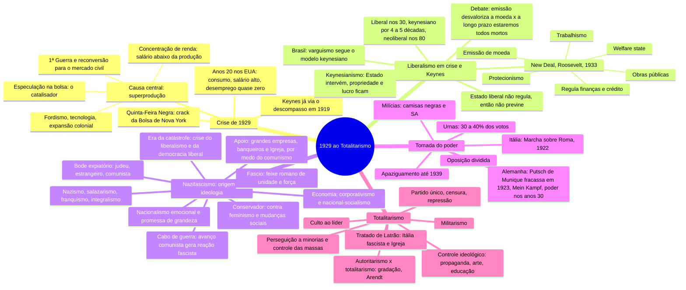

# História Geral — Crise de 29 ao Totalitarismo

> Aula do Duque, 22/09/2026 (cursinho). Mapa mental + 19 flashcards.
> ⭐ = tema que já caiu na FGV, com o id da questão no banco de provas antigas.
> Versão interativa (cards que viram, marcação sabia/revisar): https://claude.ai/artifact/SuCScsMXawZFqPLxEKemnF

**O fio da aula em uma frase:** 1929 quebra a economia e, junto, o liberalismo. Saem duas
respostas, as duas com Estado forte e sem mexer na propriedade privada: o **keynesianismo**
(New Deal, que reforma o capitalismo dentro da democracia) e o **nazifascismo** (que destrói a
democracia e vira totalitarismo).

**Duas correções nas anotações**, conferir na apostila:
- O Putsch de Munique (golpe da cervejaria) foi em **1923**, não em 1922. Em 1922 foi a Marcha sobre Roma.
- A milícia nazista das ruas antes de 1933 era a **SA** (camisas pardas). A SS nasceu como guarda
  pessoal de Hitler e só cresceu depois.

## Mapa mental

## Flashcards

Clique na pergunta para abrir a resposta.

### Crise de 1929

> [!question]- 1. Qual foi a causa central da Crise de 1929?
> **Superprodução:** a capacidade de produzir passou a capacidade de consumir. Indústria e
> agricultura produziam mais do que a sociedade conseguia comprar.

> [!question]- 2. Quais fatores levaram à superprodução, e qual foi o papel da bolsa?
> - **1ª Guerra:** a indústria dos EUA abasteceu o conflito e, depois do armistício, virou a
>   produção para o mercado civil
> - **Fordismo, avanço tecnológico e expansão colonial**
> - **Concentração de renda:** o salário subia, mas abaixo do ritmo da produção
> - **Especulação na bolsa:** foi o *catalisador*, não a causa. Estourou na Quinta-Feira Negra.

> [!question]- 3. Por que o Estado americano não agiu antes, e o que entrou em crise além da economia?
> A ideologia liberal (Adam Smith) impedia o Estado de regular o mercado. Em 1929 entra em crise
> **o próprio modelo e pensamento liberal**, não só a indústria.
> ⭐ Liberalismo de Adam Smith caiu em `2022.1-DIS-CH8`.

### Liberalismo em crise e a resposta keynesiana

> [!question]- 4. O que o keynesianismo muda e o que ele NÃO muda?
> **Muda:** o Estado passa a intervir na economia.
> **Não muda:** propriedade privada, direito ao lucro e sociedade de classes. É o capitalismo
> reformado, não substituído.

> [!question]- 5. Quais são as 6 medidas do New Deal (Roosevelt, a partir de 1933)?
> 1. Regulamentação do mercado financeiro, da bolsa e do crédito
> 2. Protecionismo: taxa sobre importados
> 3. Grandes obras públicas (estradas, hidrelétricas) para gerar emprego e consumo
> 4. Política emissionista: o Estado imprime dinheiro para bancar o programa
> 5. Trabalhismo: salário mínimo, redução de jornada, folga semanal
> 6. Welfare state: assistência social, habitação popular, auxílio alimentar

> [!question]- 6. Qual a crítica ao New Deal, o que Keynes respondeu e qual a tese alternativa?
> **Crítica:** a longo prazo, emitir moeda desvaloriza a moeda.
> **Keynes:** "a longo prazo estaremos todos mortos".
> **Tese alternativa:** para alguns economistas, quem salvou a economia americana foi a
> Segunda Guerra, não o New Deal.

> [!question]- 7. Qual a relação entre o varguismo e o keynesianismo?
> O varguismo seguiu em grande medida o modelo keynesiano: Estado interventor e trabalhismo.
> ⭐ CLT e corporativismo do Estado Novo caíram em `2025.1-DIS-CH2`.

> [!question]- 8. Qual é o arco histórico do liberalismo no século XX?
> Entra em crise nos anos 30 → cerca de 4 a 5 décadas de modelo keynesiano → volta como
> **neoliberalismo** a partir dos anos 80.

### Nazifascismo: origens e ideologia

> [!question]- 9. Por que extrema-esquerda e extrema-direita são "faces da mesma moeda"?
> As duas nascem da **crise do liberalismo e da democracia liberal** (a "era da catástrofe").
> Funciona como cabo de guerra: o avanço comunista provoca a reação fascista e nazista.
> ⭐ A barbárie anti-iluminista da época, com Hobsbawm, caiu em `2023.1-DIS-CH4`.

> [!question]- 10. De onde vem a palavra "fascismo" e quais regimes fazem parte do fenômeno?
> Do italiano *fascio*, o feixe, símbolo romano de unidade e força. Nasce na Itália com Mussolini.
> Fenômeno global: nazismo (Alemanha), salazarismo (Portugal), franquismo (Espanha),
> integralismo (Brasil).

> [!question]- 11. Qual é o núcleo ideológico do fascismo?
> **Nacionalismo extremado com apelo emocional**, não racional ("o fascismo não é intelecto, é
> coração", Mussolini). Explora o desejo de recuperar a grandeza em povos humilhados e em crise:
> o Reich de mil anos (Hitler), a volta do Império Romano (Mussolini).

> [!question]- 12. Como funcionava o bode expiatório, e o que dava base a ele?
> A culpa pela crise vai para o "outro": judeu, estrangeiro, comunista.
> - Antissemitismo de raiz medieval (~1500 anos na Europa cristã)
> - Darwinismo social e eugenia do séc. XIX como pseudociência
> - Propaganda: "uma mentira contada mil vezes é verdade" (Goebbels)
> - Contradição: os judeus eram acusados de controlar o capitalismo **e** de puxar o comunismo

> [!question]- 13. Como era a economia fascista, e quem financiou o nazismo?
> Intervencionismo + direitos trabalhistas + **corporativismo** (Mussolini) / **nacional-socialismo**
> (Hitler): todas as classes unidas pela nação, com propriedade e lucro preservados.
> Os direitos trabalhistas serviam para esvaziar o comunismo. Grandes empresas, banqueiros e a
> Igreja Católica apoiaram, por medo do comunismo.

### Tomada do poder

> [!question]- 14. Qual era a estratégia dupla de chegada ao poder?
> - **Via institucional:** eleições, com 30 a 40% dos votos. Dava bancada forte, mas não
>   governava sozinho.
> - **Via violenta:** milícias que aterrorizavam e executavam opositores (camisas negras na
>   Itália; SA na Alemanha).
> - E ajudou a **oposição dividida:** direita liberal, social-democratas e comunistas eram rivais.

> [!question]- 15. Compare a chegada ao poder na Itália e na Alemanha.
> **Itália:** golpe que deu certo, a Marcha sobre Roma (1922).
> **Alemanha:** o Putsch de Munique fracassou (1923), Hitler foi preso e escreveu *Mein Kampf*.
> Chegou ao poder nos anos 30, depois que a crise de 29 aumentou o voto nazista.

> [!question]- 16. O que foi a política do apaziguamento?
> Até 1939, Inglaterra, França e até a URSS tentaram negociar com os nazistas em vez de
> enfrentá-los. Do lado soviético, o Pacto Germano-Soviético.

### Totalitarismo

> [!question]- 17. Quais são as características de um regime totalitário?
> - Controle ideológico: propaganda, arte, educação
> - Culto à personalidade: líder infalível
> - Militarismo: a guerra como solução para os problemas nacionais
> - Perseguição a minorias e controle das massas
> - Partido único, censura, repressão violenta aos opositores
> ⭐ Nazismo e propaganda pelo esporte caiu em `2026.1-DIS-CH3`.

> [!question]- 18. Qual a diferença entre autoritarismo e totalitarismo?
> É uma **gradação**. Autoritarismo restringe o poder e as liberdades. Totalitarismo controla
> tudo: imprensa, judiciário, governo, educação e pensamento.
> Para Hannah Arendt, o modelo são **Stalin e Hitler**. Vargas e Mussolini ficaram "no caminho".
> ⭐ *As origens do totalitarismo* (Arendt) caiu em `2024.1-DIS-AR2`.

> [!question]- 19. O que foi o Tratado de Latrão?
> Acordo entre a Itália fascista e a Igreja Católica (1929) que criou o Estado do Vaticano.
> O professor marcou como detalhe para aprofundar na apostila.

## O que já caiu na FGV (banco 2021.1–2026.1)

"Séc. XX: guerras e totalitarismos" caiu 3 vezes em 39 questões de História de 2023.1 a 2026.1,
em 3 das 4 provas. **Todas as ligadas a esta aula foram discursivas**: bom material para os 40 min
de questões antigas.

| Questão | Tema |
|---|---|
| `2023.1-DIS-CH4` | Barbárie anti-iluminista na Europa (Hobsbawm) |
| `2026.1-DIS-CH3` | Nazismo e propaganda pelo esporte + exemplo brasileiro |
| `2024.1-DIS-AR2` | *As origens do totalitarismo* (Arendt) hoje, em Artes |
| `2025.1-DIS-CH2` | CLT e corporativismo do Estado Novo |
| `2022.1-DIS-CH8` | Adam Smith e o liberalismo |

Crise de 29 e New Deal: nenhuma questão no banco até agora.

## 🔗 Relacionados

[[Cursinho-projeto]]
