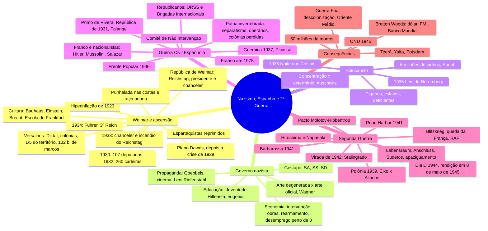

# História Geral — Nazismo, Guerra Civil Espanhola e Segunda Guerra

> Aula 14 do Caderno 4 de História (FGV), p. 39–60 do caderno. Mapa mental + 37 flashcards.
> ⭐ = tema que já caiu na FGV, com o id da questão no banco de provas antigas. ⚠️ = erro seu.
> Versão interativa (cards que viram, marcação sabia/revisar): https://claude.ai/artifact/2GqfSccHfG9s1qACYpYPpR

**O fio da aula em uma frase:** a humilhação de Versalhes e a crise de 1929 derrubam a República de
Weimar e põem o nazismo no poder; o nazifascismo testa suas armas na **Guerra Civil Espanhola** e
leva o mundo à **guerra total**, que termina com 50 milhões de mortos, a ONU, Bretton Woods e o
mundo dividido entre EUA e URSS.

**Correções no caderno**, confira antes de decorar:
- Hindenburg morreu em **1934**, não em 1939. Foi aí que Hitler virou Führer.
- O levante dos generais espanhóis foi em **julho de 1936**, não em março.
- O Japão invadiu a Manchúria em **1931**, não em 1933.
- Tito liderou a resistência na **Iugoslávia**, não na Tchecoslováquia.
- Quem desembarcou no Marrocos e na Argélia em 1942 foram **americanos e ingleses**, não alemães.
- **Hiroshima** teve mais mortos que Nagasaki: o caderno inverteu os números.

## Mapa mental

## Flashcards

Clique na pergunta para abrir a resposta.

### Weimar e a ascensão do nazismo

> [!question]- 1. O que o Tratado de Versalhes impôs à Alemanha, e como os alemães o chamaram?
> - Culpa pela 1ª Guerra
> - Perda de **todas as colônias** e de **1/5 do território** (Alsácia-Lorena, corredor polonês até Dantzig)
> - Indenização de **132 bilhões de marcos**
> - Exército limitado a **100 mil homens**
> Os alemães chamaram o tratado de **Diktat** (“imposição”). Resultado: crise e **hiperinflação** em 1923.

> [!question]- 2. O que foi a República de Weimar e que ameaças ela enfrentou?
> A 1ª república alemã (1919–1933), com Constituição social-democrata feita em Weimar: Parlamento (**Reichstag**) eleito por voto universal e executivo dividido entre **presidente e chanceler**.
> Ameaças: hiperinflação e tentativas comunistas de 1919 a 1923, como a **Liga Espartaquista** (Rosa Luxemburgo e Karl Liebknecht), reprimida pelo governo.

> [!question]- 3. Que florescimento cultural marcou Weimar, e o que o nazismo fez com ele?
> - **Bauhaus** (Gropius): design para a produção industrial
> - **Einstein**, Nobel de 1921, e o dramaturgo **Brecht**
> - **Escola de Frankfurt** (Adorno e Horkheimer): indústria cultural e crítica à razão iluminista
> O nazismo queimou **20 mil livros**, destruiu 16 mil obras e chamou a arte moderna de **“degenerada”**.

> [!question]- 4. O que era a “punhalada nas costas” (Dolchstoss)?
> A mentira nazista de que a Alemanha **perdeu a 1ª Guerra por traição** de socialistas, comunistas e judeus.
> Somava-se à ideia de uma **raça ariana pura**, “corrompida” por judeus, ciganos, poloneses e negros, e à acusação de que os judeus causaram a crise econômica.

> [!question]- 5. Por que a Crise de 1929 foi decisiva para os nazistas?
> De 1924 a 1929 a Alemanha se recuperou com moeda estável e dinheiro americano (**Plano Dawes**). Dependente desse dinheiro, a economia **desabou em 1929** e o desemprego explodiu.
> Nazistas: **107 deputados em 1930 → 260 cadeiras em 1932**. Grandes industriais (Thyssen, Krupp) financiaram o partido por **medo do comunismo**.

> [!question]- 6. Como Hitler passou de chanceler a Führer (1933–1934)?
> - **Jan. 1933:** Hindenburg o nomeia chanceler, pressionado por empresários e com medo do comunismo
> - **Fev. 1933:** incêndio do Reichstag, atribuído a um comunista, é o pretexto para prender ~4 mil comunistas
> - Partidos e sindicatos dissolvidos: **partido único**
> - **1934:** morre Hindenburg e Hitler vira **Führer e chanceler**: nasce o **3º Reich**

### O governo nazista

> [!question]- 7. Quais eram os órgãos de repressão do regime nazista?
> - **Gestapo:** polícia secreta, caçava opositores
> - **SA:** tropa de assalto, os “camisas pardas”, violência de rua
> - **SS:** de Himmler; guarda dos líderes, depois comandou os **campos de concentração**
> - **SD:** serviço de inteligência do Partido

> [!question]- 8. Como era a educação nazista para meninos e para meninas?
> Objetivo: formar **soldados obedientes a Hitler** e aos princípios racistas.
> - **Meninas:** ler, escrever, contar, educação física e **eugenia**, para serem mães da raça ariana
> - **Meninos:** esporte e tiro; dos 10 aos 14 anos, **Juventude Hitlerista** e técnicas de combate
> Nas escolas, orações ao Führer e livros que culpavam os judeus pela queda das civilizações.

> [!question]- 9. Como era a economia nazista, e por que o desemprego quase zerou?
> **Forte intervenção do Estado:** câmbio, salários e lucros controlados, e grandes **obras públicas** (rodovias, ferrovias).
> O **rearmamento**, desrespeitando Versalhes, levou o desemprego para perto de **0%**. Em 1939 a indústria alemã era a **2ª do mundo**, atrás só dos EUA.

> [!question]- 10. Como funcionava a propaganda nazista?
> - **Monopólio estatal** dos meios de comunicação, com **Goebbels** no Ministério da Propaganda
> - Mensagem simples, no nível do menos instruído, repetida sem parar
> - **Cinema** foi o maior investimento: +2.000 filmes. **Leni Riefenstahl** fez *O triunfo da vontade* e *Olímpia* (Jogos de Berlim, 1936)
> - Culto ao líder: a saudação **“Heil Hitler”**
> ⭐ Caiu na FGV: `2026.1-DIS-CH3` · saudação nazista e propaganda pelo esporte

> [!question]- 11. Qual era o ideal estético do nazismo?
> “**Embelezar**” a sociedade: a raça ariana seria pura e as outras, “degeneradas”.
> - Arte moderna = **“arte degenerada”**, de comunistas e judeus
> - Arte oficial: batalhas, heróis, mitologia, atletas e soldados arianos
> - Música: **Wagner**, antissemita e mitológico
> Hitler se via como um artista “regenerando” a beleza do mundo pelo extermínio dos “impuros”.

### Antissemitismo e Holocausto

> [!question]- 12. Quais foram as etapas da perseguição aos judeus de 1933 a 1939?
> - **1933:** funcionários públicos judeus afastados; proibidos na imprensa, na arte, nos tribunais e na saúde
> - **1935: Leis de Nuremberg** tiram os direitos civis
> - **1936:** expulsos do Exército
> - **1938:** expulsos do comércio; **Noite dos Cristais** (sinagogas e lojas destruídas, 30 mil levados a campos)
> - **1939:** bens confiscados, **guetos** e campos

> [!question]- 13. Além dos judeus, quem o nazismo tratava como “raça inferior” ou “vida sem valor”?
> - **Ciganos e eslavos**, sobretudo poloneses: massacres, campos e uso como **cobaias** por médicos nazistas
> - **Deficientes físicos e mentais:** esterilização e eutanásia, “vidas que não valiam a pena ser vividas”. Cerca de **70 mil** doentes mentais mortos até 1941

> [!question]- 14. Qual a diferença entre campo de concentração e campo de extermínio? Qual foi o maior?
> **Concentração:** trabalho forçado até a exaustão. **Extermínio:** feito para matar as “raças inferiores”.
> O maior foi **Auschwitz** (Polônia): mais de 1 milhão de judeus mortos. No total, cerca de **6 milhões de judeus**, um terço dos judeus do mundo.
> ⚠️ Quem promoveu o extermínio foi o **regime nazista**, não “a guerra”: foi o seu erro na discursiva de 30/09.
> ⭐ Caiu na FGV: `2023.1-DIS-CH4` · barbárie anti-iluminista (Hobsbawm)

> [!question]- 15. Por que muitos judeus preferem “Shoah” a “Holocausto”? E o que disse Adorno?
> “Holocausto” lembra um **sacrifício religioso**; muitos judeus acham o termo inadequado e preferem **Shoah**, palavra hebraica para **catástrofe, destruição**.
> Adorno: **depois de Auschwitz, não há poesia**. O genocídio como fracasso da civilização ocidental.
> ⭐ Caiu na FGV: `2024.1-DIS-AR2` · As origens do totalitarismo (Arendt)

### Guerra Civil Espanhola (1936–1939)

> [!question]- 16. Por que a Guerra Civil Espanhola (1936–1939) é chamada de “ensaio” da 2ª Guerra?
> Todas as ideologias da época se enfrentaram lá: **comunismo, anarquismo, republicanismo, fascismo e nacionalismo**.
> Hitler e Mussolini **testaram armas**, treinaram soldados e **selaram a aliança** Itália–Alemanha.
> ⭐ Caiu na FGV: `2021.1-DIS-AR4` · Guernica no seu contexto político

> [!question]- 17. Que tensões a Espanha tinha antes da guerra, a “pátria invertebrada”?
> Monarquia Bourbon apoiada em **latifundiários** e numa **Igreja** cheia de privilégios; massa de camponeses sem terra. Três tensões:
> - **Separatismo:** País Basco, Galícia e Catalunha
> - **Operários organizados:** anarquistas (CNT, FAI) e socialistas (UGT, PSOE)
> - **Perda das colônias:** Cuba, Filipinas e Porto Rico
> “Pátria invertebrada” é de Ortega y Gasset.

> [!question]- 18. Como a Espanha foi da ditadura à República e à Frente Popular (1923–1936)?
> - **1923:** golpe do general **Primo de Rivera**, inspirado em Mussolini; o rei Afonso XIII fica
> - **1930:** Rivera renuncia
> - **1931:** o rei vai para o exílio e a **República** é proclamada
> - **1933:** nasce a **Falange**, o partido fascista espanhol
> - **Fev. 1936:** a **Frente Popular** (esquerdas) vence por 200 mil votos: anistia, autonomia basca e catalã, **reforma agrária**

> [!question]- 19. Quem eram os dois lados da guerra, e quem ajudou cada um?
> **Nacionalistas:** militares de **Franco** e Mola, com a Falange, a Igreja e os latifundiários. Ajuda de **Hitler** (Legião Condor), **Mussolini** e **Salazar**, e de empresas americanas (Texaco, Ford, GM).
> **Republicanos:** socialistas, comunistas, anarquistas e liberais. Ajuda da **URSS** (até o pacto com Hitler) e das **Brigadas Internacionais**: ~60 mil voluntários de 54 países, como Hemingway e Orwell.

> [!question]- 20. O que foi o Comitê de Não Intervenção, e por que ele favoreceu Franco?
> Proposto por **França e Inglaterra** (Comitê de Londres, 1936–1939): nenhum país europeu entraria no conflito.
> Na prática ajudou os fascistas: **Alemanha e Itália continuaram armando Franco** e a República ficou sozinha.

> [!question]- 21. Por que os republicanos perderam, e como a guerra terminou?
> **Divididos e sem armas:** stalinistas (PCE) e trotskistas (POUM) brigavam entre si e contra os anarquistas; operários enfrentavam tanques com espingardas.
> Fim em **1º de abril de 1939**, com cerca de **1 milhão de mortos**. **Ditadura de Franco até 1975**. Destruída, a Espanha ficou **neutra na 2ª Guerra**.
> ⭐ Caiu na FGV: `2023.1-DIS-CH4` · franquismo como barbárie (Hobsbawm)

> [!question]- 22. O que aconteceu em Guernica, e o que o quadro de Picasso representa?
> **26 de abril de 1937:** a **Legião Condor** nazista bombardeou a vila basca de Guernica, o 1º bombardeio aéreo feito para **aniquilar uma cidade**.
> *Guernica* (Picasso, 1937) é uma declaração **contra a guerra e a violência** e virou símbolo do antimilitarismo. Outras obras da guerra: *Premonição da Guerra Civil* (Dalí) e a foto do soldado legalista (Robert Capa).
> ⭐ Caiu na FGV: `2021.1-DIS-AR4 e AR5` · Guernica e Revolution

### Segunda Guerra Mundial (1939–1945)

> [!question]- 23. Quais foram os antecedentes da 2ª Guerra?
> - **Versalhes:** Alemanha humilhada; Itália sem as colônias que queria
> - **Crise de 1929** e ascensão do nazifascismo expansionista
> - **Itália:** conquista a Etiópia e a Albânia
> - **Alemanha:** busca o **espaço vital** (*Lebensraum*), para de pagar indenizações, rearma-se e reocupa Sarre e Renânia (1935–1936)
> - **Japão:** invade a Manchúria (1931) e a China (1937)
> A **Liga das Nações** foi impotente.

> [!question]- 24. O que aconteceu em 1938, e o que foi o apaziguamento?
> - **Março de 1938:** **Anschluss**, a anexação da Áustria sem um tiro
> - Depois, os **Sudetos**, região da Tchecoslováquia de maioria alemã
> **Apaziguamento:** a Inglaterra cedia a Hitler, a França deixava “mãos livres” e os EUA ficavam isolados. Motivos: Versalhes teria sido duro demais, a crise econômica e a esperança de que Hitler e Stalin se destruíssem.
> ⭐ Caiu na FGV: `2026.1-DIS-CH3` · Conferência de Munique e apaziguamento

> [!question]- 25. O que foi o Pacto Molotov-Ribbentrop, e o que cada lado ganhava?
> **23 de agosto de 1939:** pacto de não agressão entre Alemanha e URSS, com divisão de áreas de influência. A **Polônia foi partilhada**.
> - **URSS:** territórios e tempo; temia uma frente anglo-francesa contra ela
> - **Alemanha:** evitar a guerra em **duas frentes**, como na 1ª Guerra

> [!question]- 26. Como começou a guerra, e quem eram o Eixo e os Aliados?
> **1º de setembro de 1939:** a Alemanha invade a Polônia; França e Inglaterra declaram guerra.
> - **Eixo:** Alemanha, Itália e Japão
> - **Aliados:** Reino Unido e França; **URSS e EUA a partir de 1941**
> Para alguns historiadores, 1914–1945 foi uma só “**Segunda Guerra dos Trinta Anos**”.

> [!question]- 27. O que foi a Blitzkrieg, e até onde ela funcionou (1939–1941)?
> **Guerra-relâmpago:** aviação (Luftwaffe) e tanques juntos. A Polônia caiu em 20 dias, depois Dinamarca, Noruega, Bélgica e Holanda.
> A **França caiu em 1940** (a Linha Maginot não segurou) e **De Gaulle** organizou a resistência.
> A **Inglaterra resistiu**: a RAF derrotou a força aérea alemã.

> [!question]- 28. O que foi a Operação Barbarossa, e por que ela fracassou?
> **Junho de 1941:** a Alemanha invade a URSS, rompendo o pacto.
> Fracassou pelo **território imenso** (sem Blitzkrieg possível), pelo **frio**, pela tática de **terra arrasada** (a mesma usada contra Napoleão) e pelo **contra-ataque soviético** diante de Moscou.

> [!question]- 29. Por que o Japão atacou Pearl Harbor, e o que isso mudou?
> O Japão se expandia pelo Pacífico (Indochina, Filipinas, Indonésia) e os EUA cortaram o seu **petróleo**.
> **7 de dezembro de 1941:** ataque à base de **Pearl Harbor** (Havaí). Os **EUA entram na guerra**, e a América Latina rompe com o Eixo, exceto Argentina e Chile.

> [!question]- 30. Por que 1942 é o ano da “virada”?
> Dois fatores: **vitórias soviéticas** e a **entrada dos EUA**.
> - **Stalingrado** (1942–1943), a batalha mais importante da guerra: ~2 milhões de mortos e feridos
> - **1943:** o Eixo perde o norte da África; os Aliados invadem a Itália e **Mussolini é deposto**

> [!question]- 31. Como a guerra terminou na Europa?
> - **6 de junho de 1944, Dia D:** desembarque aliado na **Normandia** (Eisenhower)
> - **Agosto de 1944:** Paris libertada
> - **Abril de 1945:** os soviéticos cercam Berlim; **Hitler se suicida** em 30/04
> - **8 de maio de 1945:** rendição incondicional da Alemanha

> [!question]- 32. Por que os EUA lançaram as bombas atômicas, segundo o caderno?
> O **Projeto Manhattan** (1942–1945) criou a bomba. Em **agosto de 1945**, bombas em **Hiroshima** (Little Boy) e **Nagasaki** (Fat Man).
> O Japão já estava praticamente derrotado: o objetivo era **afastar a URSS do Pacífico** e mostrar a força dos EUA. As bombas encerram a 2ª Guerra e **abrem a Guerra Fria**.

### Consequências da guerra

> [!question]- 33. Qual foi o saldo da guerra, e quem saiu mais forte?
> Cerca de **50 milhões de mortos**, dos quais **20 milhões soviéticos**: o desempenho da URSS deu prestígio ao socialismo.
> Europa arrasada. Os **EUA** saíram com o território intacto, a indústria em alta e **~80% do ouro do mundo**.

> [!question]- 34. O que decidiram as conferências de Teerã, Yalta e Potsdam?
> - **Teerã (1943)**, com Roosevelt, Churchill e Stalin: ajuda anglo-americana para aliviar a frente soviética
> - **Yalta (fev. 1945):** **Europa Oriental para a URSS**, entrada soviética no Pacífico e proposta da ONU
> - **Potsdam (jul.–ago. 1945)**, com Truman, Attlee e Stalin: Alemanha em **4 zonas** (EUA, Inglaterra, França, URSS), que viram **RFA** capitalista e **RDA** socialista; **Tribunal de Nuremberg**

> [!question]- 35. O que foi a Conferência de Bretton Woods (1944)?
> Encontro para estabilizar o capitalismo e **evitar outra 1929**, com Keynes presente.
> - **Dólar** como moeda-padrão, lastreado em ouro (35 dólares = 1 onça)
> - **FMI:** socorro a economias em crise e controle do câmbio
> - **Banco Mundial / BIRD:** reconstrução da Europa

> [!question]- 36. Quando a ONU foi criada, e qual é seu órgão máximo?
> **24 de outubro de 1945**, com sede em **Nova York**, para manter a paz e evitar novas guerras.
> Órgão máximo: o **Conselho de Segurança**, responsável pela paz e pela segurança internacionais.

> [!question]- 37. Que transformações de longo prazo a 2ª Guerra deixou?
> - **Guerra Fria:** EUA × URSS
> - **Social-democracia** e Estado de bem-estar na Europa
> - **Descolonização** da Ásia e da África
> - **Conflitos no Oriente Médio**, com a criação de Israel (1948)
> - **Industrialização da América Latina**
> ⭐ Caiu na FGV: `2025.1-OBJ-50` · Israel em 1948 · `2026.1-OBJ-47` · 80 anos do fim da guerra

## O que já caiu na FGV (banco 2021.1–2026.1)

"Séc. XX: guerras e totalitarismos" caiu 3 vezes em 39 questões de História de 2023.1 a 2026.1.
Nazismo, Guerra Civil Espanhola e 2ª Guerra aparecem em **5 dissertativas em 4 das 6 provas**, entre
História e Artes. As 5 estão recortadas, com o gabarito oficial, em
`questoes-discursivas/fgv-nazismo-guerra-civil-espanhola-2a-guerra.pdf`.

| Questão | Tema |
|---|---|
| `2023.1-DIS-CH4` | Barbárie anti-iluminista (Hobsbawm): nazismo, franquismo, 2ª Guerra |
| `2026.1-DIS-CH3` | Saudação nazista da seleção inglesa (1938), Munique e propaganda |
| `2021.1-DIS-AR4` | *Guernica* e *Revolution* no seu contexto político (Artes) |
| `2021.1-DIS-AR5` | *Guernica* e *Revolution*: arte contra a guerra (Artes) |
| `2024.1-DIS-AR2` | *As origens do totalitarismo* (Arendt) hoje (Artes) |
| `2025.1-OBJ-50` | Criação de Israel em 1948, no pós-guerra |
| `2026.1-OBJ-47` | Uso político dos 80 anos do fim da 2ª Guerra (Atualidades) |

## 🔗 Relacionados

[[Cursinho-projeto]]
