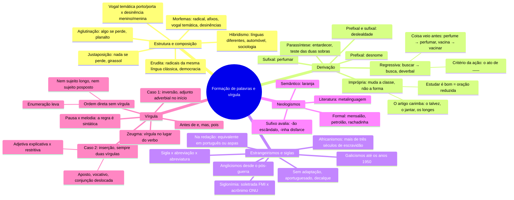

# Língua Portuguesa — Formação de palavras e vírgula

> Aula de Língua Portuguesa do cursinho, 29/09/2026. Mapa mental + 39 flashcards, tirados da
> `apostila-formacao-de-palavras-e-virgula.pdf`, nesta pasta.
> ⭐ = já caiu na FGV, com o id da questão no banco de provas antigas · ✍️ = erro seu, do banco de erros ·
> ⚠️ = ajuste ao que a aula disse.
> Versão interativa (cards que viram, marcação sabia/revisar): https://claude.ai/artifact/FYLmoTKkDA3YmPXV6eVvt3

**O fio da aula em uma frase:** a língua forma palavras juntando radicais (composição) ou partindo de
uma palavra só (derivação), e recebe palavras de fora (empréstimos, siglas, neologismos). Na outra
metade, a vírgula: na ordem direta não há vírgula; ela aparece na **inversão** e na **inserção**.

**Ajustes à aula:** o caminho é perfume → perfumar (a seta da anotação estava invertida); "estudar é
bom" é oração reduzida, não o exemplo mais seguro de derivação imprópria; "feijoada" é palavra
portuguesa; a vírgula antes de "e" com sujeitos diferentes é recomendada, não obrigatória.

**O que caiu na FGV** (112 questões de Português, 2021.1–2026.1): as duas questões de vírgula foram
sobre oração adjetiva explicativa × restritiva (`2023.1-DIS-LP13`, `2025.1-OBJ-17`). Radicais gregos 2,
sujeito posposto 2, imprópria 1, parassíntese 1, estrangeirismos 1. Regressiva, siglas, neologismos e
zeugma: 0.

## Mapa mental

## Flashcards

Clique na pergunta para abrir a resposta.

### Estrutura e composição

> [!question]- 1. Vogal temática ou desinência de gênero: como separar?
> Troque a vogal final. Se muda o sexo do ser, é **desinência de gênero** (menino / menina). Se vira
> outra palavra, é **vogal temática** (porto e porta são coisas diferentes).

> [!question]- 2. Qual a diferença entre justaposição e aglutinação?
> Nas duas, dois ou mais radicais se juntam. **Justaposição:** nenhuma parte perde som (girassol,
> passatempo, guarda-chuva). **Aglutinação:** pelo menos uma perde som (planalto = plano + alto,
> aguardente = água + ardente). O hífen não decide nada.

> [!question]- 3. Justaposição ou aglutinação: pontapé, planalto, girassol, vinagre, embora?
> **Justaposição:** pontapé, girassol. **Aglutinação:** planalto (plano + alto), vinagre (vinho + acre),
> embora (em + boa + hora).

> [!question]- 4. O que é composição erudita? Dê exemplos.
> Radicais clássicos **da mesma língua** (grego ou latim), para termos científicos. Democracia (povo +
> poder), filosofia (amigo + sabedoria), cronômetro (tempo + medida); em latim, agricultura e homicida.
> ⭐ Radicais gregos: `2022.1-DIS-LP22` e `2025.1-DIS-LP3`.

> [!question]- 5. O que é hibridismo? Dê exemplos.
> Radicais de **línguas diferentes**: automóvel (grego + latim), televisão (grego + latim), sociologia
> (latim + grego), burocracia (francês + grego), sambódromo (africano + grego), alcoolômetro (árabe +
> grego).

> [!question]- 6. Democracia ou sociologia: qual das duas é híbrida?
> **Sociologia** (socio, latim + logia, grego). Democracia é erudita: os dois radicais são gregos.

### Derivação

> [!question]- 7. Quais são os seis tipos de derivação?
> Prefixal (refazer, desnome) · sufixal (lealdade, perfumar) · prefixal e sufixal (deslealdade) ·
> parassintética (entardecer) · regressiva (buscar → a busca) · imprópria (o jantar, o talvez).

> [!question]- 8. Parassíntese ou prefixal e sufixal: qual é o teste?
> Tire só o prefixo, depois só o sufixo. Nenhuma sobra existe → **parassíntese** (entardecer: tardecer ✗,
> entarde ✗). Alguma existe → **prefixal e sufixal** (deslealdade: lealdade ✓, desleal ✓).
> ⭐ `2026.1-OBJ-27` (verbo formado por parassíntese).

> [!question]- 9. Classifique: entristecer, infelizmente, subterrâneo, desigualdade.
> Entristecer e subterrâneo: **parassíntese**. Infelizmente e desigualdade: **prefixal e sufixal**
> (felizmente, infeliz, igualdade e desigual existem).

> [!question]- 10. Qual é o processo de formação de "desnome"?
> **Derivação prefixal:** des- + nome. Não é parassíntese: não tem sufixo.
> ✍️ Seu erro de 24/09 (ficou em branco).

> [!question]- 11. O que é derivação regressiva, e o que é um deverbal?
> A palavra nova é **menor**: o verbo perde a terminação e vira substantivo com -a, -o ou -e. Esse
> substantivo é o **deverbal**: buscar → busca, recuar → recuo, atacar → ataque, combater → combate.

> [!question]- 12. Como saber se o substantivo veio do verbo ou o verbo veio do substantivo?
> Critério da **ação**: "o ato de ___". Funciona (a busca) → **regressiva**. Não funciona (o perfume é
> coisa) → o substantivo veio primeiro e o verbo deriva dele por **sufixação**: perfume → perfumar,
> planta → plantar.

> [!question]- 13. "Vacina" é formada por derivação regressiva?
> **Não.** Nomeia substância, não ação: é primitiva. O verbo **vacinar** deriva dela (vacina + -ar).
> ✍️ Seu erro de 23/09 (25%): faltou o critério e o verbo.

> [!question]- 14. A anotação diz "perfumar → perfume: derivação sufixal". O que está errado?
> A seta está invertida: **perfume → perfumar**. Perfume é primitiva; perfumar é a derivada, por sufixação.
> ⚠️ Ajuste à aula.

> [!question]- 15. O que é derivação imprópria, e qual é a marca mais comum?
> A palavra **muda de classe sem mudar de forma** (conversão). O **artigo** carimba: o talvez, o jantar,
> o porquê, os longes (advérbio com artigo e plural).
> ⭐ `2023.1-OBJ-IL30` ("o mirabolante").

> [!question]- 16. "Estudar é bom" é um exemplo seguro de derivação imprópria?
> Não é o mais seguro: *estudar* é núcleo de oração subordinada substantiva subjetiva reduzida de
> infinitivo (aceita advérbio: "estudar muito"). Seguro é com determinante: "o estudar constante".
> ⚠️ Ajuste à aula.

> [!question]- 17. Além de verbo → substantivo, que outras conversões existem?
> Adjetivo → substantivo (o belo) · conjunção → substantivo (o porquê, um senão) · substantivo →
> adjetivo (produtos piratas) · próprio → comum (um judas, gilete) · comum → próprio (Pereira) ·
> particípio → preposição (durante, exceto) · → interjeição (Viva! Basta!).

> [!question]- 18. "O jantar" e "a pesca": qual é imprópria e qual é regressiva?
> **O jantar:** imprópria (forma idêntica, ganhou artigo). **A pesca:** regressiva (pescar perdeu o -r).

### Estrangeirismos e siglas

> [!question]- 19. Quais são as três formas de um estrangeirismo entrar no português?
> **Sem adaptação** (site, link, bullying) · **aportuguesada** (futebol, bife, sanduíche, xampu, abajur) ·
> **decalque**, tradução ao pé da letra (arranha-céu, cachorro-quente, fim de semana).

> [!question]- 20. Galicismos e anglicismos: quando e por quê?
> **Galicismos:** até os anos 1950, prestígio cultural francês (batom, perfume, maionese).
> **Anglicismos:** desde o pós-guerra, poderio econômico e tecnológico dos EUA (futebol, site, link).

> [!question]- 21. De onde vêm os africanismos? E "feijoada" é um deles?
> De mais de três séculos de escravidão, até 1888; línguas bantas e iorubá: samba, caçula, cafuné,
> moleque, tutu, candomblé, macumba. **Feijoada não:** feijão + -ada, palavra portuguesa.
> ⚠️ Ajuste à aula.

> [!question]- 22. Como usar estrangeirismo na redação e na dissertativa?
> Estrangeirismo desnecessário é vício de linguagem. Tem equivalente? Use o português. Não tem? Entre
> aspas. ⭐ `2023.1-DIS-LP15` (estrangeirismos, trecho de Bechara).

> [!question]- 23. O que é siglonímia? E sigla soletrada × acrônimo?
> Palavras formadas pelas iniciais, por economia comunicativa. **Soletrada:** FMI, FGV, INSS.
> **Acrônimo:** ONU, OTAN, Unicamp. OTAN = NATO em inglês (o adjetivo vem antes).

> [!question]- 24. Sigla, abreviação vocabular e abreviatura: qual a diferença?
> **Sigla:** iniciais (ONU). **Abreviação:** corte usado também na fala (foto, metrô, pneu).
> **Abreviatura:** só na escrita, com ponto (Dr., pág.). Sigla gera derivado: petista, celetista.

### Neologismos

> [!question]- 25. Neologismo formal ou semântico: qual a diferença?
> **Formal:** palavra nova (mensalão, podcast, deletar). **Semântico:** sentido novo (laranja, nuvem,
> vírus). O oposto é o **arcaísmo**.

> [!question]- 26. Mensalão, petrolão, laranja, rachadinha: o que são e como se formaram?
> **Mensalão:** pagamentos a parlamentares por votos (2005), mensal + -ão. **Petrolão:** desvios na
> Petrobras (Lava Jato, 2014), por analogia com mensalão. **Laranja:** quem empresta o nome, sentido
> novo. **Rachadinha:** parlamentar fica com parte do salário do assessor, rachar + -inha.

> [!question]- 27. Que efeito de sentido têm os sufixos de "mensalão" e "rachadinha"?
> **-ão** marca o tamanho do escândalo. **-inha** dá tom de coisa pequena e informal, irônico diante de
> um desvio de dinheiro público.

> [!question]- 28. Numa questão sobre neologismo em texto literário, o que a resposta precisa ter?
> Mostrar que o autor **pratica o que descreve** (metalinguagem) e **citar as palavras inventadas** do
> trecho. ✍️ Seu erro de 24/09 (Manoel de Barros, 25%): faltou citar façume e curtume.

### Vírgula

> [!question]- 29. Sinais de pausa e sinais de melodia: quais são?
> **Pausa:** vírgula, ponto e vírgula, ponto. **Melodia:** dois-pontos, interrogação, exclamação,
> aspas, reticências, parênteses, travessão.

> [!question]- 30. Vírgula se põe onde a gente respira?
> **Não.** A regra é sintática, pela ordem dos termos. Depois de sujeito longo há pausa e não há vírgula.

> [!question]- 31. Qual é a regra base da vírgula?
> Na **ordem direta** (sujeito → verbo → complemento → adjunto) não há vírgula. Enumeração leva, porque
> separa itens da mesma função. A vírgula aparece na **inversão** e na **inserção**.

> [!question]- 32. "Os alunos que estudaram durante o ano inteiro, passaram." Está certo?
> **Não.** A vírgula separa sujeito e verbo. Sujeito longo continua sendo sujeito.

> [!question]- 33. "Chegaram, os resultados." Está certo?
> **Não.** Sujeito posposto não se separa do verbo. A inversão que pede vírgula é a do adjunto adverbial.
> ⭐ Sujeito posposto: `2024.1-OBJ-27` e `2026.1-OBJ-20`.

> [!question]- 34. Adjunto adverbial no início da frase: quando leva vírgula?
> Longo: vírgula. Curto: facultativa. Oração adverbial no início: vírgula (no fim, facultativa).
> ✍️ Seu erro de 23/09: "Sob essa perspectiva a palavra…" sem vírgula.

> [!question]- 35. Que elementos intercalados ficam entre vírgulas?
> Aposto, vocativo, conjunção deslocada (porém, portanto), expressão explicativa (isto é, ou seja),
> oração intercalada e oração adjetiva explicativa. Sempre **duas** vírgulas.
> ⭐ `2025.1-OBJ-17` (vírgulas da oração adjetiva e do vocativo).

> [!question]- 36. Oração adjetiva explicativa × restritiva: qual leva vírgula, e o que muda no sentido?
> **Explicativa, entre vírgulas:** vale para todos ("Os alunos, que estudaram, foram aprovados").
> **Restritiva, sem vírgula:** só uma parte ("Os alunos que estudaram foram aprovados"). Ser único →
> sempre explicativa. ⭐ `2023.1-DIS-LP13` e `2025.1-OBJ-17`: as duas questões de vírgula da FGV.

> [!question]- 37. Quando vai vírgula antes do "e"?
> Sujeitos diferentes · "e" com valor de "mas" · "e" repetido (polissíndeto). Mesmo sujeito: sem
> vírgula. ⚠️ A aula disse "obrigatória"; nas gramáticas é recomendada. Na redação, use sempre.

> [!question]- 38. Vai vírgula antes de "pois"?
> **Sim**, quando é explicativo: "…não corresponde a uma derivação regressiva, pois é uma palavra
> primitiva." ✍️ Faltou duas vezes (Artes e vacina, 23/09).

> [!question]- 39. O que é zeugma, e como ele difere da elipse?
> **Zeugma:** omite termo já dito; a vírgula marca o lugar ("Eu prefiro café; ela, chá."). **Elipse:**
> omite termo que não apareceu ("Estudamos ontem"). Todo zeugma é elipse; nem toda elipse é zeugma.

## 🔗 Relacionados

[[Cursinho-projeto]]
