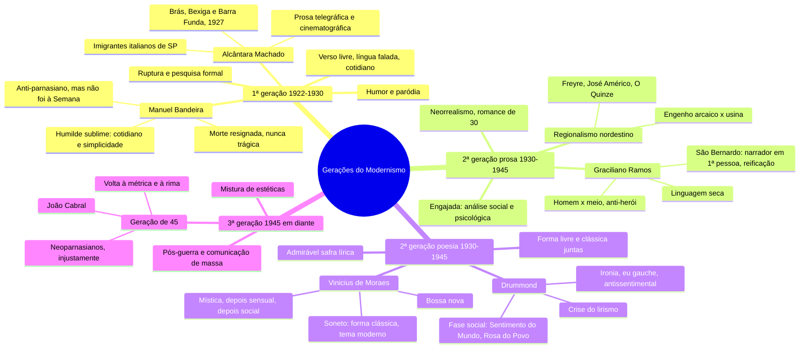

# Literatura — As gerações do Modernismo

> Literatura, Caderno 4 (FGV): Aula 12 (págs. 1 a 15) e Aula 14 (págs. 23 a 31). Mapa mental + 23 flashcards.
> Os cards são só de **característica** (da geração, do autor, da obra). Interpretar trecho de poema fica para a prova.
> ⭐ = já caiu na FGV, com o id da questão no banco de provas antigas. 📋 = obra da lista de Artes de 2027.
> Versão interativa (cards que viram, marcação sabia/revisar): https://claude.ai/artifact/6FzwvfSsnmPFyjnWPYdEkv
> ou `geracoes-modernistas.html`, nesta pasta.

**O fio das duas aulas em uma frase:** a 1ª geração (1922–30) quebra a forma; a 2ª (1930–45) guarda
essas conquistas e aprofunda o tema, no romance de 30 e na poesia do homem no mundo em guerra; a 3ª
(1945 em diante) mistura estéticas, e a Geração de 45 volta à métrica.

## Mapa mental

## Flashcards

Clique na pergunta para abrir a resposta.

### As três gerações

> [!question]- 1. Quais são as três gerações do Modernismo, com datas e proposta?
> - **1ª (1922–1930), a da Semana de 22:** ruptura e pesquisa formal. Verso livre, língua falada, humor, paródia.
> - **2ª (1930–1945):** guarda as conquistas e aprofunda o tema. Prosa: o romance de 30, engajado e regionalista. Poesia: o homem no mundo em guerra.
> - **3ª (1945 em diante):** experiências com a palavra e mistura de estéticas. A Geração de 45 volta à métrica e à rima.

> [!question]- 2. O que a 2ª geração troca em relação à 1ª?
> Troca a **pesquisa formal** pela **profundidade do tema**, sem abrir mão das conquistas de 22.
> E passa a misturar: forma livre e forma clássica (o soneto volta), linguagem coloquial e culta, humor e ironia.

> [!question]- 3. Quais são as três conquistas do Modernismo segundo Mário de Andrade, e qual delas a FGV cobrou?
> 1. Direito permanente à **pesquisa estética**
> 2. Atualização da inteligência artística brasileira
> 3. Estabilização de uma consciência criadora nacional
>
> Este card vem do banco de provas, não do caderno.
> ⭐ `2025.1-OBJ-29` · "No meio do caminho" usa o direito à pesquisa estética

### 1ª geração (1922–1930)

> [!question]- 4. Quais são as características da 1ª geração?
> - **Ruptura** com a tradição, sobretudo com o Parnasianismo
> - **Verso livre** e **linguagem coloquial**: a língua falada no Brasil contra a sintaxe de Portugal
> - Poesia do **cotidiano** e das coisas simples
> - **Humor**, poema-piada e **paródia** dos clássicos
> - Prosa **experimental**: frases curtas, cortes de cena como no cinema

> [!question]- 5. Manuel Bandeira: qual é a marca da poesia dele?
> O "**humilde sublime**" (ou "banal sublime"): poesia do cotidiano e da simplicidade.
> Linguagem coloquial, mas densa e cheia de sentidos. Para ele, o mistério está na simplicidade: dizer com singeleza coisas humanas profundas.

> [!question]- 6. Quais são os temas de Bandeira, e como a morte aparece?
> Paixão pela vida, amor e erotismo, solidão, angústia, infância e cotidiano.
> É uma alma romântica refeita pelo século XX: **sem sentimentalismo e sem idealização**. A tuberculose o fez esperar a morte desde jovem, e ela aparece **melancólica e resignada, nunca trágica**.

> [!question]- 7. Bandeira: quais são os livros, e qual foi a relação dele com a Semana de 22?
> **Livros:** *Cinza das Horas* (1917), *Carnaval* (1919), *Libertinagem* (1930), *Estrela da Manhã* (1936), reunidos em *Estrela da Vida Inteira* (1966).
> **Semana de 22:** não foi, porque discordava da postura agressiva do grupo, mas o poema "Os Sapos", sátira aos parnasianos, foi lido lá.

> [!question]- 8. Alcântara Machado: qual é o estilo e qual é o tema?
> **Estilo:** contos com linguagem telegráfica, elíptica e **cinematográfica**, com cortes rápidos de cena (recurso cubista), leve e bem-humorada. Têm **atmosfera de reportagem**: captam o instantâneo da vida na cidade.
> **Tema:** os **imigrantes italianos** dos bairros operários de São Paulo e a luta dos "novos brasileiros" para se integrar.
> *Brás, Bexiga e Barra Funda* (1927) é, com *Macunaíma*, a maior renovação da prosa modernista.

> [!question]- 9. O que é a intertextualidade modernista?
> Um texto que se refere a outro, quase sempre em **paródia**: faz piada ou ironia com o original e o **recontextualiza**, atualizando o conteúdo e a linguagem.
> O alvo preferido são os clássicos: a "Canção do exílio" (parodiada por Oswald, Murilo Mendes, Drummond e José Paulo Paes), Castro Alves, Bilac.

### 2ª geração: prosa (1930–1945)

> [!question]- 10. Como se chama a prosa da 2ª geração, e qual é a proposta?
> **Neorrealismo**, ou romance de 30: prosa **engajada**, de análise crítica **social e psicológica**. A crítica fala em "grande surto do romance".
> Quer entender a dor humana em todas as origens: social, natural, familiar, política e psicológica.

> [!question]- 11. Quais são as vertentes do romance de 30, e qual é a mais importante?
> - Urbano: Marques Rebelo, Érico Veríssimo
> - Intimista: Cornélio Pena, Lúcio Cardoso, Dyonélio Machado
> - Épico (histórico-político): Érico Veríssimo
> - **Regionalista nordestino, a mais importante:** Rachel de Queiroz, Graciliano Ramos, Jorge Amado, José Lins do Rego e José Américo de Almeida

> [!question]- 12. O que o regionalismo nordestino de 30 analisa?
> A passagem do Nordeste da sociedade **arcaica e senhorial dos engenhos** para um capitalismo parcial das **usinas** e da exportação (cacau e açúcar).
> O contraste entre coronelismo e indústria, e a **desigualdade que continua**: o pobre da periferia e do sertão segue desamparado.

> [!question]- 13. Quem abriu o regionalismo de 30, e quem o consolidou?
> **Idealizadores:** Gilberto Freyre (*Casa-Grande & Senzala*) e José Américo de Almeida (*A Bagaceira*, 1928).
> **Consolidou:** Rachel de Queiroz, com *O Quinze* (1930).
> 📋 *Caminho de pedras*, de Rachel, está na lista de Artes de 2027.

> [!question]- 14. Graciliano Ramos: quais são as marcas da obra?
> - Parte do **regional para o universal**
> - Tensão máxima entre o **homem e o meio** (natural ou social); o protagonista é anti-herói
> - Situações-limite (violência, humilhação, rejeição) e final trágico ou angustiado
> - Linguagem **seca, concisa, enxuta**
> ⭐ `2026.1-DIS-AR2` · *Vidas secas*, em Artes (📋 e na lista de 2027)

> [!question]- 15. O que a vida de Graciliano tem a ver com a obra?
> Foi prefeito de Palmeira dos Índios (AL) e, no **Estado Novo**, foi preso, acusado de ligação com o Partido Comunista. A prisão virou *Memórias do Cárcere*.
> Obras: *Caetés*, *São Bernardo*, *Angústia*, *Vidas Secas*, *Insônia*.

> [!question]- 16. *São Bernardo*: como a obra mostra as marcas de Graciliano?
> - **Narrador em 1ª pessoa**, em retrospectiva: o fazendeiro Paulo Honório conta a própria vida para tentar entendê-la
> - **Reificação:** ele trata tudo e todos, até a mulher, como objeto, pelo lucro
> - **Homem × meio:** ele mesmo culpa a vida dura do sertão que o formou
> - Linguagem seca, reduzida ao essencial; final de ruína e solidão

### 2ª geração: poesia (1930–1945)

> [!question]- 17. Como a crítica chama a poesia de 30, e quais são as características dela?
> "**Admirável safra lírica**": Drummond, Cecília Meireles, Murilo Mendes, Jorge de Lima e Vinicius de Moraes.
> - O tema é **o homem no mundo** e o horror dos anos 30 e 40 (a guerra)
> - Reflexão e pessimismo, mas com vontade de combate e indignação
> - Mistura forma livre e clássica, linguagem coloquial e culta, humor e ironia

> [!question]- 18. Drummond: quais são as marcas da poesia dele?
> - **Crise do lirismo:** pergunta para que serve um poeta num mundo confuso e violento, e desconfia da palavra
> - **Ironia** (gracejo que disfarça lamento) e **antissentimentalismo**
> - O **eu gauche**, desajustado, deslocado no mundo
> - Estilo seco e antirretórico; a reflexão sai de coisas banais do cotidiano
> ⭐ `2025.1-OBJ-28 a 30` · "No meio do caminho"

> [!question]- 19. Quais são as duas primeiras fases de Drummond?
> - ***Alguma Poesia* (1930) e *Brejo das Almas* (1934):** poema-piada, sintaxe solta, ironia, o eu gauche e Minas
> - ***Sentimento do Mundo* (1940), *José* (1942) e *A Rosa do Povo* (1945):** **poesia participante**: a história, a guerra, a experiência coletiva e a solidariedade

> [!question]- 20. Vinicius de Moraes: quais são as fases?
> - **Mística e religiosa:** *Caminho para a Distância*, *Forma e Exegese*, *Ariana, a Mulher* (1936, o auge)
> - **Sensual e cotidiana**, com sintaxe mais popular: *Cinco Elegias* (1938), *Poemas, Sonetos e Baladas* (1948)
> - **Social**, depois
>
> A marca é o **lirismo**, muitas vezes sensual.

> [!question]- 21. Vinicius: o que marca a forma e o alcance da obra dele?
> - **Soneto:** a forma clássica com tema e linguagem modernos, a mistura típica da 2ª geração
> - **Poesia social:** contra a guerra e a bomba atômica
> - **Palco e música:** *Orfeu da Conceição* (teatro, 1956), que virou o filme *Orfeu Negro* (Palma de Ouro e Oscar), e a **bossa nova** com Tom Jobim

### 3ª geração (1945 em diante)

> [!question]- 22. O que muda na literatura a partir de 1945?
> O pós-guerra traz a comunicação de massa (rádio, TV, cinema, quadrinhos, propaganda), e a literatura passa a **misturar estéticas**, reciclando influências de fora (o "caráter antropófago" de Oswald).
> Por isso há quem chame o período de **Pós-Modernismo** e marque 1945 como o fim do Modernismo: agora se aceita até o passado clássico.

> [!question]- 23. O que foi a Geração de 45?
> Poetas que quiseram **voltar a ser clássicos**: métrica, rima, linguagem culta e cuidada, recusando em parte o Modernismo. Chamados, injustamente, de "**neoparnasianos**".
> Nomes: Lêdo Ivo, Péricles Eugênio da Silva Ramos e **João Cabral de Melo Neto** (que vem na aula 15).
> ⭐ `2023.1-OBJ-27 a 29` e `2024.1-OBJ-29 e 30` · João Cabral, o autor que mais caiu na objetiva

## O que já caiu na FGV (banco 2021.1–2026.1)

Das duas aulas, o que já caiu foi **Drummond** na objetiva e **Graciliano** em Artes. Bandeira,
Alcântara Machado e Vinicius: nenhuma questão no banco até agora.

| Questão | Tema |
|---|---|
| `2025.1-OBJ-28 a 30` | "No meio do caminho" (Drummond): repetição, pesquisa estética, licença poética |
| `2026.1-DIS-AR2` | *Vidas secas* e Antonio Candido, em Artes |
| `2023.1-OBJ-27 a 29` · `2024.1-OBJ-29 e 30` | João Cabral (Geração de 45, aula 15) |
| `2022.1-DIS-AR11` | *Manifesto Antropófago* (Oswald, 1ª geração), em Artes |

## 🔗 Relacionados

[[Cursinho-projeto]]
