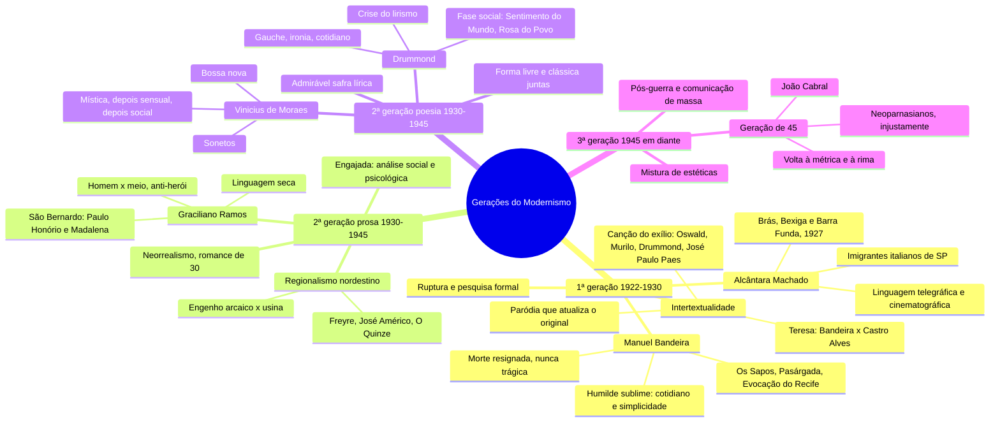

# Literatura — As gerações do Modernismo

> Literatura, Caderno 4 (FGV): Aula 12 (págs. 1 a 15) e Aula 14 (págs. 23 a 31). Mapa mental + 36 flashcards.
> ⭐ = já caiu na FGV, com o id da questão no banco de provas antigas. 📋 = obra da lista de Artes de 2027.
> Versão interativa (cards que viram, marcação sabia/revisar): https://claude.ai/artifact/6FzwvfSsnmPFyjnWPYdEkv
> ou `geracoes-modernistas.html`, nesta pasta.

**O fio das duas aulas em uma frase:** a 1ª geração (1922–30) quebra a forma; a 2ª (1930–45) guarda
essas conquistas e aprofunda o tema, no romance de 30 e na poesia do homem no mundo em guerra; a 3ª
(1945 em diante) mistura estéticas, e a Geração de 45 volta à métrica.

## Mapa mental

## Flashcards

Clique na pergunta para abrir a resposta.

### As três gerações

> [!question]- 1. Quais são as três gerações do Modernismo, com datas e proposta?
> - **1ª (1922–1930), a da Semana de 22:** ruptura e pesquisa formal. Verso livre, língua falada, humor, paródia.
> - **2ª (1930–1945):** guarda as conquistas e aprofunda o tema. Prosa: o romance de 30, engajado e regionalista. Poesia: o homem no mundo em guerra.
> - **3ª (1945 em diante):** experiências com a palavra e mistura de estéticas. A Geração de 45 volta à métrica e à rima.

> [!question]- 2. O que a 2ª geração troca em relação à 1ª?
> Troca a **pesquisa formal** pela **profundidade do tema**, sem abrir mão das conquistas de 22.
> E passa a misturar: forma livre e forma clássica (o soneto volta), linguagem coloquial e culta, humor e ironia.

> [!question]- 3. Quais são as três conquistas do Modernismo segundo Mário de Andrade, e qual delas a FGV cobrou?
> 1. Direito permanente à **pesquisa estética**
> 2. Atualização da inteligência artística brasileira
> 3. Estabilização de uma consciência criadora nacional
>
> Este card vem do banco de provas, não do caderno.
> ⭐ `2025.1-OBJ-29` · "No meio do caminho" usa o direito à pesquisa estética

### 1ª geração (1922–1930)

> [!question]- 4. Manuel Bandeira: qual é a marca da poesia dele?
> O "**humilde sublime**" (ou "banal sublime"): poesia do cotidiano e da simplicidade.
> Linguagem coloquial, mas densa e cheia de sentidos. Para ele, o mistério está na simplicidade: dizer com singeleza coisas humanas profundas.

> [!question]- 5. Quais são os temas de Bandeira, e como a morte aparece?
> Paixão pela vida, amor e erotismo, solidão, angústia, infância e cotidiano.
> A **tuberculose** o fez esperar a morte desde jovem, e ela aparece **melancólica e resignada, nunca trágica**. Ex.: "Pneumotórax", em que o médico, sem cura, manda tocar um tango argentino.

> [!question]- 6. Qual foi a relação de Bandeira com a Semana de 22?
> Não foi, porque discordava da postura agressiva do grupo.
> Mas esteve presente pelo poema **"Os Sapos"**, sátira aos parnasianos (o "sapo-tanoeiro" que martela o verso), lido por Ronald de Carvalho.

> [!question]- 7. O que é Pasárgada, em "Vou-me embora pra Pasárgada"?
> Um lugar imaginário de **evasão**: lá ele é amigo do rei e tem tudo o que a vida doente lhe negou (ginástica, bicicleta, banho de mar, amor).
> É a fuga romântica refeita com linguagem modernista.

> [!question]- 8. O que "Poema tirado de uma notícia de jornal" mostra do Modernismo?
> Um fato banal de jornal vira poema: João Gostoso, carregador de feira, bebe, canta, dança e se afoga.
> **Cotidiano, verso livre, frases secas**, e a morte contada sem comentário.

> [!question]- 9. "Evocação do Recife": o que o poema defende sobre a língua?
> A **língua do povo**, "errada" para a gramática e "certa" porque é o português do Brasil, contra a imitação da sintaxe de Portugal.
> É bandeira modernista, junto com a memória da infância no Recife.

> [!question]- 10. Como Bandeira parodia o Romantismo em "Teresa"?
> Retoma "O 'Adeus' de Teresa", de **Castro Alves**, e **desidealiza a amada**: onde o romântico via a pálida Teresa da valsa, Bandeira vê pernas "estúpidas" e olhos mais velhos que o corpo.
> A paródia ri do original e o atualiza.

> [!question]- 11. Alcântara Machado: qual é o estilo e qual é o tema?
> **Estilo:** linguagem telegráfica, elíptica e **cinematográfica**, com cortes rápidos de cena (recurso cubista), leve e bem-humorada.
> **Tema:** os **imigrantes italianos** dos bairros operários de São Paulo e a luta dos "novos brasileiros" para se integrar.
> *Brás, Bexiga e Barra Funda* (1927) é, com *Macunaíma*, a maior renovação da prosa modernista.

> [!question]- 12. O que Alcântara quis dizer com "este livro não nasceu livro: nasceu jornal"?
> Os contos têm **atmosfera de reportagem**: captam o fato, o instantâneo da vida cotidiana da cidade, como uma notícia.

> [!question]- 13. "Gaetaninho": qual é a ironia do conto?
> O menino sonha andar de carro, coisa que na Rua do Oriente só acontece em enterro.
> Ele morre atropelado pelo bonde e vai, enfim, no carro da frente, **dentro do caixão**. Ironia trágica, contada seca, sem sentimentalismo.

> [!question]- 14. O que é a intertextualidade modernista?
> Um texto que se refere a outro, quase sempre em **paródia**: faz piada ou ironia com o original e o **recontextualiza**, atualizando o conteúdo e a linguagem.

> [!question]- 15. Quem parodiou a "Canção do exílio", de Gonçalves Dias, e de que geração é cada um?
> - **Oswald de Andrade** (1ª), "Canto de regresso à pátria": troca palmeiras por palmares e o sabiá pelo progresso de São Paulo
> - **Murilo Mendes** (2ª), "Canção do exílio": a terra das macieiras da Califórnia, crítica à cultura importada
> - **Drummond** (2ª), "Nova canção do exílio"
> - **José Paulo Paes** (poesia contemporânea), "Canção de exílio facilitada", reduzida a rimas em "á"

> [!question]- 16. Quem foi Juó Bananére?
> Pseudônimo de Alexandre Marcondes Machado, que parodiava Camões, Bilac e os políticos da República Velha num **português macarrônico** de imigrante italiano.
> "Uvi strella" parodia o "Ora (direis) ouvir estrelas", de Bilac. Livro: *La divina Increnca* (1915).

### 2ª geração: prosa (1930–1945)

> [!question]- 17. Como se chama a prosa da 2ª geração, e qual é a proposta?
> **Neorrealismo**, ou romance de 30: prosa **engajada**, de análise crítica **social e psicológica**. A crítica fala em "grande surto do romance".
> Quer entender a dor humana em todas as origens: social, natural, familiar, política e psicológica.

> [!question]- 18. Quais são as vertentes do romance de 30, e qual é a mais importante?
> - Urbano: Marques Rebelo, Érico Veríssimo
> - Intimista: Cornélio Pena, Lúcio Cardoso, Dyonélio Machado
> - Épico (histórico-político): Érico Veríssimo
> - **Regionalista nordestino, a mais importante:** Rachel de Queiroz, Graciliano Ramos, Jorge Amado, José Lins do Rego e José Américo de Almeida

> [!question]- 19. O que o regionalismo nordestino de 30 analisa?
> A passagem do Nordeste da sociedade **arcaica e senhorial dos engenhos** para um capitalismo parcial das **usinas** e da exportação (cacau e açúcar).
> O contraste entre coronelismo e indústria, e a **desigualdade que continua**: o pobre da periferia e do sertão segue desamparado.

> [!question]- 20. Quem abriu o regionalismo de 30, e quem o consolidou?
> **Idealizadores:** Gilberto Freyre (*Casa-Grande & Senzala*) e José Américo de Almeida (*A Bagaceira*, 1928).
> **Consolidou:** Rachel de Queiroz, com *O Quinze* (1930).
> 📋 *Caminho de pedras*, de Rachel, está na lista de Artes de 2027.

> [!question]- 21. Graciliano Ramos: quais são as marcas da obra?
> - Parte do **regional para o universal**
> - Tensão máxima entre o **homem e o meio** (natural ou social); o protagonista é anti-herói
> - Situações-limite (violência, humilhação, rejeição) e final trágico ou angustiado
> - Linguagem **seca, concisa, enxuta**
> ⭐ `2026.1-DIS-AR2` · *Vidas secas*, em Artes (📋 e na lista de 2027)

> [!question]- 22. O que a vida de Graciliano tem a ver com a obra?
> Foi prefeito de Palmeira dos Índios (AL) e, no **Estado Novo**, foi preso, acusado de ligação com o Partido Comunista. A prisão virou *Memórias do Cárcere*.
> Obras: *Caetés*, *São Bernardo*, *Angústia*, *Vidas Secas*, *Insônia*.

> [!question]- 23. *São Bernardo*: quem narra e qual é o enredo?
> **Paulo Honório**, em 1ª pessoa e em retrospectiva: de guia de cego a dono da fazenda São Bernardo, que tomou do jogador Padilha.
> Trata **tudo e todos como objeto**, pelo lucro. Casa com Madalena, tem um ciúme doentio, ela se suicida, a fazenda se arruína, e ele escreve para tentar entender a própria vida.

> [!question]- 24. Por que Madalena é o centro do conflito em *São Bernardo*?
> Professora humanitária, com leve ideal socialista, ela defende os empregados e é **a única pessoa que Paulo Honório não consegue transformar em objeto**.
> O ciúme dele é ódio deturpado: cada pedido dela diminui o lucro. No fim ele culpa a si e à "vida agreste" que lhe deu "uma alma agreste": o peso do meio.

### 2ª geração: poesia (1930–1945)

> [!question]- 25. Como a crítica chama a poesia de 30, e qual é o tema dela?
> "**Admirável safra lírica**": Drummond, Cecília Meireles, Murilo Mendes, Jorge de Lima e Vinicius de Moraes.
> O tema é **o homem no mundo** e o horror dos anos 30 e 40 (a guerra): poesia de reflexão e pessimismo, mas com vontade de combate e indignação.

> [!question]- 26. O que Drummond declara em "Mãos dadas"?
> Que não vai cantar o mundo velho nem o futuro, nem fugir para o amor, a paisagem ou o sonho: sua matéria é o **tempo presente e os homens presentes**, de mãos dadas com os companheiros.
> É o manifesto da **poesia participante**.

> [!question]- 27. Drummond: o que é a "crise do lirismo"?
> O poeta pergunta **para que serve um poeta** num mundo confuso e violento, e desconfia da palavra, que prende o que quer dizer.
> A resposta dele: **ironia** (gracejo que disfarça lamento), **antissentimentalismo**, estilo seco e antirretórico, e reflexão tirada de coisas banais do cotidiano.

> [!question]- 28. Quais são as duas primeiras fases de Drummond?
> - ***Alguma Poesia* (1930) e *Brejo das Almas* (1934):** poema-piada, sintaxe solta, ironia, Minas. "Poema de sete faces", "Cidadezinha qualquer", "Quadrilha", "No meio do caminho".
> - ***Sentimento do Mundo* (1940), *José* (1942) e *A Rosa do Povo* (1945):** a história e a experiência coletiva, a guerra, a solidariedade. "Mãos dadas", "E agora, José?".

> [!question]- 29. "Poema de sete faces": o que é ser gauche?
> *Gauche* é "esquerdo" em francês: **desajustado**. Um anjo torto manda o poeta ser gauche na vida.
> É o eu deslocado e irônico de Drummond, que sabe que uma rima (Raimundo com mundo) não é solução.

> [!question]- 30. "No meio do caminho": o que a FGV perguntou?
> - **Recurso central:** a reiteração, a repetição insistente da pedra
> - **Conquista modernista:** o direito à pesquisa estética
> - **Licença poética:** "tinha uma pedra", *ter* no lugar de *haver*, infração à norma culta que imita a fala
> ⭐ `2025.1-OBJ-28 a 30` · "No meio do caminho"

> [!question]- 31. "E agora, José?": quem é José?
> O **homem comum sem saída**: a festa acabou, está sem mulher, sem discurso, sem utopia, e cada porta que tenta não existe.
> A pergunta repetida marca o impasse, mas José não morre: é duro e segue marchando. Poema de *José* (1942), em plena guerra.

> [!question]- 32. Vinicius de Moraes: quais são as fases?
> - **Mística e religiosa:** *Caminho para a Distância*, *Forma e Exegese*, *Ariana, a Mulher* (1936, o auge)
> - **Sensual e cotidiana**, com sintaxe mais popular: *Cinco Elegias* (1938), *Poemas, Sonetos e Baladas* (1948)
> - **Social**, depois
>
> A marca é o **lirismo**, muitas vezes sensual.

> [!question]- 33. Por que os sonetos de Vinicius são típicos da 2ª geração?
> Usam a **forma clássica** (o soneto) com tema e linguagem modernos, a mistura que a 2ª geração faz.
> "Soneto de fidelidade": o amor intenso, mas finito, que vale enquanto dura. "Soneto da separação": antíteses (riso e pranto) e o "de repente" repetido.

> [!question]- 34. Onde aparecem o Vinicius social e o Vinicius da música?
> **Social:** "A Rosa de Hiroxima" (a antirrosa atômica, contra a bomba) e "Balada dos mortos dos campos de concentração".
> **Palco e música:** *Orfeu da Conceição* (teatro, 1956), que virou o filme *Orfeu Negro* (Palma de Ouro e Oscar), e a **bossa nova** com Tom Jobim ("Garota de Ipanema").

### 3ª geração (1945 em diante)

> [!question]- 35. O que muda na literatura a partir de 1945?
> O pós-guerra traz a comunicação de massa (rádio, TV, cinema, quadrinhos, propaganda), e a literatura passa a **misturar estéticas**, reciclando influências de fora (o "caráter antropófago" de Oswald).
> Por isso há quem chame o período de **Pós-Modernismo** e marque 1945 como o fim do Modernismo: agora se aceita até o passado clássico.

> [!question]- 36. O que foi a Geração de 45?
> Poetas que quiseram **voltar a ser clássicos**: métrica, rima, linguagem culta e cuidada, recusando em parte o Modernismo. Chamados, injustamente, de "**neoparnasianos**".
> Nomes: Lêdo Ivo, Péricles Eugênio da Silva Ramos e **João Cabral de Melo Neto** (que vem na aula 15).
> ⭐ `2023.1-OBJ-27 a 29` e `2024.1-OBJ-29 e 30` · João Cabral, o autor que mais caiu na objetiva

## O que já caiu na FGV (banco 2021.1–2026.1)

Das duas aulas, o que já caiu foi **Drummond** na objetiva e **Graciliano** em Artes. Bandeira,
Alcântara Machado e Vinicius: nenhuma questão no banco até agora.

| Questão | Tema |
|---|---|
| `2025.1-OBJ-28 a 30` | "No meio do caminho" (Drummond): repetição, pesquisa estética, licença poética |
| `2026.1-DIS-AR2` | *Vidas secas* e Antonio Candido, em Artes |
| `2023.1-OBJ-27 a 29` · `2024.1-OBJ-29 e 30` | João Cabral (Geração de 45, aula 15) |
| `2022.1-DIS-AR11` | *Manifesto Antropófago* (Oswald, 1ª geração), em Artes |

## 🔗 Relacionados

[[Cursinho-projeto]]
